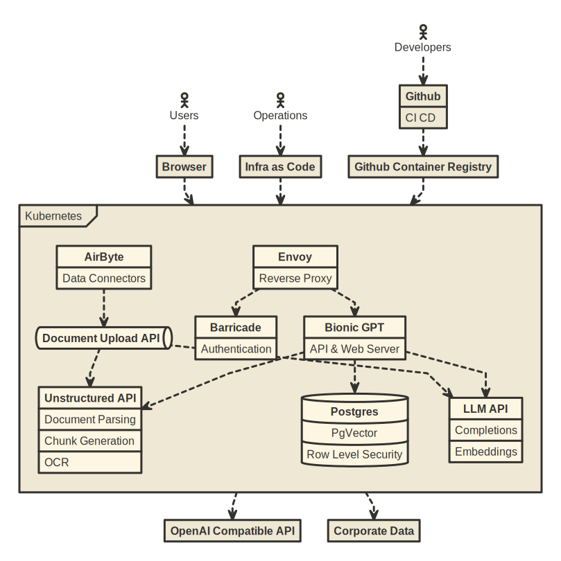

<h1 align="center">BionicGPT</h1>

 <strong>
   BionicGPT is an on-premise replacement for ChatGPT, offering the advantages of Generative AI while maintaining strict data confidentiality
 </strong>
 BionicGPT can run on your laptop or scale into the data center. 

 

  <!-- License -->
  
  

  <h4>
    <a href="https://bionic-gpt.com">
      Homepage
    </a>
    |
    <a href="https://github.com/bionic-gpt/bionic-gpt/blob/main/CONTRIBUTING.md">
      Contributing
    </a>
    |
    <a href="https://rust-on-nails.com/">
      Built with Rust on Nails
    </a>
  </h4>

 

<!-- ROADMAP -->
## Roadmap

- [x] Text Generation
    - [x] Connect to Open AI compatible API's i.e. LocalAI
    - [x] Select different prompts
    - [x] Syntax highlighting for code
- [ ] Image Generation
    - [ ] Connect to stable diffusion
- [x] Authentication
    - [x] Email/Password sign in and registration
    - [x] SSO
- [x] Teams
    - [x] Invite Team Members
    - [x] Manage the teams you belong to
    - [x] Create new teams
    - [x] Switch between teams
    - [x] RBAC
- [x] Document Management
    - [x] Document Upload
    - [x] Allow user to create datasets
    - [x] UI for datasets table 
    - [x] Turn documents into 1K batches and generate embeddings
    - [x] OCR for document upload
- [x] Document Pipelines
    - [x] Allow user to upload docs via API to datasets
    - [x] Process documents and create chunks and embeddings
- [x] Retrieval Augmented Generation
    - [x] Parse text out of documents
    - [x] Generate Embeddings and store in pgVector
    - [x] Add Embeddings to the prompt using similarity search
- [x] Prompt Management 
    - [x] Create and Edit prompts on a per team basis
    - [x] Associate prompts with datasets
- [x] Model Management 
    - [x] Create/update default prompt fo a model
    - [x] Set model location URL.
    - [x] Switchable LLM backends.
    - [ ] Associate models with a command i.e. /image
- [ ] Guardrails
    - [ ] Figure out a strategy
- [x] API
    - [x] Create per team API keys
    - [x] Attach keys to a prompt
    - [ ] Revoke keys
- [ ] Fine Tuning
    - [ ] QLORA adapters
- [x] System Admin
    - [x] Usage Statistics
    - [x] Audit Trail
    - [ ] Set API limits
- [x] Deployment
    - [x] Docker compose so people can test quickly.
    - [x] Kubernetes deployment strategy.
    - [x] Kubernetes Operator
    - [ ] Hardware recommendations.

See the [open issues](https://github.com/purton-tech/bionicgpt/issues) for a full list of proposed features (and known issues).

<!-- Try it out -->
## Try it out with `docker compose`

follow [our guide](https://bionic-gpt.com/docs/running-locally/introduction/) to running Bionic-GPT on your local machine.

## Kubernetes Ready

BionicGPT is optimized to run on Kubernetes and implements the full pipeline of LLM fine tuning from data acquisition to user interface.

