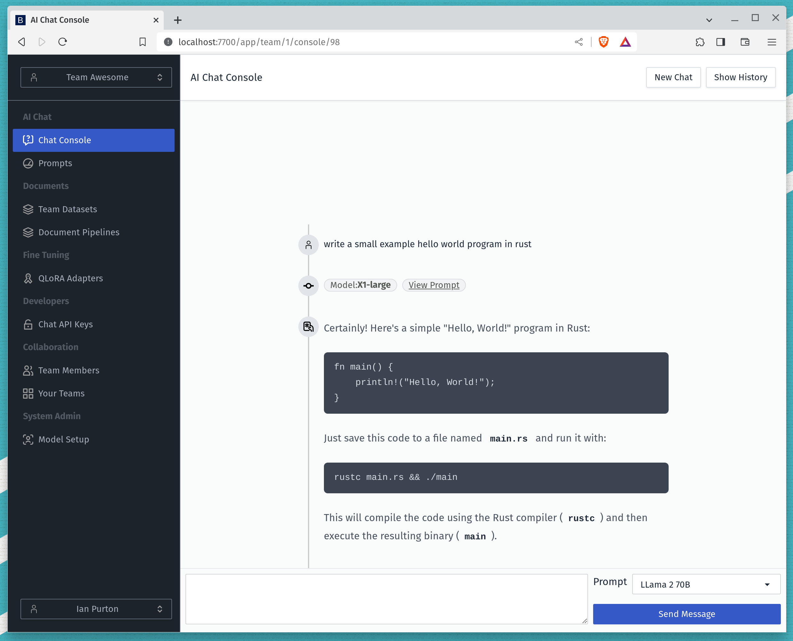
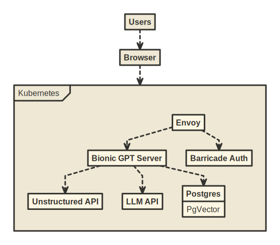

<h1 align="center">BionicGPT</h1>
<div align="center">
 <strong>
   BionicGPT is an on-premise replacement for ChatGPT, offering the advantages of Generative AI while maintaining strict data confidentiality
 </strong>
 BionicGPT can run on your laptop or scale into the data center. 
</div>

<br />

<div align="center">
  <!-- License -->
  <a href="https://github.com/purton-tech/bionic-gpt#License">
    
  </a>
  <a href="https://github.com/purton-tech/bionic-gpt#License">
    
  </a>
</div>

<div align="center">
  <h4>
    <a href="https://bionic-gpt.com">
      Homepage
    </a>
  </h4>
</div>

<br />



<!-- ROADMAP -->
## Roadmap

- [x] Chat Console
    - [x] Connect to Open AI compatible API's i.e. LocalAI
    - [x] Select different prompts
    - [ ] Multi Modal (Show images and text)
    - [x] Syntax highlighting for code
    - [ ] Mixture of Experts?
- [x] Authentication
    - [x] Email/Password sign in and registration
    - [ ] SSO
- [x] Teams
    - [x] Invite Team Members
    - [x] Manage the teams you belong to
    - [x] Create new teams
    - [x] Switch between teams
    - [ ] RBAC
- [x] Document Management
    - [x] Document Upload
    - [x] Allow user to create datasets
    - [x] UI for datasets table 
    - [x] Turn documents into 1K batches and generate embeddings
    - [ ] OCR for document upload
- [ ] Document Pipelines
    - [ ] Create S3 compatible buckets
    - [ ] Allow user to upload docs to buckets
    - [ ] Process documents and create embeddings
- [x] Retrieval Augmented Generation
    - [x] Parse text out of documents
    - [x] Generate Embeddings and store in pgVector
    - [x] Add Embeddings to the prompt using similarity search
- [x] Prompt Management 
    - [x] Create and Edit prompts on a per team basis
    - [x] Associate prompts with datasets
- [x] Model Management 
    - [x] Create/update default prompt fo a model
    - [x] Set model location URL.
    - [x] Switchable LLM backends.
    - [ ] Associate models with a command i.e. /image
- [ ] Guardrails
    - [ ] Figure out a strategy
- [x] API
    - [x] Create per team API keys
    - [x] Attach keys to a prompt
    - [ ] Revoke keys
- [ ] Fine Tuning
    - [ ] QLORA adapters
- [ ] System Admin
    - [ ] Hardware Status
    - [ ] Audit Trail
- [x] Deployment
    - [x] Docker compose so people can test quickly.
    - [x] Kubernetes deployment strategy.
    - [ ] Kubernetes bionicgpt.yaml
    - [ ] Hardware recommendations.

See the [open issues](https://github.com/purton-tech/bionicgpt/issues) for a full list of proposed features (and known issues).

<!-- Try it out -->
## Try it out

Cut and paste the following into a `docker-compose.yml` file and run `docker-compose up` access the user interface on http://localhost:7800/auth/sign_up

This has been tested on an AMD 2700x with 16GB of ram. The included `ggml-gpt4all-j` model runs on CPU only.

**Warning** - The images in this `docker-compose` are large due to having the model weights pre-loaded for convenience.

```yml
services:

  local-ai:
    image: ghcr.io/purton-tech/bionicgpt-model-api:llama-2-7b

  # Handles parsing of multiple documents types.
  unstructured:
    image: downloads.unstructured.io/unstructured-io/unstructured-api:db264d8
    ports:
      - "8000:8000"

  # Handles routing between the application, barricade and the LLM API
  envoy:
    image: ghcr.io/purton-tech/bionicgpt-envoy:1.1.14
    ports:
      - "7800:7700"

  # Postgres pre-loaded with pgVector
  db:
    image: ankane/pgvector
    environment:
      POSTGRES_PASSWORD: testpassword
      POSTGRES_USER: postgres
      POSTGRES_DB: finetuna
    healthcheck:
      test: ["CMD-SHELL", "pg_isready -U postgres"]
      interval: 10s
      timeout: 5s
      retries: 5

  # Sets up our database tables
  migrations:
    image: ghcr.io/purton-tech/bionicgpt-db-migrations:1.1.14
    environment:
      DATABASE_URL: postgresql://postgres:testpassword@db:5432/postgres?sslmode=disable
    depends_on:
      db:
        condition: service_healthy

  # Barricade handles all /auth routes for user sign up and sign in.
  barricade:
    image: purtontech/barricade
    environment:
        # This secret key is used to encrypt cookies.
        SECRET_KEY: 190a5bf4b3cbb6c0991967ab1c48ab30790af876720f1835cbbf3820f4f5d949
        DATABASE_URL: postgresql://postgres:testpassword@db:5432/postgres?sslmode=disable
        FORWARD_URL: app
        FORWARD_PORT: 7703
        REDIRECT_URL: /app/post_registration
    depends_on:
      db:
        condition: service_healthy
      migrations:
        condition: service_completed_successfully
  
  # Our axum server delivering our user interface
  embeddings-job:
    image: ghcr.io/purton-tech/bionicgpt-embeddings-job:1.1.14
    environment:
      APP_DATABASE_URL: postgresql://ft_application:testpassword@db:5432/postgres?sslmode=disable
    depends_on:
      db:
        condition: service_healthy
      migrations:
        condition: service_completed_successfully
  
  # Our axum server delivering our user interface
  app:
    image: ghcr.io/purton-tech/bionicgpt:1.1.14
    environment:
      APP_DATABASE_URL: postgresql://ft_application:testpassword@db:5432/postgres?sslmode=disable
    depends_on:
      db:
        condition: service_healthy
      migrations:
        condition: service_completed_successfully
```

## Kubernetes Ready

BionicGPT is optimized to run on Kubernetes and implements the full pipeline of LLM fine tuning from data acquisition to user interface.


