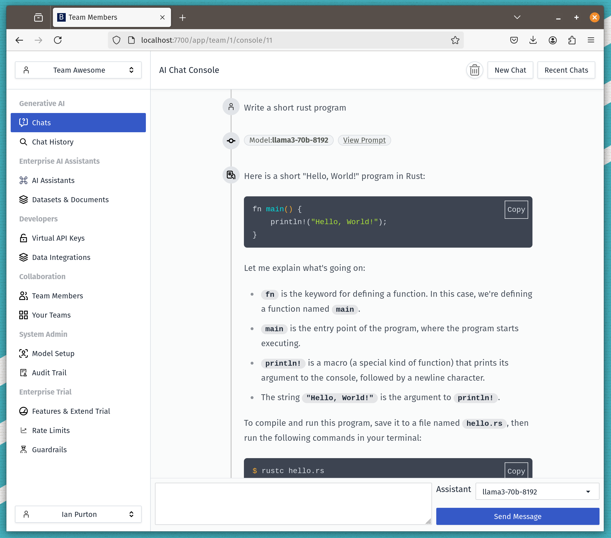
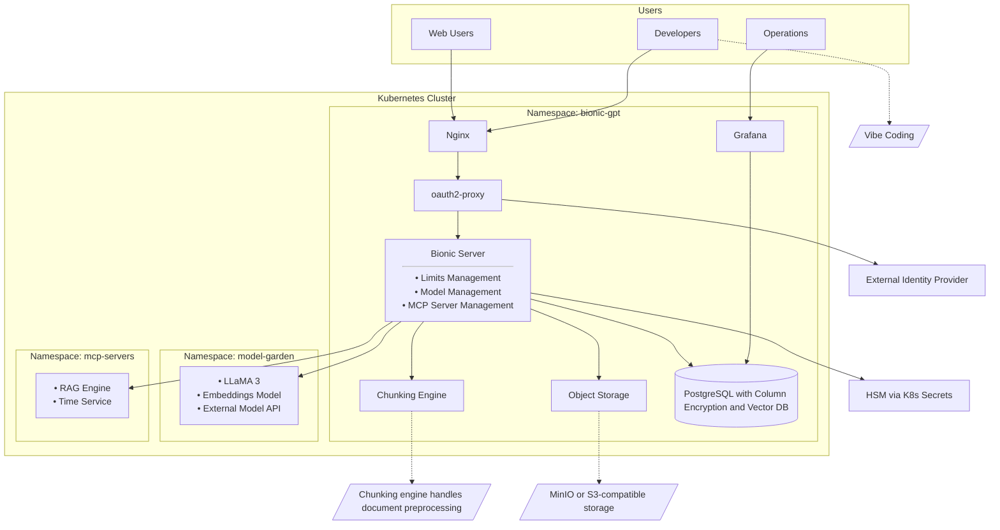
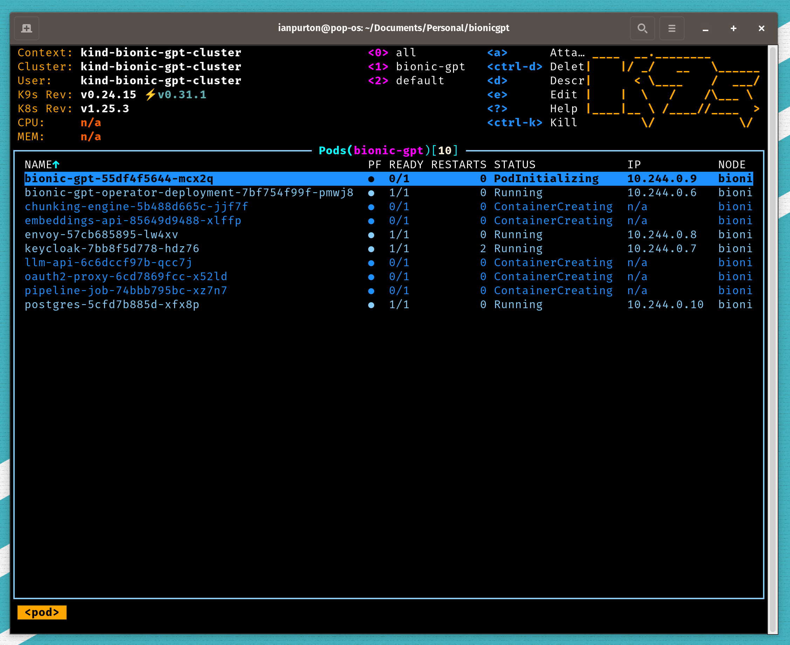

<h1 align="center">BionicGPT</h1>

 <strong>
   BionicGPT is an on-premise replacement for ChatGPT, offering the advantages of Generative AI while maintaining strict data confidentiality
 </strong>
 BionicGPT can run on your laptop or scale into the data center. 

 

  <!-- License -->
  
  

  <h4>
    <a href="https://bionic-gpt.com">
      Homepage
    </a>
    |
    <a href="https://github.com/bionic-gpt/bionic-gpt/blob/main/CONTRIBUTING.md">
      Contributing
    </a>
    |
    <a href="https://bionic-gpt.com/docs/">
      Documentation
    </a>
  </h4>

 

<!-- Features -->

### Run Gen AI Locally in Seconds

Try our [Docker Compose](https://bionic-gpt.com/docs/running-locally/docker-compose/) installation. Ideal for running AI locally and for small pilots.

### Familiar Chat Experience

- 🖥️ Intuitive Interface: Our chat interface is inspired by ChatGPT to ensure a user-friendly experience.
- 🌈 Theme Customization: The theme for Bionic is completely customizable allowing you to brand Bionic as you like.
- ⚡ Ultra Fast UI: Enjoy fast and responsive performance from our Rust based UI.
- 📜 Chat History: Effortlessly access and manage your conversation history.

### AI Assistants (Retrieval Augmented Generation)

- 🤖 AI Assistants: Users can create assistants that work with their own data to enhance the AI.
- 🗨️ Share Assistants with Team Members: Generate and share assistants seamlessly between users, enhancing collaboration and communication.
- 📋 RAG Pipelines: Assistants are full scale enterprise ready RAG pipelines that can be launched in minutes.
- 📑 Any Documents: 80% of enterprise data exists in difficult-to-use formats like HTML, PDF, CSV, PNG, PPTX, and more. We support all of them.
- 💾 No Code: Configure embeddings engine and chunking algorithms all through our UI.
- 🗨️ System Prompts: Configure system prompts to get the LLM to reply in the way you want.

### Teams

- 👫 Teams: Your company is made up of Teams of people and Bionic utilises this setup for maximum effect.
- 👫 Invite Team Members: Teams can self-manage in a controlled environment.
- 🙋 Manage Teams: Manage who has access to Bionic with your SSO system.
- 👬 Virtual Teams: Create teams within teams to 
- 🚠 Switch Teams: Switch between teams whilst still keeping data isolated.
- 🚓 RBAC: Use your SSO system to configure which features users have access to.

### Defence in Depth Security

- 👮 SAST: Static Application Security Testing - Our CI/CD pipeline runs SAST so we can identify risks before the code is built.
- 📢 Authorization RLS - We use Row Level Security in Postgres as another check to ensure data is not leaked between unauthorized users.
- 🚔 CSP: Our Content Security Policy is at the highest level and stops all manner of security threats.
- 🐳 Minimal containers: We build containers from Scratch whenever possible to limit supply chain attacks.
- ⏳ Non root containers: We run containers as non root to limit horizontal movement during an attack.
- 👮 Audit Trail: See who did what and when.
- ⏰ Postgres Roles: We run the minimum level of permissions for our postgres connections.
- 📣 SIEM integration: Integrate with your SIEM system for threat detection and investigation.
- ⌛ Resistant to timing attacks (api keys): Coming soon.
- 📭 SSO: We didn't build our own authentication but use industry leading and secure open source IAM systems.
- 👮 Secrets Management: Our Kubernetes operator creates secrets using secure algorithms at deployment time.

### Observability and Reporting

- 📈 Observability API: Compatible with Prometheus for measuring load and usage.
- 🤖 Dashboards: Create dashboards with Grafana for an overview of your whole system.
- 📚 Monitor Chats: All questions and responses are recording and available in the Postgres database.

### Token Usage Limits and Controls

- 📈 Fairly share resources: Without token limits it's easy for your models to become overloaded.
- 🔒 Reverse Proxy: All models are protected with our reverse proxy that allows you to set limits and ensure fair usage across your users.
- 👮 Role Based: Apply token usage limits based on a users role from your IAM system.

### Turn AI Assistants into APIs

- 🔐 Assistants API: Any assistant you create can easily be turned into an Open AI compatible API.
- 🔑 Key Management: Users can create API keys for assistants they have access to.
- 🔏 Throttling limits: All API keys follow the users throttling limits ensuring fair access to the models.

### Manage Data Governance with GuardRails

- 📁 Batch Guardrails: Apply rules to documents uploaded by our batch data pipeline.
- 🏅 Streaming Guardrails: LLMs deliver results in streams, we can apply rules in realtime as the stream flies by.
- 👾 Prompt injection: We can guard against prompt injections attacks as well as many more.

### Local or Remote Large Language Models

- 🤖 Full support for open source models running locally or in your data center.
- 🌟 Multiple Model Support: Install and manage as many models as you want.
- 👾 Easy Switch: Seamlessly switch between different chat models for diverse interactions.
- ⚙️ Many Models Conversations: Effortlessly engage with various models simultaneously, harnessing their unique strengths for optimal responses. Enhance your experience by leveraging a diverse set of models in parallel.

### Role Based Access Control

- ⚠️ Configurable UI: Give users access or not to certain features based on roles you give them in your IAM system.
- 🚦 With limits: Apply token usage limits based on a users role.
- 🎫 Fully secured: Rules are applied in our server and defence in depth secured one more time with Postgres RLS.

### Data Integrations

- 📤 100s of Sources: With our Airbyte integration you can batch upload data from sources such as Sharepoint, NFS, FTP, Kafka and more.
- 📥 Batching: Run upload once a day or every hour. Set the way you want.
- 📈 Real time: Capture data in real time to ensure your models are always using the latest data.
- 🚆 Manual Upload: Users have the ability to manually upload data so RAG pipelines can be setup in minutes.
- 🍟 Datasets: Data is stored in datasets and our security ensures data can't leak between users or teams.
- 📚 OCR: We can process documents using OCR to unlock even more data.

### Deploy to Bare Metal or The Cloud

- 🚀 Effortless Setup: Install seamlessly using Kubernetes (k3s, Docker Desktop or the cloud) for a hassle-free experience.
- 🌟 Continuous Updates: We are committed to improving Bionic with regular updates and new features.

<!-- Try it out -->
## Try it out

follow [our guide](https://bionic-gpt.com/docs/) to running Bionic-GPT in production.

## Architecture

## Enterprise

For companies that need better security, user management and professional support

[Talk to the founders](https://calendly.com/bionicgpt)

This covers: 
- ✅ **Help with integrations**
- ✅ **Feature Prioritization**
- ✅ **Custom Integrations**
- ✅ **LTS (Long Term Support) Versions**
- ✅ **Professional Support**
- ✅ **Custom SLAs**
- ✅ **Secure access with Single Sign-On**
- ✅ **Continuous Batching**
- ✅ **Data Pipelines**

# Support / talk with founders

- [Schedule a Chat 👋](https://calendly.com/bionicgpt)
- [Connect on Linked in 💭](https://www.linkedin.com/in/kulbinderdio/)

# Scales to 1000's of users.

BionicGPT is optimized to run on Kubernetes and provide Generative AI services for potentially 1000's of users.

