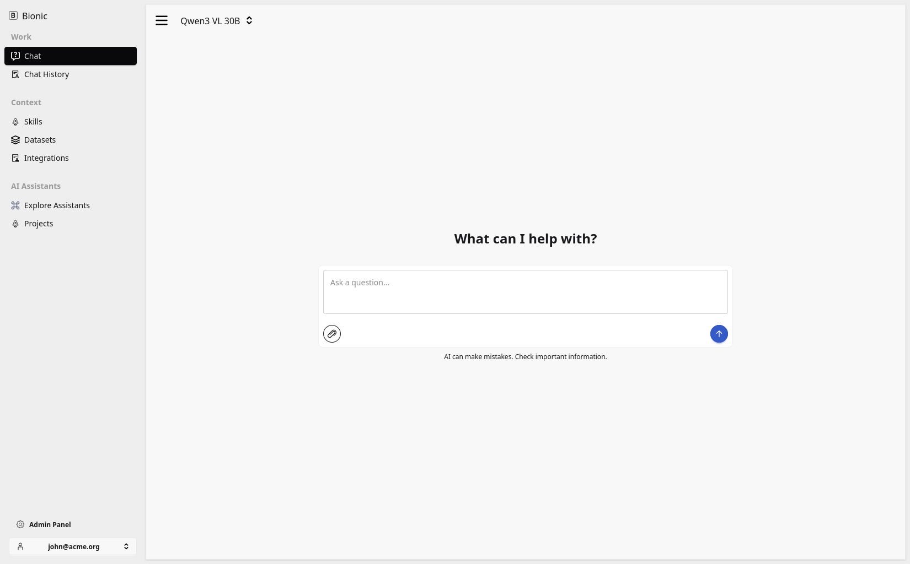
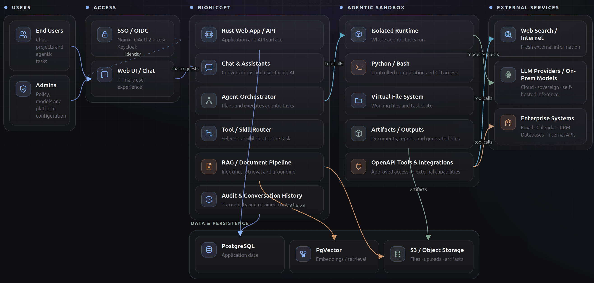

<h1 align="center">Bionic</h1>

  <strong>
    Bionic is an open-source Rust agentic harness for internal AI teams building sovereign AI.
  </strong>
   
  Deploy it on-premise, in private cloud, or in air-gapped environments. Connect your own models, data, tools, and internal systems, then build organisation-specific AI workflows without rebuilding the whole platform stack.
   
   
  <strong>Open source. Self-hosted. Model independent.</strong>

 

  

  <h4>
    <a href="https://bionic-gpt.com">Homepage</a>
    |
    <a href="https://bionic-gpt.com/docs/">Documentation</a>
    |
    <a href="https://bionic-gpt.com/pricing/">Pricing</a>
    |
    <a href="https://github.com/bionic-gpt/bionic-gpt/blob/main/CONTRIBUTING.md">Contributing</a>
  </h4>

 

## Why Bionic

Most internal AI teams do not need another generic chat UI. They need a controlled runtime where models can use tools, inspect files, call approved integrations, run code, retrieve knowledge, and produce durable outputs.

Bionic provides that foundation. Your team keeps control of the models, infrastructure, integrations, governance rules, and business-specific workflows.

## What Bionic Provides

- AI workspace and conversation history
- Model connectivity for hosted, private, and local models
- RAG and dataset-backed knowledge
- Built-in tool runtime
- Sandboxed code and command execution
- Virtual filesystem for uploads, datasets, skills, and generated outputs
- Integrations exposed to the runtime
- Skills for reusable domain workflows
- Generated artifacts and canvases
- Identity, teams, permissions, audit, and usage controls
- Kubernetes-oriented deployment infrastructure

## Agentic Runtime

Bionic is not just a chat surface. Each conversation can become a controlled working environment where the model can discover available tools, read relevant skills, operate over files, execute sandboxed code, and return durable outputs.

## Run Bionic

For local evaluation and small pilots, use the Docker Compose installation:

[Try Bionic with Docker Compose](https://bionic-gpt.com/docs/running-locally/docker-compose/)

For production-style local testing, use Kubernetes:

[Run Bionic on Kubernetes](https://bionic-gpt.com/docs/running-locally/kubernetes/)

For private cloud, on-premise, and air-gapped deployments, start with the production installation docs:

[Bionic documentation](https://bionic-gpt.com/docs/)

## Extend Bionic

Bionic is designed for internal AI engineers and platform teams that need to connect real organisational systems.

- **Models:** use approved hosted models, private inference endpoints, or local models.
- **Datasets:** connect private documents and knowledge sources for grounded workflows.
- **Integrations:** expose approved business systems to the runtime.
- **Skills:** package instructions, templates, and repeatable domain workflows.
- **Tools:** give models deterministic capabilities through the built-in tool runtime.
- **Outputs:** persist generated files and artifacts for use in the chat experience.

## Security and Control

Bionic is built for customer-controlled deployment environments:

- Self-hosted infrastructure
- SSO/OIDC integration
- Team-based permissions
- Audit trails
- Usage controls
- Postgres-backed persistence
- Object storage for generated files and documents
- Local, private, or hosted model support
- Kubernetes deployment model

## Commercial Support

Bionic is open source. Commercial support is available for organisations running it as critical internal infrastructure.

- **Community:** free, open-source, self-hosted foundation.
- **Enterprise:** production support, SLAs, security response, supported releases, architecture guidance, and upgrade assistance.
- **Deployment Accelerator:** help deploying Bionic and delivering a first validated production workflow.

[View pricing](https://bionic-gpt.com/pricing/) or [talk to us](https://calendly.com/bionicgpt).

## Contributing

Contributions are welcome. Start with [CONTRIBUTING.md](https://github.com/bionic-gpt/bionic-gpt/blob/main/CONTRIBUTING.md).

## License

Bionic is licensed under the Apache License 2.0.
