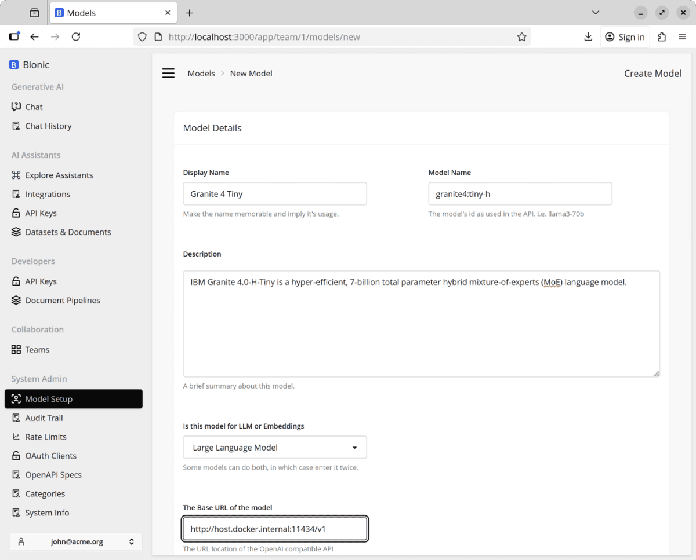
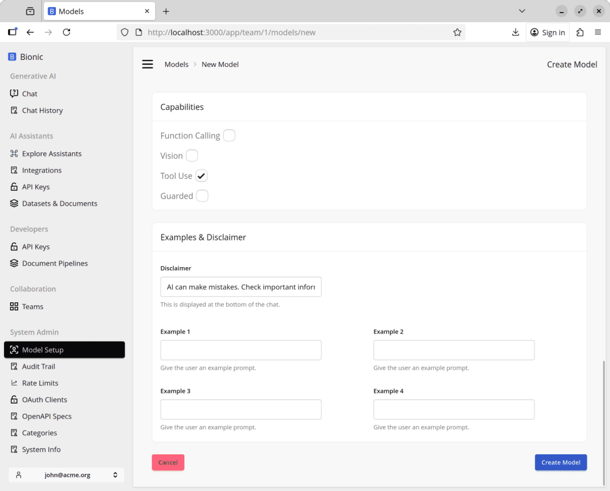
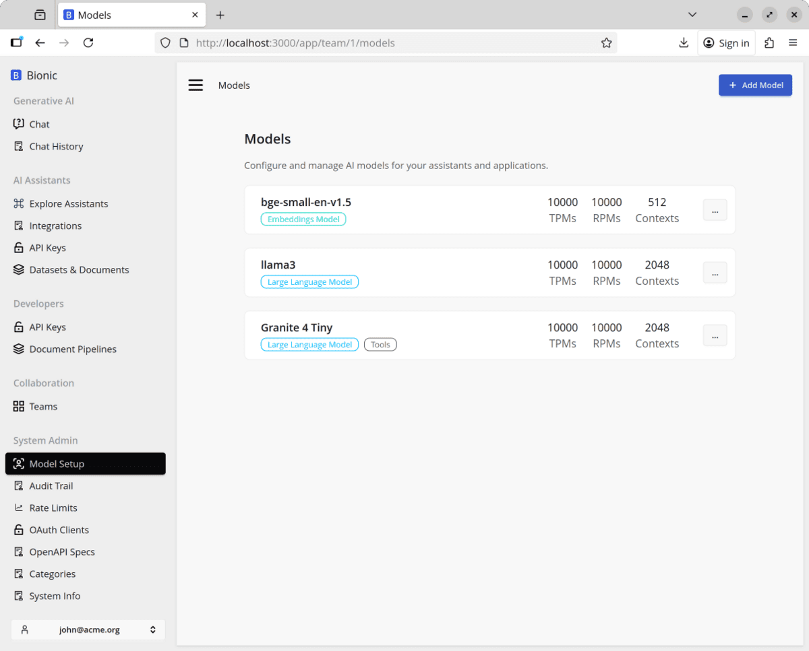

# Option 2: Run Locally with Ollama

Ollama is an inference engine for serving models on your own computer.

Use this path if you want to run the lab without sending prompts to a hosted
model provider.

This lab uses IBM Granite 4.0 Tiny because it runs well on commodity CPUs
without requiring a GPU and supports the structured tool calls used throughout
the course.

## Install Ollama

Install [Ollama](https://ollama.ai/) and make sure it is running.

## Configure Ollama to Listen on `0.0.0.0`

Ollama must listen on `0.0.0.0` so Bionic running in Docker or Kubernetes can
connect to it.

```bash
sudo sed -i '/^\[Service\]/a Environment="OLLAMA_HOST=0.0.0.0"' \
    /etc/systemd/system/ollama.service
sudo systemctl daemon-reload
sudo systemctl restart ollama.service
```

## Run a Model

```sh
ollama run granite4:tiny-h
```

## Test Ollama Directly

Call Ollama's OpenAI-compatible endpoint to confirm that the model is running:

```sh
curl http://localhost:11434/v1/chat/completions \
    -H "Content-Type: application/json" \
    -d '{
        "model": "granite4:tiny-h",
        "messages": [
            {
                "role": "system",
                "content": "You are a helpful assistant."
            },
            {
                "role": "user",
                "content": "Hello!"
            }
        ]
    }'
```

## Connect Ollama to Bionic

Go to `Models > New Model` and enter the following details:

```text
Display Name: Granite 4 Tiny
Model Name: granite4:tiny-h
Description: IBM Granite 4.0-H-Tiny
Base URL: http://host.docker.internal:11434/v1
```



### Enable Tool Use

Enable **Tool Use** so the model can call the runtime tools used in later
lessons.



Create the model and confirm that it appears in the model list.


