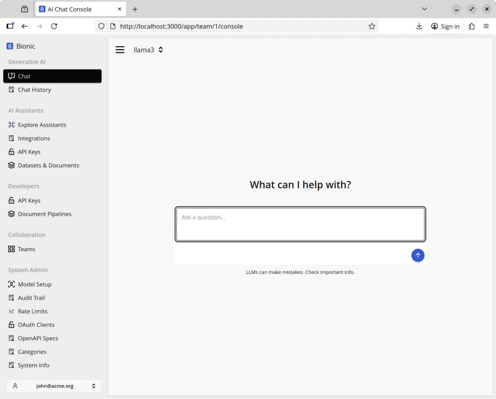

# Running the Bionic Platform

We have a very lightweight version of Bionic for running locally for for limited Proofs of concept. If you require features such as user management, document pipelines etc from the enterprise version then install the enterprise version instead.

## Prerequisites

The easiest way to get running with Bionic is with our `docker-compose.yml` file. You'll need [Docker](https://docs.docker.com/engine/install/) installed on your machine.

### OSX and Linux

```sh
curl -O https://raw.githubusercontent.com/bionic-gpt/bionic-gpt/refs/heads/main/infra-as-code/docker-compose.yml
```

### Windows

```sh
Invoke-WebRequest -Uri https://raw.githubusercontent.com/bionic-gpt/bionic-gpt/refs/heads/main/infra-as-code/docker-compose.yml -OutFile docker-compose.yml
```

### And run

```sh
docker compose up
```

You can then access the front end from `http://localhost:3000`.

## Screenshot



## Choose How to Run Your Model

With Bionic running, choose one of the next two paths:

1. Connect Bionic to a hosted API provider.
2. Run a model locally with Ollama.

Both paths lead to a model that you can test from the Bionic chat console.
