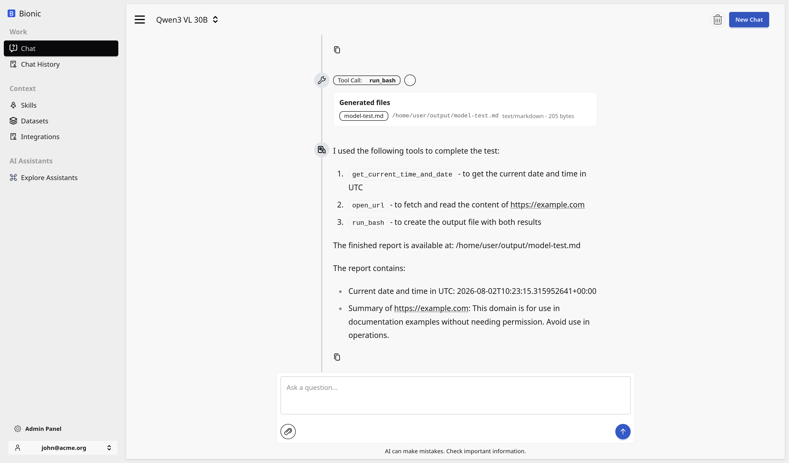
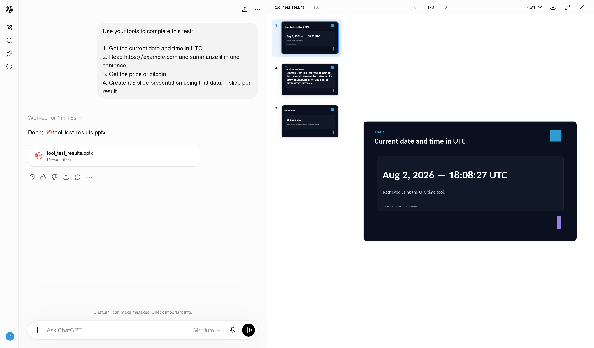

# Test the Platform

Whether you connected an API provider or configured Ollama, you can now test
the complete Bionic environment.

Open the Bionic chat console, select the model you configured, and enter this
prompt:

```text
Use your tools to complete this test:

1. Get the current date and time in UTC.
2. Read https://example.com and summarize it in one sentence.
3. Get the price of bitcoin
4. Create a 3 slide presentation using that data, 1 slide per result.
```

This checks that the model can select tools, retrieve current information,
read a URL, create a file in its sandbox, and return a finished artifact.

The screenshot below shows a simpler code-generation check in the same chat
console. It can be replaced with the result of the full test later.



## Compare the Same Test

For comparison, here is the same test running in ChatGPT. The ChatGPT image
also stands in for Mistral Vibe until its result is available.

<div class="not-prose my-8 grid grid-cols-1 gap-4 md:grid-cols-2">
  <figure class="overflow-hidden rounded-xl border border-slate-200 bg-slate-50 shadow-sm">
    
    <figcaption class="px-3 py-2 text-sm font-semibold text-slate-600">ChatGPT: platform test</figcaption>
  </figure>
  <figure class="overflow-hidden rounded-xl border border-slate-200 bg-slate-50 shadow-sm">
    
    <figcaption class="px-3 py-2 text-sm font-semibold text-slate-600">Mistral Vibe: screenshot coming soon</figcaption>
  </figure>
</div>
