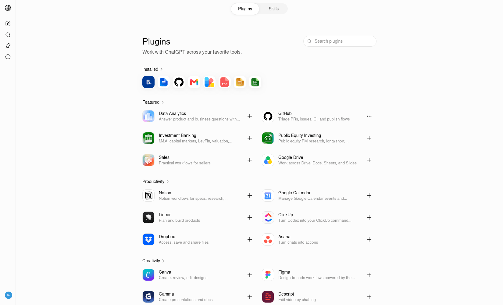
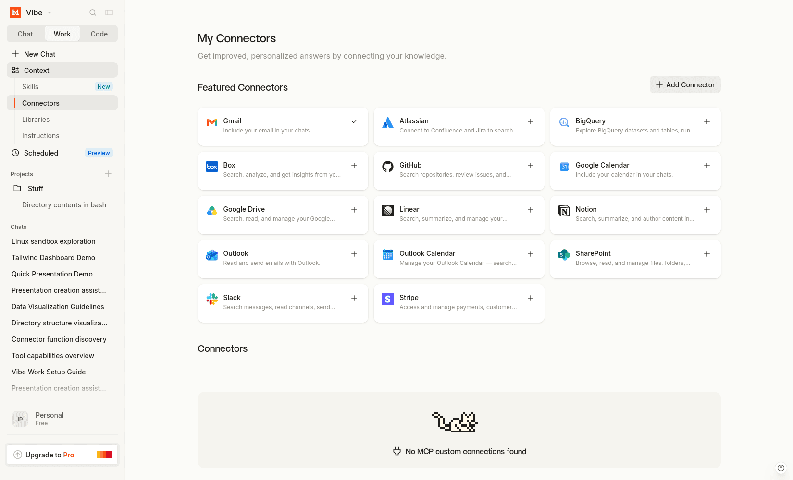
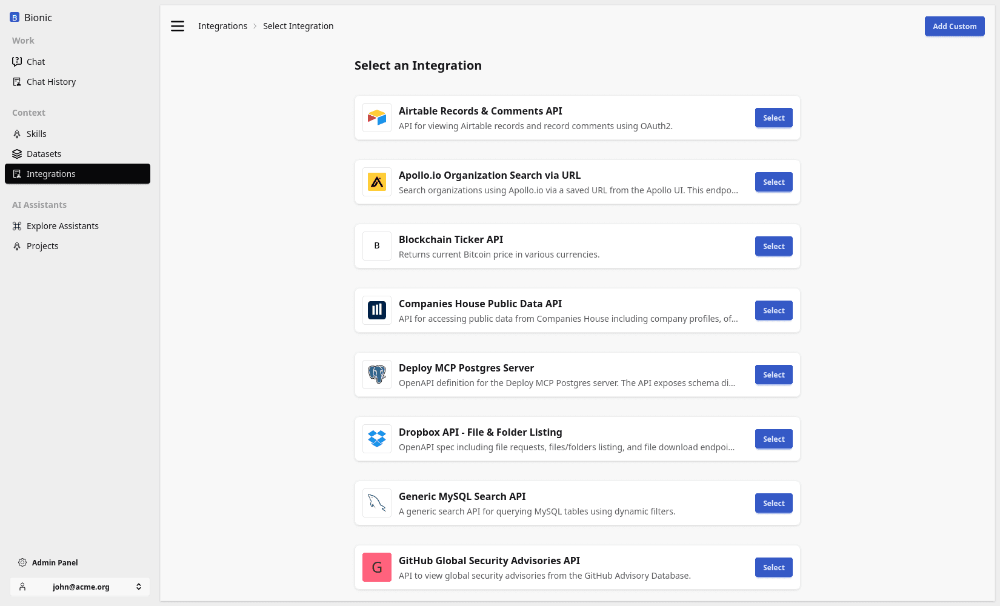

# Runtime Tools

Tools are where a chat interface starts to cross from **assistant** into **operator**.

Once the model can call tools, it can fetch current data, inspect files, run code, trigger actions, and work with APIs instead of only reasoning from the text in its context.

That covers many requests that used to justify a custom agent:

* check a system and summarise its status;
* query a database;
* create a ticket;
* update a CRM;
* transform a file;
* search the web;
* generate and publish an artifact.

The important question is not only “can we build an agent around this capability?” It is “can the existing chat runtime expose the capability safely enough for the workflow?”

  <figure class="overflow-hidden rounded-xl border border-slate-200 bg-slate-50 shadow-sm">
    
    <figcaption class="px-3 py-2 text-sm font-semibold text-slate-600">ChatGPT Tools</figcaption>
  </figure>
  <figure class="overflow-hidden rounded-xl border border-slate-200 bg-slate-50 shadow-sm">
    
    <figcaption class="px-3 py-2 text-sm font-semibold text-slate-600">Mistral Vibe Tools</figcaption>
  </figure>
  <figure class="overflow-hidden rounded-xl border border-slate-200 bg-slate-50 shadow-sm">
    
    <figcaption class="px-3 py-2 text-sm font-semibold text-slate-600">Bionic GPT Tools</figcaption>
  </figure>

## Built-in Tools and Integrations

Runtime tools provide general capabilities such as filesystem access, execution, memory, web access, and artifact generation. Integrations expose operations from an external business system.

Both appear to the model as callable tool definitions, but their trust boundaries differ. A file-read tool acts inside the workspace. A CRM tool might read or change enterprise data. Tools with side effects need clear permissions, argument validation, audit history, and human approval where the consequence warrants it.

The following diagram uses [OpenClaw](https://openclaw.ai) as a concrete example. It combines the runtime tools, [system prompt](https://gist.github.com/242816/db0e828914b4d8c99de44e69aaec6042), and [tool definitions](https://gist.github.com/242816/9affbf5f3198e4e4677dd3afaf38e90d).

## Runtime Capabilities

- **Memory**: recall prior facts and context.
- **Sandbox**: safely read, write, edit, and execute code.
- **Cron**: run jobs on a schedule.
- **Skills**: packaged workflows and constraints.
- **Toolsets (OpenAPI, web, etc.)**: connect external systems.

Without a runtime, you have a chat model.
With a runtime, you have an **agent** that can act reliably over time.

The runtime does not make every action safe by default. It supplies the place where access controls, isolation, timeouts, approvals, and observability can be enforced.

## Tool Summary

| Tool name          | Category              | Required params                     | Key enums / notes                                                                     |
| ------------------ | --------------------- | ----------------------------------- | ------------------------------------------------------------------------------------- |
| `read`             | Filesystem            | `path \| file_path`                 | Read text or images, supports `offset`, `limit`                                       |
| `write`            | Filesystem            | `content`, `path \| file_path`      | Overwrites file                                                                       |
| `edit`             | Filesystem            | `path \| file_path`, `old*`, `new*` | Exact string replace; multiple alias params (`oldText`, `old_string`)                 |
| `exec`             | Shell                 | `cmd`                               | Long-running allowed; `timeout`, `pty`, `background`, `elevated`, `host`, `security`  |
| `process`          | Shell                 | `action`                            | `logs`, `write`, `keys`, `kill`, `status` (exec session control)                      |
| `browser`          | Browser automation    | `action`                            | Large dispatcher: `start`, `stop`, `open`, `navigate`, `act`, `snapshot`, `pdf`, etc. |
| `canvas`           | UI / A2UI             | `action`                            | `present`, `hide`, `eval`, `snapshot`, `push`, `reset`                                |
| `nodes`            | Device / node control | `action`                            | Pairing, notify, camera/screen/location, `run`, `invoke`                              |
| `message`          | Messaging             | `action`, `content`                 | Only `send` despite description mentioning broadcast                                  |
| `tts`              | Audio                 | `text`                              | Text-to-speech                                                                        |
| `agents_list`      | Agent mgmt            | —                                   | Lists available agents                                                                |
| `sessions_list`    | Session mgmt          | —                                   | List sessions                                                                         |
| `sessions_history` | Session mgmt          | `session_id`                        | Fetch conversation history                                                            |
| `sessions_send`    | Session mgmt          | `session_id`, `content`             | Send message to session                                                               |
| `sessions_spawn`   | Session mgmt          | `content`                           | Spawn sub-agent (one-shot or persistent)                                              |
| `subagents`        | Agent mgmt            | `action`                            | `list`, `kill`, `send`                                                                |
| `session_status`   | Session mgmt          | `session_id`                        | Inspect session; optional model override                                              |
| `web_search`       | Web                   | `query`                             | Brave Search wrapper; locale options                                                  |
| `web_fetch`        | Web                   | `url`                               | Fetch + readable extraction                                                           |
| `memory_search`    | Memory                | `query`                             | Semantic search over memory                                                           |
| `memory_get`       | Memory                | `id`                                | Retrieve memory entry                                                                 |
