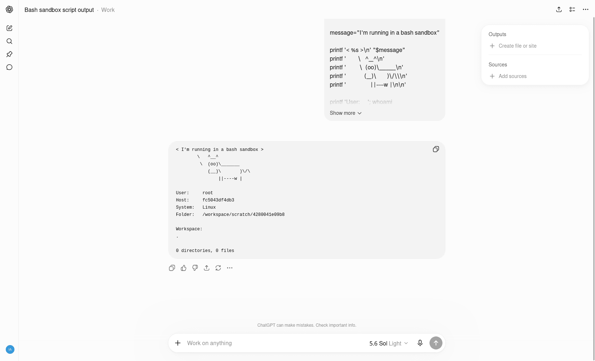
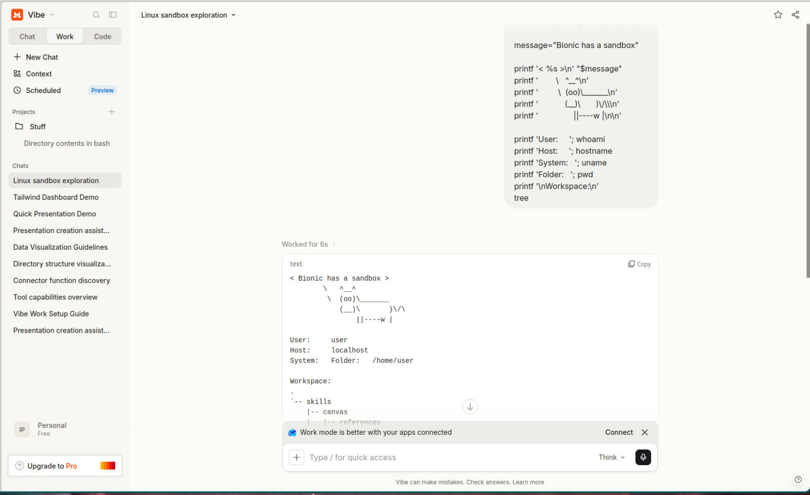
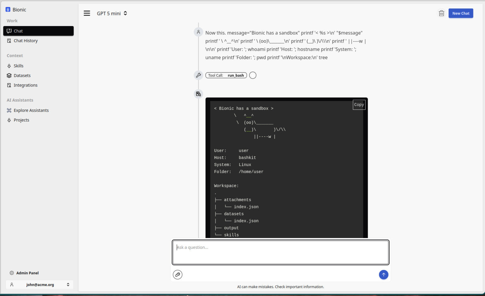

# Sandboxes

## Chat Is No Longer Just Chat

Modern chat interfaces are increasingly agentic workspaces, not just text boxes wrapped around a model.

The important shift is the sandbox. Once the model can run commands, read and write files, transform data, and produce outputs, many agent workflows become chat workflows with a working directory attached.

A sandbox gives the model a place to act. It can inspect uploaded files, generate intermediate files, execute code, call local tools, and return artifacts without getting direct access to the host system.

That changes how you should think about chat products. If the chat UI already includes sandboxed execution, file storage, tools, generated outputs, and project context, then it already contains many of the primitives people expect from an agent runtime.

## Sandbox Tool Definitions

A sandbox usually appears to the model as a small set of tool definitions. The exact API varies by platform, but the shape is often something like this:

```js
# Read a file from the sandbox
read(path: string): string

# Write a file in the sandbox
write(path: string, content: string): string

# Apply a patch/edit to an existing file
edit(path: string, diff: string): string

# Execute code and return stdout/stderr
exec(code: string): string

# Run a command/process in the sandbox
process(command: string, args: string[]): string
```

These tools let the model observe state, modify files, run experiments, and produce outputs. The sandbox is the boundary that makes those actions practical.

## Try It

Run the prompt below in a chat product with sandbox or code execution enabled. It is basically a small shell script. The point is to make the hidden working environment visible.

```txt
Run the script below in your sandbox

message="I'm running in a bash sandbox"

printf '< %s >\n' "$message"
printf '        \   ^__^\n'
printf '         \  (oo)\_______\n'
printf '            (__)\       )\/\\\n'
printf '                ||----w |\n\n'

printf 'User:     '; whoami
printf 'Host:     '; hostname
printf 'System:   '; uname
printf 'Folder:   '; pwd
printf '\nWorkspace:\n'
tree
```

If the product has a real sandbox, the model should be able to run the commands and show details about the execution environment and workspace.

<div class="not-prose my-8 grid grid-cols-1 gap-4 md:grid-cols-3">
  <figure class="overflow-hidden rounded-xl border border-slate-200 bg-slate-50 shadow-sm">
    
    <figcaption class="px-3 py-2 text-sm font-semibold text-slate-600">ChatGPT: chat plus sandbox</figcaption>
  </figure>
  <figure class="overflow-hidden rounded-xl border border-slate-200 bg-slate-50 shadow-sm">
    
    <figcaption class="px-3 py-2 text-sm font-semibold text-slate-600">Mistral Vibe: chat plus sandbox</figcaption>
  </figure>
  <figure class="overflow-hidden rounded-xl border border-slate-200 bg-slate-50 shadow-sm">
    
    <figcaption class="px-3 py-2 text-sm font-semibold text-slate-600">Bionic GPT: chat plus sandbox</figcaption>
  </figure>
</div>

## Sandboxes (What & Why)

A **sandbox** is an isolated execution environment where an LLM can safely run code or tools without access to the host system.

LLMs use sandboxes to:

* Execute code securely
* Prevent data leaks or system damage
* Enforce resource limits (CPU, memory, time)
* Run untrusted or user-generated instructions

In agentic systems, sandboxes enable **safe autonomy**:

> *The model can act, experiment, and fail — without breaking production.*

Common sandbox examples:

* Python execution environments
* Containerized tool runners
* WASM-based runtimes

**No sandbox → no safe tool execution → no real agent behavior.**

## Further Reading

- [OpenClaw Sandbox](https://docs.openclaw.ai/gateway/sandboxing)
- [Code Mode: give agents an entire API in 1,000 tokens](https://blog.cloudflare.com/code-mode-mcp/)
- [IronClaw sandbox implementation](https://github.com/nearai/ironclaw/tree/main/src/sandbox)
- [AI Sandboxes Startup](https://e2b.dev/)
- [Just Bash](https://github.com/vercel-labs/just-bash) Simulates a bash environment with configurable tools.
