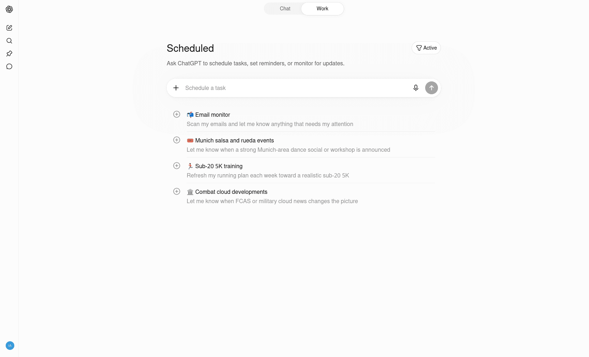
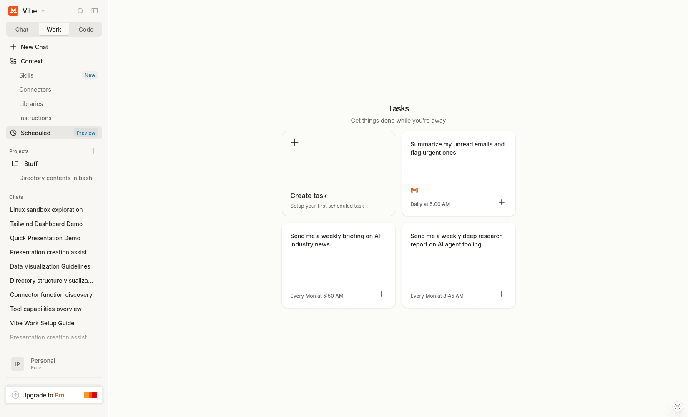

# Scheduled Tasks

Scheduled tasks let an AI computer resume work in the future without waiting for the user to ask again.

They cover requests such as:

* check this every morning;
* send me a weekly summary;
* watch for changes;
* run this report on a schedule;
* remind me at a specific time.

If the chat runtime already has scheduling, the assistant does not need to become a separate application merely to wake up with the right context.

<div class="not-prose my-8 grid grid-cols-1 gap-4 md:grid-cols-2">
  <figure class="overflow-hidden rounded-xl border border-slate-200 bg-slate-50 shadow-sm">
    
    <figcaption class="px-3 py-2 text-sm font-semibold text-slate-600">ChatGPT Tasks</figcaption>
  </figure>
  <figure class="overflow-hidden rounded-xl border border-slate-200 bg-slate-50 shadow-sm">
    
    <figcaption class="px-3 py-2 text-sm font-semibold text-slate-600">Mistral Vibe Tasks</figcaption>
  </figure>
</div>

Scheduled jobs trigger tool calls in the future without waiting for another message.

```js
# Create a scheduled job
cron(schedule: string, tool_name: string, arguments: object): string

# List scheduled jobs
cron_list(): object[]

# Update an existing scheduled job
cron_update(job_id: string, schedule: string, arguments: object): string

# Delete a scheduled job
cron_delete(job_id: string): string

# Health check for scheduler loop
heartbeat(): string
```

## Example: Create a Weekly Reminder Job

### User prompt

```text
Every Monday at 9am, remind me to send the team status update.
```

### 1) Model requests a cron job

```json
{
  "role": "assistant",
  "content": "",
  "tool_calls": [
    {
      "id": "call_cron_create_01",
      "name": "cron",
      "arguments": "{\"schedule\":\"0 9 * * 1\",\"tool_name\":\"send_reminder\",\"arguments\":{\"message\":\"Send the team status update\",\"channel\":\"in_app\"}}"
    }
  ]
}
```

### 2) Dispatcher executes and returns tool result

```json
{
  "role": "tool",
  "name": "cron",
  "tool_call_id": "call_cron_create_01",
  "content": "{\"job_id\":\"job_01JCRONABC\",\"status\":\"scheduled\",\"next_run\":\"2026-03-02T09:00:00-05:00\"}"
}
```

### 3) Model confirms and asks follow-up questions

```json
{
  "role": "assistant",
  "content": "Done. I scheduled a weekly reminder for Mondays at 9:00 AM. Do you want this in your local timezone, and should I also send it to email?"
}
```

## API Call with Full History

```sh
curl http://localhost:11434/api/chat \
  -H "Content-Type: application/json" \
  -d '{
    "model": "granite4:tiny-h",
    "stream": false,
    "tools": [
      {
        "type": "function",
        "function": {
          "name": "cron",
          "description": "Create a scheduled job that runs a tool in the future.",
          "parameters": {
            "type": "object",
            "properties": {
              "schedule": { "type": "string", "description": "Cron expression" },
              "tool_name": { "type": "string" },
              "arguments": {
                "type": "object",
                "additionalProperties": true
              }
            },
            "required": ["schedule", "tool_name", "arguments"]
          }
        }
      }
    ],
    "messages": [
      {
        "role": "system",
        "content": "You are a careful assistant. When users request recurring actions, use the cron tool and confirm timezone and delivery channel."
      },
      {
        "role": "user",
        "content": "Every Monday at 9am, remind me to send the team status update."
      },
      {
        "role": "assistant",
        "content": "",
        "tool_calls": [
          {
            "id": "call_cron_create_01",
            "name": "cron",
            "arguments": "{\"schedule\":\"0 9 * * 1\",\"tool_name\":\"send_reminder\",\"arguments\":{\"message\":\"Send the team status update\",\"channel\":\"in_app\"}}"
          }
        ]
      },
      {
        "role": "tool",
        "name": "cron",
        "tool_call_id": "call_cron_create_01",
        "content": "{\"job_id\":\"job_01JCRONABC\",\"status\":\"scheduled\",\"next_run\":\"2026-03-02T09:00:00-05:00\"}"
      }
    ]
  }'
```

## Questions to Ask Before Scheduling

1. Which timezone should be used?
2. Is this one-time or recurring?
3. Which delivery channel should be used (in-app, email, Slack)?
4. Should missed runs be retried?

## When a Scheduler Is Not Enough

A built-in scheduled task is appropriate when one assistant can resume with known context and perform a bounded action.

Dedicated orchestration becomes valuable when the workflow needs complex dependencies, transactional side effects, strict delivery guarantees, escalation paths, concurrency controls, durable queues, or detailed operational recovery.

Scheduling answers **when to start**. It does not automatically provide all the guarantees required by a business process.
