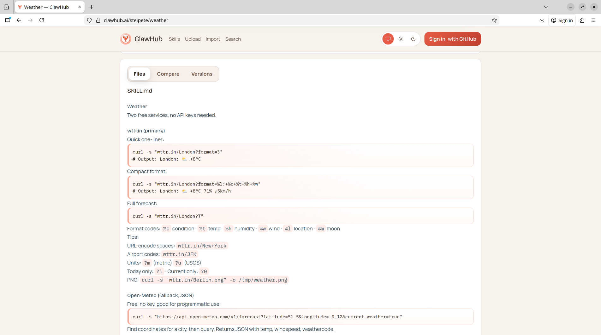

# Skills

Skills are a lightweight way to keep the base prompt small while still enabling targeted workflows.

## How It Works

1. The runtime injects an `<available_skills>` list into the prompt (only when skills are eligible).
2. If the model decides it needs one, it calls `read` to load that skill's `SKILL.md` from the listed location.
3. The model then executes the workflow using sandbox tools (`read`, `edit`, `write`, `exec`, `process`).
4. If no skills are eligible, the Skills section is omitted.

```xml
<available_skills>
  <skill>
    <name>...</name>
    <description>...</description>
    <location>...</location>
  </skill>
</available_skills>
```

```txt
# Read skill instructions first
+read(path: string): string

# Then execute skill steps in sandbox
+edit(path: string, diff: string): string
+write(path: string, content: string): string
+exec(code: string): string
+process(command: string, args: string[]): string
```

## Weather Skill Example

OpenClaw weather example:




- [https://clawhub.ai/steipete/weather](https://clawhub.ai/steipete/weather)

In practice:

- The model sees the weather skill in `<available_skills>`.
- It uses `read` on the skill path.
- It follows the instructions and uses sandbox/tool calls to complete the task.
