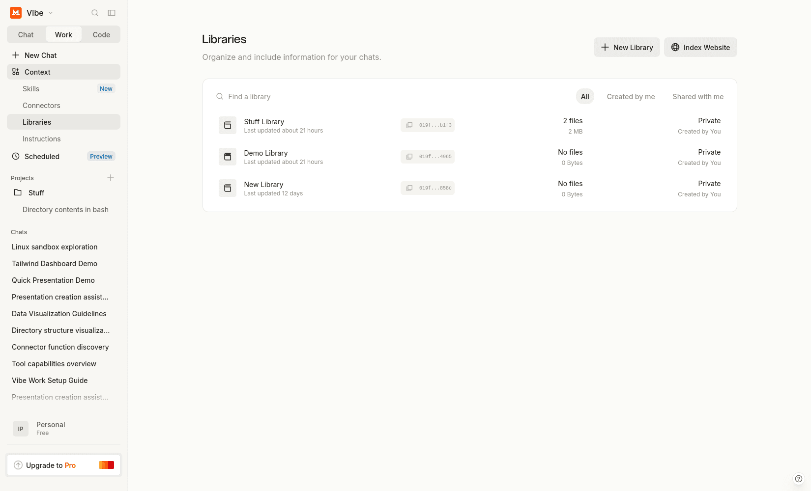
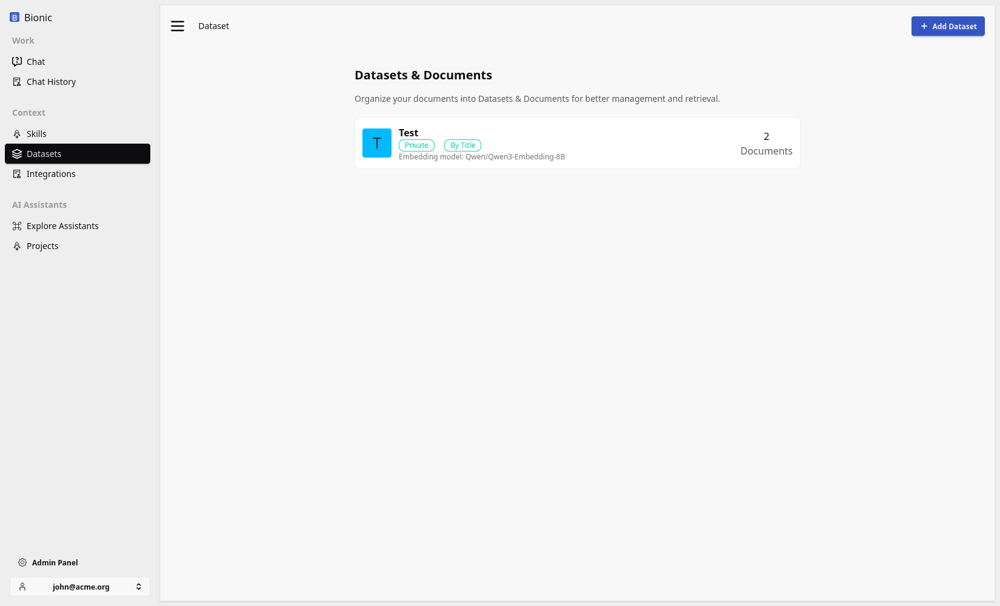

# Datasets

Attachments give a conversation immediate access to a file. A **dataset** or **library** is a reusable collection of source material that can support many conversations, users, or assistants.

Datasets cover the knowledge side of an AI computer. They let a model retrieve relevant information from material that is not present in its training data or the current prompt.

## Attachments, Working Files, and Datasets

These types of files play different roles:

| Type | Purpose | Typical lifetime |
| --- | --- | --- |
| Attachment | Add immediate context to a conversation | One conversation or task |
| Working file | Store input, intermediate work, or generated output in a sandbox | One run, session, or project |
| Dataset | Provide a curated and reusable body of knowledge | Across conversations and users |

An attachment is useful for questions such as “summarise this document.” A dataset is useful for questions such as “answer using our product manuals and support policies.”

The distinction is not only storage duration. A dataset normally needs:

* a clear owner and purpose;
* controlled membership and access;
* searchable or indexed content;
* source metadata;
* an update and deletion process.

## How a Model Uses a Dataset

A model should not guess which knowledge sources exist or search material it is not allowed to access. A dataset workflow usually looks like this:

1. Discover the datasets available to the current assistant and user.
2. Inspect the files in the most relevant datasets.
3. Retrieve passages related to the user's question.
4. Read enough surrounding context to interpret those passages.
5. Produce an answer that identifies or cites its sources.

The model reasons about which sources to use, while the retrieval system enforces scope and returns the relevant content.

This is different from putting every source document into the model's prompt. Retrieval selects a small amount of relevant material, keeping the working context focused and making the sources easier to inspect.

## Bring Your Knowledge

If the use case is mostly “answer questions from these documents” or “use this folder as reference material,” retrieval inside the chat interface may already be enough.

You do not necessarily need to begin by building a standalone RAG application, ingestion pipeline, agent framework, and custom frontend. First connect or upload representative material and test the complete user workflow.

  <figure class="overflow-hidden rounded-xl border border-slate-200 bg-slate-50 shadow-sm">
    
    <figcaption class="px-3 py-2 text-sm font-semibold text-slate-600">ChatGPT Library</figcaption>
  </figure>
  <figure class="overflow-hidden rounded-xl border border-slate-200 bg-slate-50 shadow-sm">
    
    <figcaption class="px-3 py-2 text-sm font-semibold text-slate-600">Mistral Vibe Library</figcaption>
  </figure>
  <figure class="overflow-hidden rounded-xl border border-slate-200 bg-slate-50 shadow-sm">
    
    <figcaption class="px-3 py-2 text-sm font-semibold text-slate-600">Bionic GPT Library</figcaption>
  </figure>

## Test the Dataset

Use questions taken from the real workflow rather than questions designed to match the documents.

1. Add a small but representative collection of source files.
2. Ask questions whose answers appear clearly in the material.
3. Ask questions that require information from more than one file.
4. Ask about information that is missing and check that the model admits the gap.
5. Add conflicting or outdated material and inspect which source the answer uses.
6. Verify that citations identify the passages that support each important claim.
7. Confirm that users without access cannot discover or retrieve the dataset.

If the answers are accurate, grounded, and useful, the existing dataset workflow may be sufficient. A custom system becomes valuable when the use case needs specialised ingestion, retrieval logic, evaluation, permissions, scale, or a dedicated user experience.

## From Dataset to RAG

Datasets provide the source material. A production retrieval-augmented generation system also has to extract content, divide it into useful chunks, create a searchable index, apply access controls, retrieve relevant passages, and keep the index synchronised as files change.

Those are implementation concerns around the same basic idea: give the model controlled access to relevant knowledge instead of expecting it to know everything.
