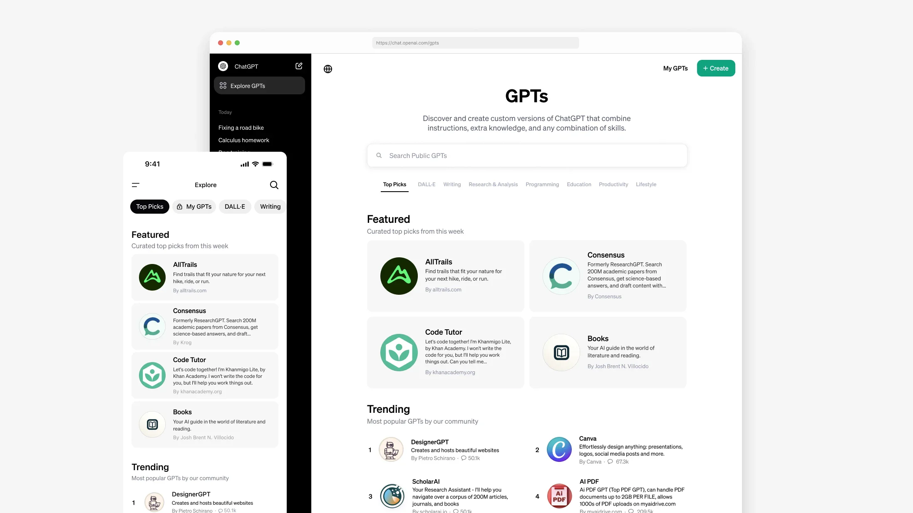
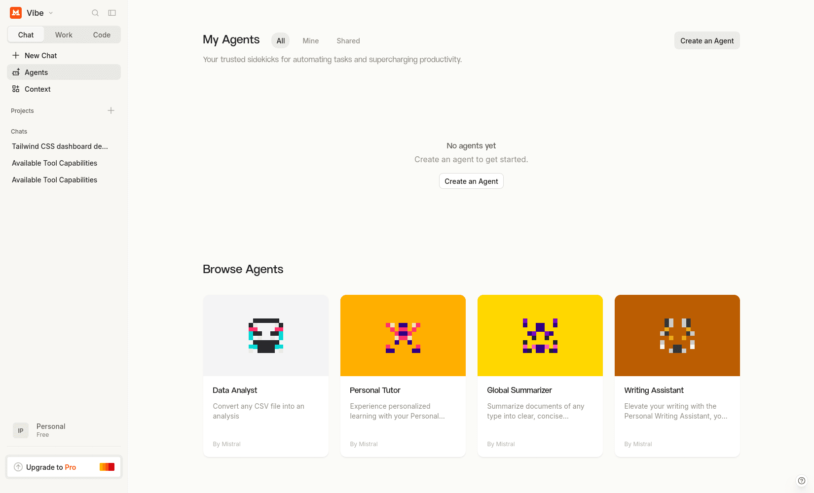
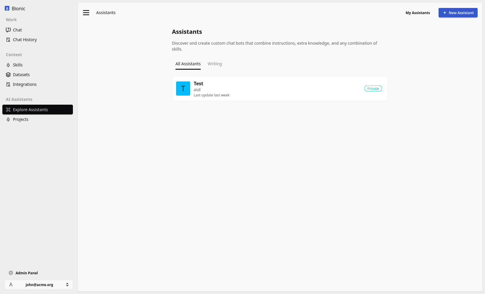

# When to Build an Agent

Modern chat systems already include many of the primitives that teams expect from an agent platform: tools, files, projects, memory, datasets, skills, sandboxes, scheduled tasks, integrations, and generated artifacts.

Before building a separate agent application, ask whether the existing AI computer can support the workflow well enough.

The argument is not that custom agents are unnecessary. It is that “build an agent” should not be the default answer before the existing environment has been tested.

## Named Agents Are Packaging

A named agent or assistant is usually a reusable bundle of:

* instructions;
* model choice;
* tools and integrations;
* skills;
* datasets or other knowledge;
* permissions and defaults.

That packaging is useful when many users need the same entry point and should not recreate the configuration manually.

It does not necessarily create a new runtime. The named agent often operates inside the same conversational environment as every other assistant.

  <figure class="overflow-hidden rounded-xl border border-slate-200 bg-slate-50 shadow-sm">
    
    <figcaption class="px-3 py-2 text-sm font-semibold text-slate-600">ChatGPT GPTs</figcaption>
  </figure>
  <figure class="overflow-hidden rounded-xl border border-slate-200 bg-slate-50 shadow-sm">
    
    <figcaption class="px-3 py-2 text-sm font-semibold text-slate-600">Mistral Agents</figcaption>
  </figure>
  <figure class="overflow-hidden rounded-xl border border-slate-200 bg-slate-50 shadow-sm">
    
    <figcaption class="px-3 py-2 text-sm font-semibold text-slate-600">Bionic Assistants</figcaption>
  </figure>

Named agents become a problem when an organisation creates a separate assistant for every narrow task. The result is a catalog that users must understand and maintain, even though the underlying tools and context could have supported the same work in one flexible workspace.

## Real Work Crosses Boundaries

Users do not organise their work around neat product categories.

One request may require the AI computer to:

1. research a topic;
2. inspect uploaded files;
3. query a connected system;
4. analyse a dataset;
5. generate a chart;
6. draft an email;
7. create a presentation;
8. schedule a follow-up.

A narrowly built agent may perform one step well, but the user still has to move information between separate workflows. General-purpose chat workspaces are powerful because the model can combine the available capabilities around the outcome.

## The Use Case Ladder

Start with the least specialised solution that can satisfy the workflow.

### 1. Start with Chat

Use ordinary chat when the task can be completed with prompting, uploads, built-in tools, and generated outputs.

This is the fastest way to test whether the model is capable of the work and whether users find the result valuable.

### 2. Add a Project

Use a project when the work needs persistent instructions, reusable files, prior decisions, or an ongoing workspace.

The project gives the user continuity without constraining every conversation to one narrow workflow.

### 3. Package a Named Agent

Create a named agent when a repeated workflow needs a standard set of instructions, skills, datasets, integrations, permissions, or defaults.

This improves discovery and consistency. It is still using the platform runtime rather than creating another application.

### 4. Build a Product

Build a dedicated application when the workflow requires guarantees or interactions that the conversational environment cannot provide.

Common build thresholds include:

* durable domain and workflow state;
* fine-grained permissions beyond the chat platform;
* formal approvals and separation of duties;
* transactional actions and idempotency;
* reliable background processing and retries;
* complex orchestration across many systems;
* audit, compliance, or reporting requirements;
* a fixed user experience for a high-volume task;
* operational ownership, monitoring, and service-level objectives.

At this point, the custom application is buying more than a prompt and a tool loop. It is providing product-level guarantees.

## Evaluate Before You Build

Test the workflow with representative users and real examples:

1. Can normal chat complete the task?
2. Do files, datasets, tools, and skills provide the required context and method?
3. Does a project provide enough continuity?
4. Would a named agent make the workflow easier to discover and repeat?
5. Which concrete guarantee is missing from the existing runtime?
6. Is that missing guarantee valuable enough to justify owning another application?

If the workflow works in the existing environment, the highest-return investment may be adoption, training, and better reusable context rather than new software.

Build when the evidence shows that the workflow needs a product. Until then, use the AI computer you already have.
