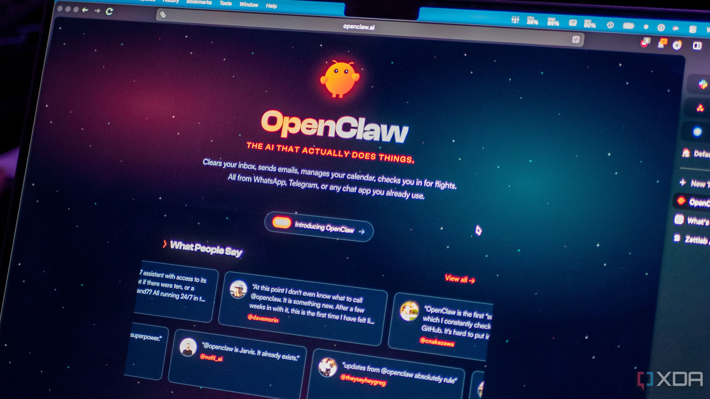
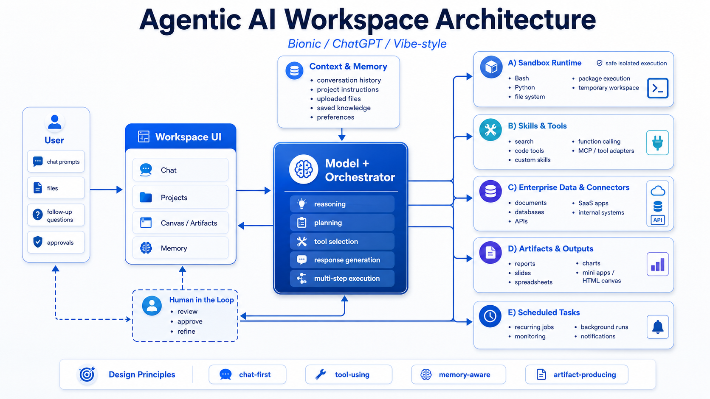

# From Chatbot to AI Computer

In [Understanding Tool Calls](/architect-course/020-basics-of-tool-calls/010-understanding-tool-calls/), we asked a model:

> What is the price of Bitcoin today in USD?

The model could not answer from its training data because the price changes constantly. We solved that problem by giving it a purpose-built tool named `get_bitcoin_price_usd`.

That tool adds one useful capability. If we want the model to retrieve an exchange rate, inspect a CSV, resize an image, or generate a report, we could keep adding purpose-built tools. Alternatively, we can give the model a working environment containing software that already knows how to perform many of those tasks.

This is the shift from chatbot to **AI computer**.

An AI computer is a conversational workspace in which a model can inspect and create files, execute commands or code, use installed tools and skills, maintain working context, connect to external systems, schedule future work, and produce finished artifacts.

Here, “AI computer” describes the software environment around the model. It does not mean AI-specific hardware, a GPU workstation, or a consumer “AI PC.”

[OpenClaw](https://docs.openclaw.ai/agent) made this shift easy to see. It
connected the model to a workspace and tools on your computer, allowing it to
read and change files, run commands, and use existing software. The model could
then handle many kinds of work without a separate tool or agent being designed
for every request.



## Give the Model a Computer

Let us ask the Bitcoin question again. This time we will not provide a Bitcoin-specific tool. We will provide one general tool that can execute a Bash command inside an isolated environment:

```json
{
  "type": "function",
  "function": {
    "name": "exec_bash",
    "description": "Execute a Bash command in an isolated workspace and return stdout and stderr.",
    "parameters": {
      "type": "object",
      "properties": {
        "command": {
          "type": "string",
          "description": "The Bash command to execute."
        }
      },
      "required": ["command"],
      "additionalProperties": false
    }
  }
}
```

The user still asks:

```txt
What is the price of Bitcoin today in USD?
```

The model knows that it needs current information. It also knows that `curl` can make an HTTP request, so it can use the general execution tool to call a public price API:

```json
{
  "role": "assistant",
  "content": "",
  "tool_calls": [
    {
      "name": "exec_bash",
      "arguments": {
        "command": "curl --fail --silent --show-error https://api.coinbase.com/v2/prices/BTC-USD/spot"
      }
    }
  ]
}
```

The model does not execute this command itself. The application receives the tool call, runs the command inside the permitted sandbox, and returns stdout and stderr.

A successful command returns JSON similar to this:

```json
{
  "data": {
    "amount": "64251.42",
    "base": "BTC",
    "currency": "USD"
  }
}
```

The amount above is illustrative. Bitcoin prices change continuously.

The application adds the command result to the conversation, and the model can now answer:

```txt
Bitcoin is currently trading at approximately $64,251.42 USD.
```

The agentic loop is the same as before: the model requests a tool, the application executes it, and the result is returned to the model. What changed is the breadth of the tool.

## Minimum Tools

Mistral Vibe exposes a small set of general tools that the model can combine
around the request in front of it.

<section class="not-prose my-8 rounded-xl border border-slate-200 bg-slate-50 p-6 shadow-sm" aria-label="Mistral Vibe minimum toolset">
  <p class="mb-1 text-sm font-semibold uppercase tracking-wide text-slate-500">Mistral Vibe</p>
  <h3 class="mb-6 text-2xl font-bold text-slate-900">A minimum toolset</h3>
  <div class="grid grid-cols-1 gap-3 sm:grid-cols-2">
    <div class="rounded-lg border border-slate-200 bg-white p-4">
      <code class="font-semibold text-slate-900">exec_bash</code>
      <p class="mt-1 text-sm text-slate-600">Run shell commands</p>
    </div>
    <div class="rounded-lg border border-slate-200 bg-white p-4">
      <code class="font-semibold text-slate-900">exec_python</code>
      <p class="mt-1 text-sm text-slate-600">Execute Python</p>
    </div>
    <div class="rounded-lg border border-slate-200 bg-white p-4">
      <code class="font-semibold text-slate-900">search_tool</code>
      <p class="mt-1 text-sm text-slate-600">Discover available capabilities</p>
    </div>
    <div class="rounded-lg border border-slate-200 bg-white p-4">
      <code class="font-semibold text-slate-900">read_file</code>
      <p class="mt-1 text-sm text-slate-600">Inspect workspace files</p>
    </div>
    <div class="rounded-lg border border-slate-200 bg-white p-4">
      <code class="font-semibold text-slate-900">write_file</code>
      <p class="mt-1 text-sm text-slate-600">Create or update files</p>
    </div>
    <div class="rounded-lg border border-slate-200 bg-white p-4">
      <code class="font-semibold text-slate-900">search_replace</code>
      <p class="mt-1 text-sm text-slate-600">Make targeted edits</p>
    </div>
  </div>
</section>

In the following sections, we will show how this small toolset can cover a
large range of the work users ask the model to perform.

## The Architecture We Will Explore

The following lessons explore how the runtime, files, tools, skills, memory,
integrations, and outputs fit together around the model.

<figure class="not-prose my-8 overflow-hidden rounded-xl border border-slate-200 bg-white shadow-sm">
  
</figure>
