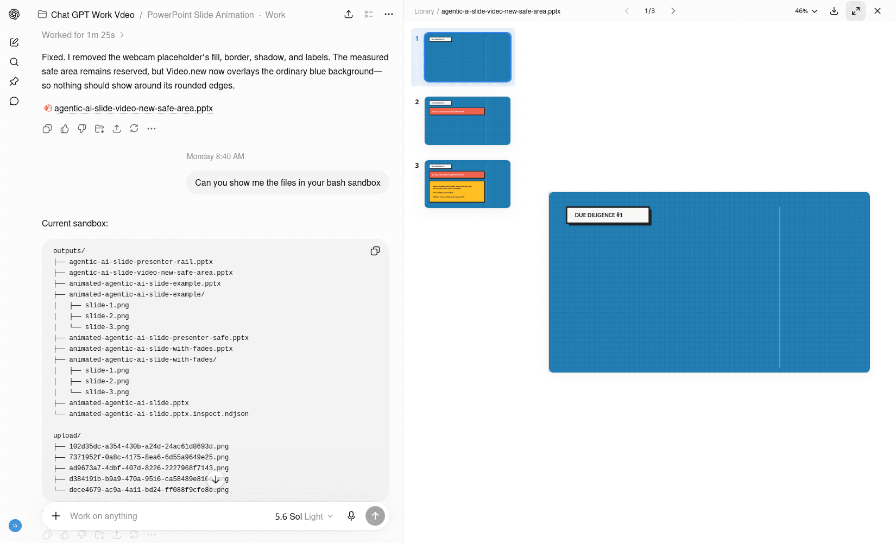
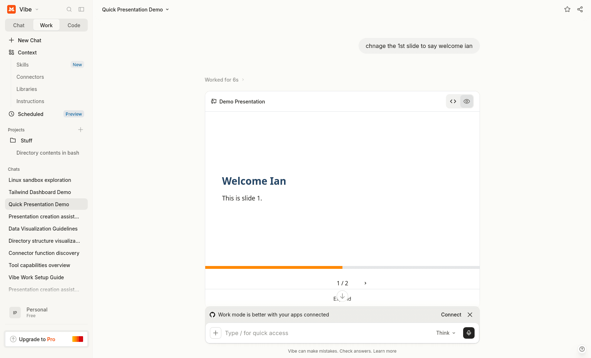
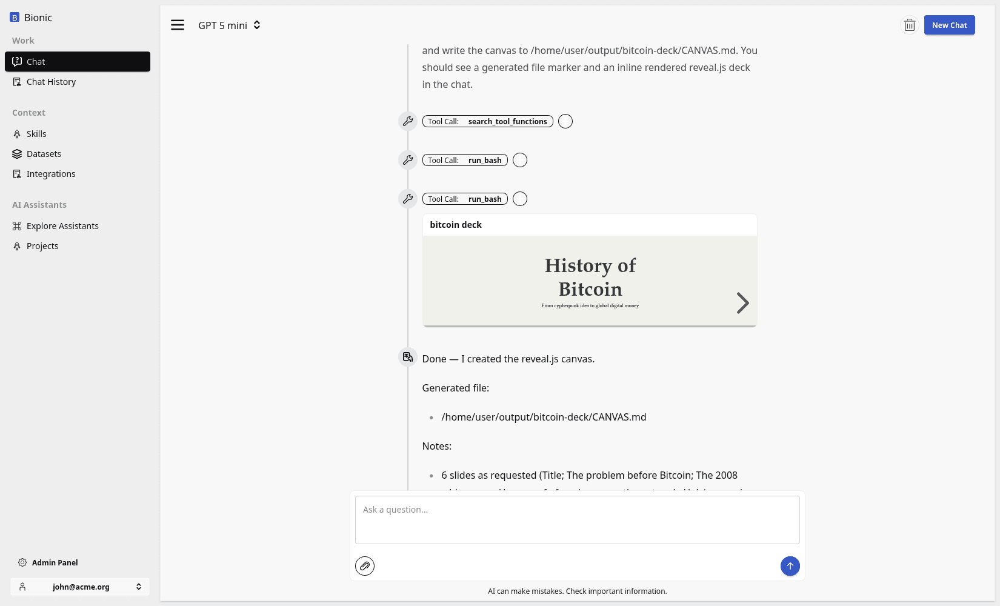

# Presenting Results

An AI computer can research a topic, analyse data, create files, and produce a finished artifact. That does not always mean the work is ready to use.

A human may still need to understand the result, check its assumptions, correct mistakes, or approve what happens next. The way the result is presented is therefore part of the workflow.

## Artifacts and Presentation Surfaces

An **artifact** is the output created by the model: a document, spreadsheet, chart, presentation, HTML page, image, or other durable file.

A **presentation surface** is how that output is shown to a person. It might be a slide deck, table, canvas, dashboard, map, preview, or interactive interface.

The same underlying information can be presented in different ways:

| Need | Useful presentation surface |
| --- | --- |
| Explain a recommendation as a narrative | Presentation or document |
| Compare exact values | Table or spreadsheet |
| Monitor changing metrics | Dashboard |
| Explore locations or geographic patterns | Map |
| Review a visual design | Canvas or preview |
| Investigate data from different angles | Interactive chart or interface |

The appropriate format depends on the audience and the decision they need to make.

## The Human-in-the-Loop Cycle

Presenting the result makes the model's work inspectable. It creates a natural checkpoint between generation and action:

1. The model performs the work and produces an artifact.
2. The chat interface renders the artifact in a useful form.
3. A person reviews the result, its evidence, and its assumptions.
4. The person approves it or provides corrections.
5. The model revises the artifact or the workflow continues.

The human is not limited to accepting or rejecting a final answer. They can steer the work while it is still taking shape.

## Example: Creating a Presentation

Imagine that you want an AI computer to research a topic and prepare a presentation. A useful prompt could be:

```txt
Research how agentic AI is changing internal knowledge work.

Before creating the presentation:
1. Propose a six-slide outline.
2. List the evidence you plan to use for each slide.
3. Show me the outline for review.

After I approve the outline, create the presentation with:
- a clear argument;
- concise slide text;
- charts or diagrams where they improve understanding;
- source links and explicit assumptions;
- a final slide with recommended next steps.
```

The first response is a review point, not the finished artifact. You might ask the model to change the audience, remove a weak claim, add missing evidence, or restructure the story.

Once the outline is approved, the model can create the presentation. The chat interface can render a preview so you can check the visual hierarchy, wording, charts, and sources before downloading or sharing the file.

If something is wrong, the conversation continues:

```txt
Slide four is too technical for an executive audience.
Replace the implementation detail with a risk-and-controls summary,
then regenerate the presentation.
```

The artifact is revised without starting the workflow again or manually editing every slide.

## Rich Responses

Models are no longer limited to paragraphs of text. They can create charts, tables, maps, HTML, slides, dashboards, and interactive artifacts.

That matters because many custom agent demonstrations are really custom user-interface demonstrations: “the agent produces a polished report,” “the agent creates a dashboard,” or “the agent shows an interactive result.”

If the chat interface can render the artifact directly, a separate application may not be necessary for the first version. The conversational workspace can be used to test the workflow with real users. A dedicated product becomes valuable when repeated use demands a fixed interface, stronger permissions, durable workflow state, or operational guarantees.

<div class="not-prose my-8 grid grid-cols-1 gap-4 md:grid-cols-3">
  <figure class="overflow-hidden rounded-xl border border-slate-200 bg-slate-50 shadow-sm">
    
    <figcaption class="px-3 py-2 text-sm font-semibold text-slate-600">ChatGPT Canvas</figcaption>
  </figure>
  <figure class="overflow-hidden rounded-xl border border-slate-200 bg-slate-50 shadow-sm">
    
    <figcaption class="px-3 py-2 text-sm font-semibold text-slate-600">Mistral Vibe Canvas</figcaption>
  </figure>
  <figure class="overflow-hidden rounded-xl border border-slate-200 bg-slate-50 shadow-sm">
    
    <figcaption class="px-3 py-2 text-sm font-semibold text-slate-600">Bionic GPT Canvas</figcaption>
  </figure>
</div>

## Presentation Is Part of the System

The presentation surface is not decoration added after the model has finished. It determines whether a person can understand the result, verify it, and decide what to do next.

Presentations are one form of this human checkpoint. Other workflows may need inline corrections, approvals, comparisons, tracked changes, or formal sign-off. In each case, the AI computer performs the work while the interface gives a person an effective place to participate.
