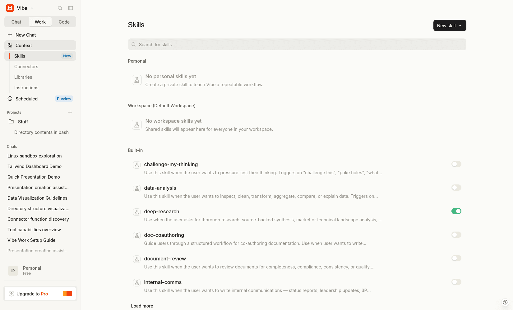
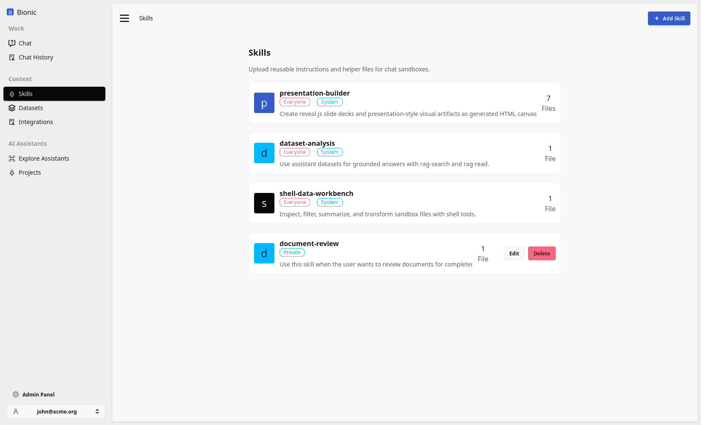
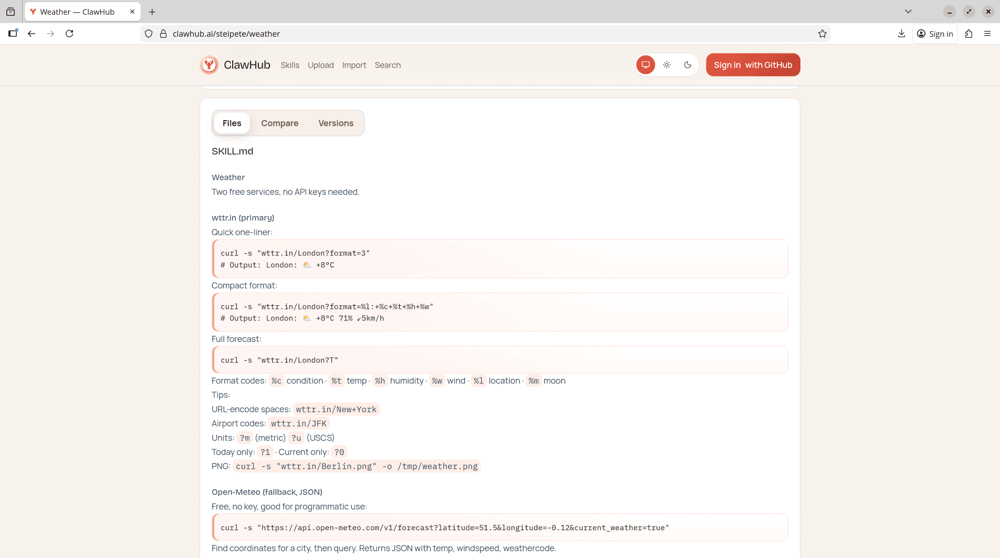

# Skills

Skills are packaged know-how.

They give a model a repeatable method for completing a task: how to create a presentation, analyse a dataset, write in a company style, use a tool correctly, or follow a domain-specific process.

This is different from tools and datasets:

| Component | What it provides |
| --- | --- |
| Tool | A capability the model can invoke |
| Dataset | Knowledge the model can retrieve |
| Skill | Instructions for applying capabilities and knowledge well |

A tool might let the model execute Bash. A dataset might contain quarterly results. A skill can explain how to turn those results into an executive presentation using the available commands, templates, and output conventions.

<div class="not-prose my-8 grid grid-cols-1 gap-4 md:grid-cols-3">
  <figure class="overflow-hidden rounded-xl border border-slate-200 bg-slate-50 shadow-sm">
    
    <figcaption class="px-3 py-2 text-sm font-semibold text-slate-600">ChatGPT Skills</figcaption>
  </figure>
  <figure class="overflow-hidden rounded-xl border border-slate-200 bg-slate-50 shadow-sm">
    
    <figcaption class="px-3 py-2 text-sm font-semibold text-slate-600">Mistral Vibe Skills</figcaption>
  </figure>
  <figure class="overflow-hidden rounded-xl border border-slate-200 bg-slate-50 shadow-sm">
    
    <figcaption class="px-3 py-2 text-sm font-semibold text-slate-600">Bionic GPT Skills</figcaption>
  </figure>
</div>

## Why Package a Workflow?

A one-off instruction belongs in the current prompt. A method that people use repeatedly is a candidate for a skill.

Packaging the method has several advantages:

* users do not need to remember the complete procedure;
* the same conventions can be applied across conversations;
* examples, templates, and scripts can travel with the instructions;
* improvements can be made once and reused;
* the base prompt stays focused instead of containing every specialist workflow.

A skill is useful when quality depends on **how** the work is performed, not only on whether the model has access to a tool.

## Anatomy of a Skill

Every skill has a `SKILL.md` file at its root. It describes when the skill should be used and the workflow the model should follow.

A skill can also contain supporting resources:

```txt
presentation-builder/
├── SKILL.md
├── bin/
│   └── build-reveal-canvas.sh
├── templates/
│   └── company-briefing.html
└── examples/
    └── quarterly-review.md
```

The supporting files are part of the working environment. Instructions can tell the model to inspect a template, run a deterministic helper, or follow an example instead of recreating the method from scratch.

Good skills state:

* when they apply;
* the required inputs;
* the steps to follow;
* the tools and supporting files to use;
* where to save the result;
* how to check that the work is complete.

## Progressive Disclosure

Loading every skill into every prompt would consume context and distract the model. Instead, the runtime initially provides a small catalog containing only each available skill's name, description, and location:

```xml
<available_skills>
  <skill>
    <name>presentation-builder</name>
    <description>Create presentation-style visual artifacts.</description>
    <location>/home/user/skills/presentation-builder/SKILL.md</location>
  </skill>
</available_skills>
```

The complete instructions remain in the virtual filesystem until the model needs them.

The flow is:

1. The runtime determines which skills are available to the user and model.
2. It adds their summaries to `<available_skills>`.
3. The model selects a skill when its description matches the request.
4. The model reads the referenced `SKILL.md`.
5. It follows the workflow using the permitted sandbox tools and skill files.
6. If no skills are available, the catalog is omitted.

This keeps the base prompt small while making specialist workflows discoverable.

## Example: Building a Presentation

Suppose the user asks:

```txt
Create a six-slide presentation explaining our quarterly results
to an executive audience.
```

The model sees that `presentation-builder` applies and reads:

```txt
/home/user/skills/presentation-builder/SKILL.md
```

The skill tells the model which presentation format to produce, how to structure the slides, which bundled helper to use, and where to save the artifact.

A typical workflow is:

1. Inspect the source material and draft the slide structure.
2. Write the slide content to a temporary working file.
3. Run the skill's presentation helper.
4. Save the finished canvas under:

   ```txt
   /home/user/output/<presentation-name>/CANVAS.md
   ```

5. Check that the artifact is self-contained and report its generated path.

The Bash tool provides execution. The virtual filesystem provides the source files and output location. The skill provides the method that combines them into a presentation the chat interface can render.

This is a useful example of why many repeated behaviours do not need a separately implemented agent. The same conversational runtime can load different packages of know-how as the task changes.

## Skills Do Not Replace Tools

A skill cannot create a capability that the runtime does not provide. Instructions to query a database are only useful if the environment has an authorised database tool. Instructions to create an artifact need file-writing and execution capabilities.

Likewise, a tool definition usually should not contain a long operating procedure. Its schema should describe the operation and its arguments. The skill can describe when to call it, how to combine it with other tools, and how to validate the result.

Use:

* a **prompt** for a one-off request;
* a **tool** for an executable capability;
* a **dataset** for reusable source knowledge;
* a **skill** for a reusable method.

## Skills from Other Sources

Skills can be distributed through catalogs as well as created inside an organisation. The weather skill below is an example from ClawHub:



- [ClawHub weather skill](https://clawhub.ai/steipete/weather)

The same discovery flow applies: the model sees the description, reads the skill instructions when relevant, and follows them using the capabilities available in its sandbox.

## Review Skills Before Use

Skills influence model behaviour and can instruct it to run commands or access files. Treat imported skills as software:

* review the source and provenance;
* inspect scripts and supporting files;
* check which tools, paths, and network destinations they require;
* avoid embedding credentials in instructions;
* test with representative and adversarial prompts;
* version changes and re-run the tests when the runtime changes.

A focused skill with explicit inputs, outputs, and checks is easier to trust than a vague collection of instructions.

## A Skill Is Not an Agent

A skill does not create another autonomous system. It adds packaged know-how to the AI computer that already provides the model, tools, filesystem, context, and artifact handling.

The runtime remains responsible for permissions and execution. The model remains responsible for deciding when the skill applies and following its instructions. The skill makes that behaviour reusable.
