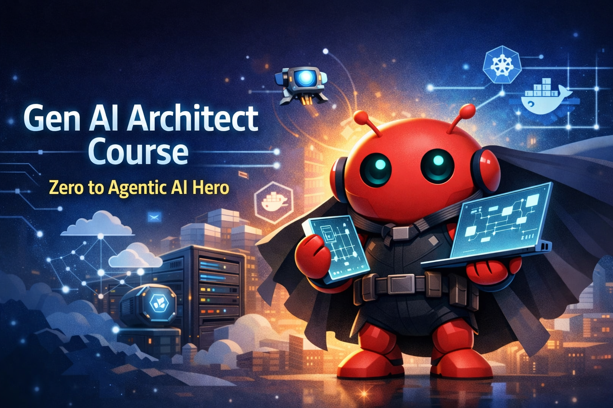

# Zero to Agentic AI Hero Overview

After this course you'll understand:

- **Standing up the lab** – Choosing Granite 4 Tiny, serving it through Ollama, launching Bionic with Docker Compose, and validating the model hookup.
- **Tool-call fundamentals** – How assistants request deterministic tools, how the UI mediates the workflow, and how to debug payloads end-to-end.
- **Enterprise integrations** – Connecting MCP services such as Postgres, importing OpenAPI specs, and attaching those capabilities to assistants safely.
- **Agent runtime capabilities** – Using sandboxes, memory, cron jobs, skills, OpenAPI toolsets, and documents/attachments.
- **Operations on Kubernetes** – Installing K3s, contrasting Compose vs. cluster deployments, and promoting the stack via the Bionic CLI.
- **Prompt engineering discipline** – Layering system/developer/user prompts while iterating through the `/api/chat` endpoint.

