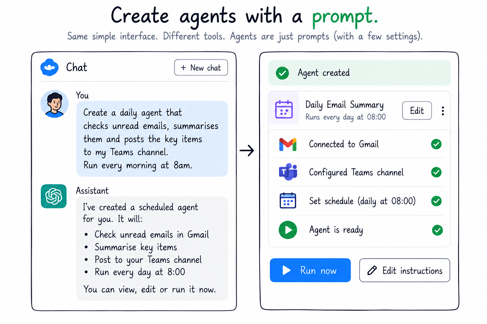
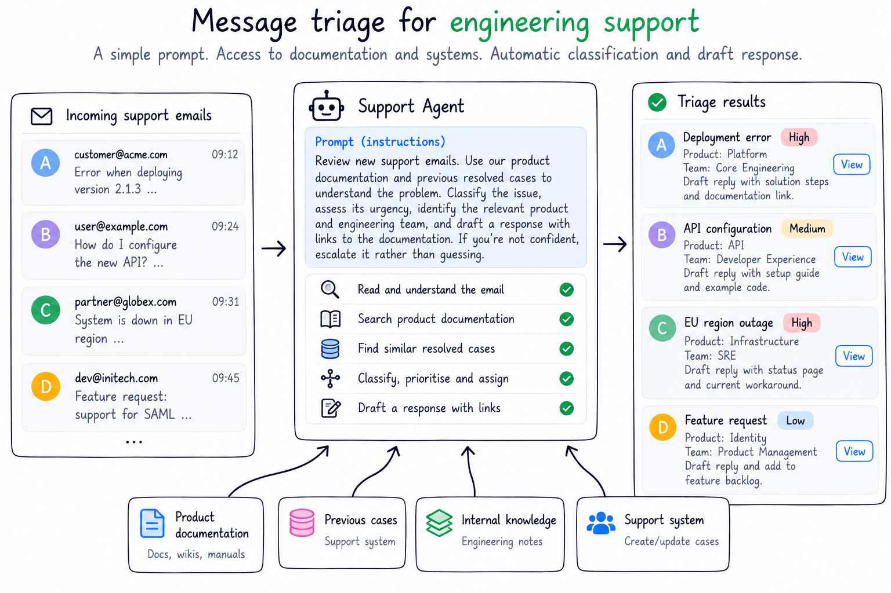
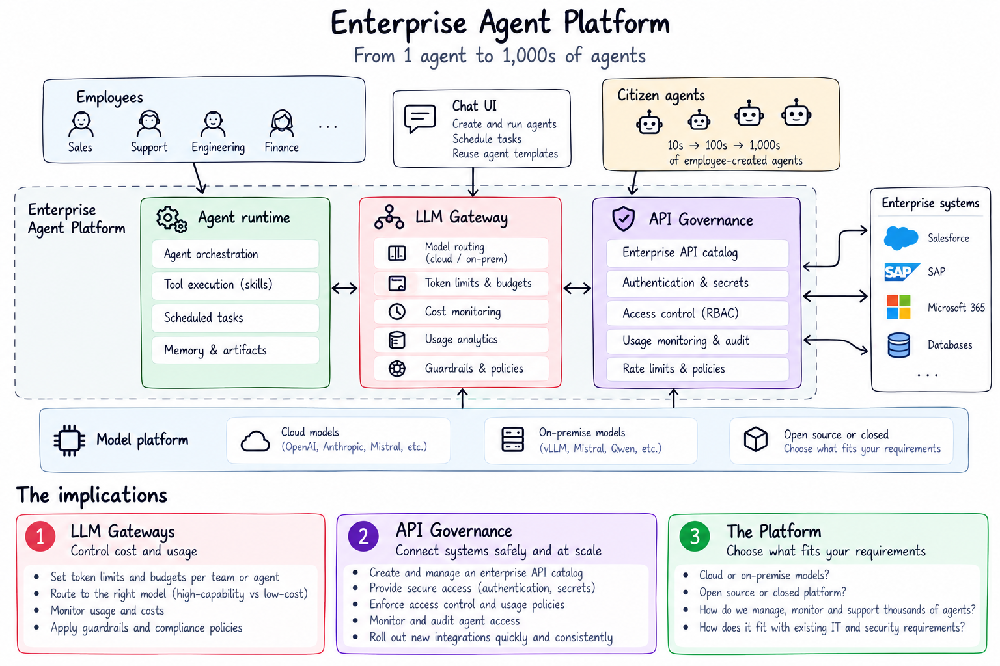

**Citizen Agent Development** is the practice of enabling non-technical employees to create and deploy AI agents for their own work. [Gartner](https://www.gartner.com/en/documents/6299715) describes this through no-code agent builders for citizen developers, while [appliedAI](https://www.appliedai.de/uploads/files/2603_AppliedAI_Whitepaper_AI_Maturity_26_EN_A4_04RZ_web_2026-03-02-132127_fiaq.pdf) explicitly calls the emerging practice *Citizen Agent Development*.

In this article, we'll take a look at some of the published information in the industry to understand what companies mean by agents, how these agents are created and what benefits, if any, they bring.

Here I've listed some of the articles that were used to put this information together.

- [**Prosus — 60,000+ agents built by 40,000 employees**](https://www.prosus.com/news-insights/2026/deploying-agentic-ai-at-scale-from-the-company-that-built-60000-agents?utm_source=chatgpt.com) — Built using its internal Toqan platform; Prosus identified 20 recurring high-value use-case patterns.

- [**Atos — 19,000 AI agents**](https://news.microsoft.com/source/2026/06/09/atos-group-and-microsoft-expand-strategic-collaboration-to-scale-secure-agentic-ai-across-atos-group-workforce-and-clients/?utm_source=chatgpt.com) — Reports managing 19,000 agents across the organization alongside 56,000 Copilot users.

- [**Atea — 10,000+ agents across 8,000 employees**](https://enablement.microsoft.com/en-us/ai-agents/transformation-stories/atea/?utm_source=chatgpt.com) — Microsoft says non-technical employees are building their own agents, dashboards and applications.

- [**Dow — 10,000+ AI agents**](https://www.microsoft.com/en/customers/story/25620-dow-microsoft-copilot-studio?utm_source=chatgpt.com) — Dow describes scaling an internal agent ecosystem using Copilot Studio, including citizen development alongside centrally managed solutions.

- [**Microsoft — 3+ million agents created with Copilot Studio**](https://blogs.microsoft.com/blog/2025/04/23/microsoft-2025-annual-work-trend-index-the-frontier-firm-is-born/?utm_source=chatgpt.com) — Microsoft reported that customers had created more than three million agents in the preceding year; this is ecosystem-wide rather than one company.

## How?

From what I can see, most of these agents are created via a prompt, so they require no code. You can see this with Mistral Vibe, ChatGPT and, of course, Bionic.

There's another aspect that's mentioned: training.

Employees were trained en masse to "build agents" using this mechanism, and after that usage increased a lot.



So it's safe to say that three things need to be in place.

1. An AI platform where users can create agents without writing code.
1. The platform must support tools, particularly connections to existing systems like email and authentication.
1. Training and advocacy. Employees create more agents after training sessions.

## What Types of Agents?

Based on [Prosus's analysis of 60,000+ employee-created AI agents](https://www.prosus.com/news-insights/2026/deploying-agentic-ai-at-scale-from-the-company-that-built-60000-agents), here's a selection of agents:

1. **Sales assistant** — prepare reps, identify opportunities and recommend next actions.
2. **Customer/churn analysis** — identify customers at risk and suggest interventions.
3. **Customer service assistant** — handle specialised customer queries and cases.
4. **Prospect/message triage** — classify inbound messages and leads, then route or act on them.
5. **Research & monitoring** — monitor news, competitors, markets and events.
6. **Data analysis & reporting** — analyse company data and generate reports.
7. **Demand & shortage forecasting** — analyse operational data and anticipate problems.
8. **Contract & invoice review** — extract, compare and validate business documents.
9. **Supplier & partner onboarding** — coordinate onboarding, communications and checks.
10. **Personal/employee assistant** — handle summaries, drafting, coordination and recurring knowledge work.

### Example - Message Triage

It's possible to imagine a prompt for message triage.

```
Review new support emails. 
Use our product documentation and previous resolved cases to understand the problem. 
Classify the issue, assess its urgency, 
identify the relevant product and engineering team, 
and draft a response with links to the supporting documentation. 
If you're not confident, escalate it rather than guessing.
```



That's quite a lot of value for such a short prompt.

## Benefits

Prosus in particular mentions agents saving time and money, or sometimes creating opportunities such as new revenue.

They also categorise agents by impact, such as saving one or two hours versus saving many hours.

So the articles do tend to support the view that enterprise agents are a good thing.

## The Implications

Straight away, we can see that if enterprises start to build out thousands of agents, people are going to start thinking about token usage.

There's also API governance: how do we give agents access to existing systems in a safe and compliant way?

The things I think we need to look at are...

- LLM Gateways - A way to put limits on token usage as well as monitor costs.
- API Governance - How do we connect our systems and roll that out as quickly as possible?
- The Platform - Which AI platform? Cloud, on-prem, open source or closed.




## The Future

Citizen Agent Development is only just starting. Once organisations have thousands or tens of thousands of agents, a new set of problems appears.

- **Model switching** — Not every agent needs the most capable model. Research such as [RouteLLM](https://arxiv.org/abs/2406.18665) explores automatically routing requests between stronger, expensive models and cheaper models while maintaining quality.

- **Intelligence up front** — A powerful model could create and validate a scheduled task, then turn it into explicit instructions that a much smaller model can execute repeatedly. This starts to resemble the emerging idea of using stronger models to generate supervision and workflows for weaker models.

- **Procedural memory** — Perhaps we don't need to create an agent at all. [Agent Workflow Memory](https://arxiv.org/abs/2409.07429) shows how agents can extract reusable workflows from previous experiences, while [LEGOMem](https://www.microsoft.com/en-us/research/publication/legomem-modular-procedural-memory-for-multi-agent-llm-systems-for-workflow-automation/) explores reusable procedural memory specifically for workflow automation. A user might eventually just say *"another customer — you fix it"* or *"kick off the bond rollover."*

- **Agent consolidation** — If tens of thousands of employee-created agents collapse into a relatively small number of recurring patterns, perhaps platforms can identify, share and improve those patterns rather than maintaining thousands of near-duplicates. [LifeMem](https://arxiv.org/abs/2609.12655) explores automatically discovering reusable skills by clustering previous agent trajectories around common workflows.

- **Evaluation** — We need to evaluate the complete deployed system — model, skills, memory, sandbox and enterprise integrations — rather than testing models in isolation. Benchmarks such as [τ-bench](https://arxiv.org/abs/2406.12045) and [AutomationBench](https://github.com/zapier/AutomationBench) are moving evaluation toward realistic tool-using agents, although there is still plenty of room for evaluation of complete enterprise platforms.


It's early. But I suspect we're starting to see some of the benefits of the agent hype across the enterprise.
