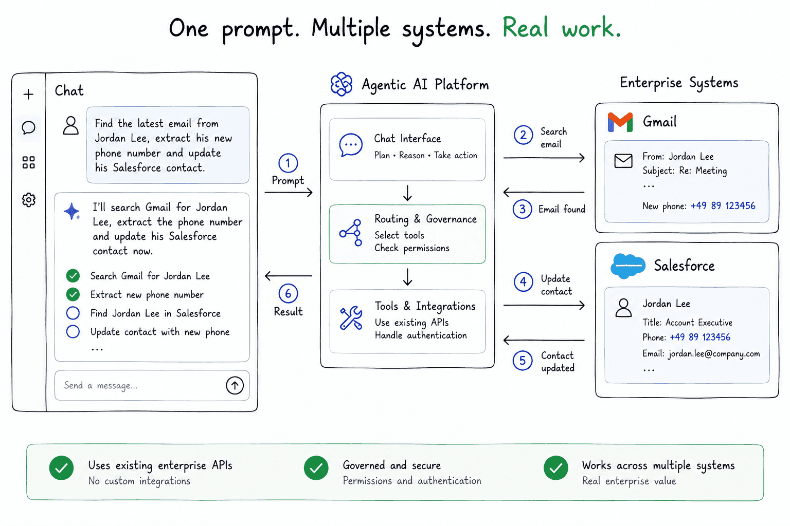
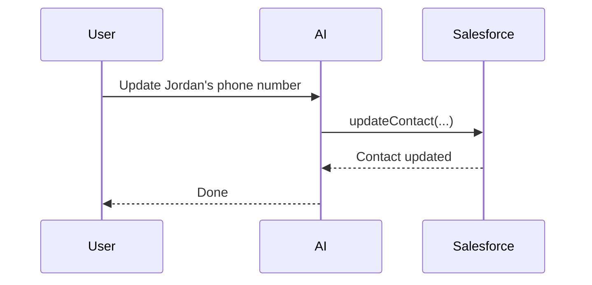
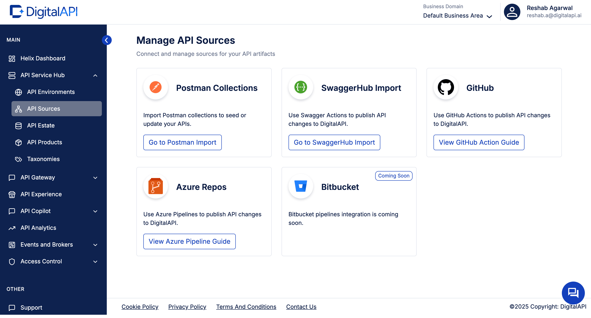
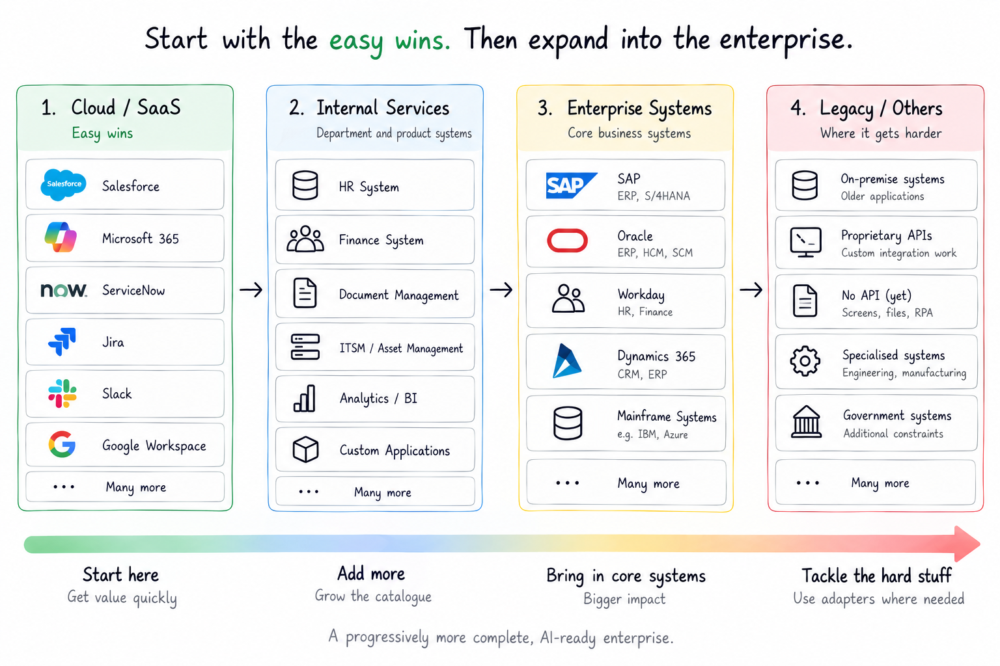
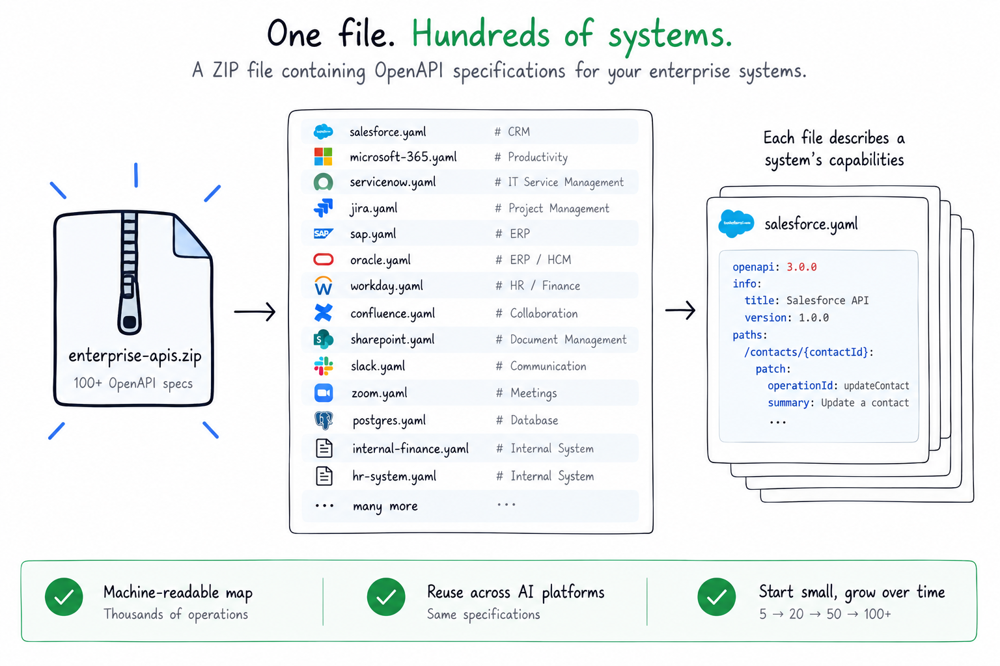
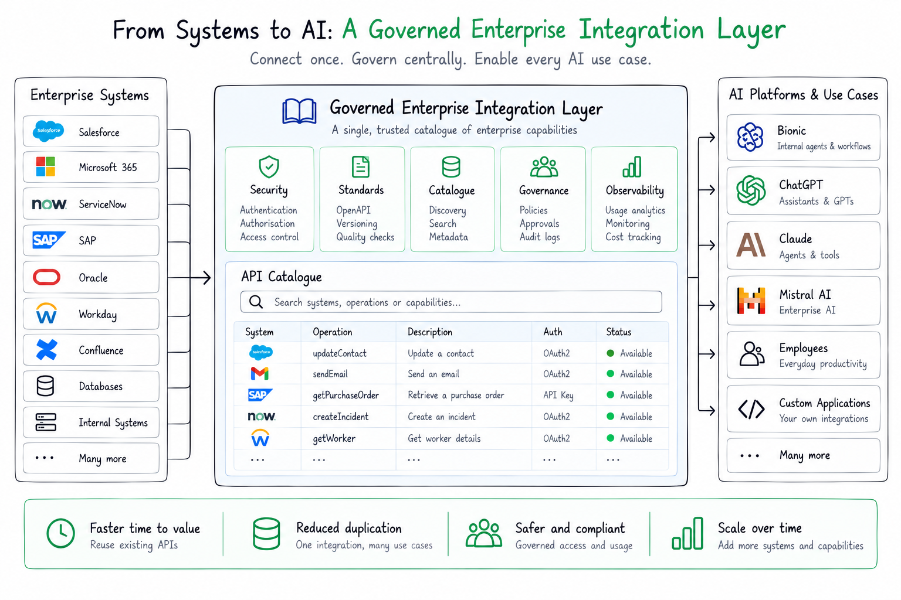

# Agentic AI: A Faster Path to Enterprise Integration

## The integration problem

This article looks at **one part of Agentic AI transformation**: connecting AI to the hundreds of systems that already exist inside a large enterprise.

Salesforce, SAP, ServiceNow, Microsoft 365, internal systems, legacy applications...

Potentially **hundreds of systems exposing thousands of API operations**.

How do we make all of that available to AI without turning every connection into its own engineering project?



---

## Machine Readable API Specifications

About a million years ago, we invented ways for computer systems to describe their APIs.

One standard that gained a *lot* of traction was **Swagger**, now known as **OpenAPI**.

An OpenAPI specification gives us a machine-readable description of what a system can do.

Here's a deliberately tiny example:

```json
{
  "paths": {
    "/contacts/{contactId}": {
      "patch": {
        "operationId": "updateContact",
        "parameters": [
          {
            "name": "contactId",
            "in": "path",
            "required": true
          }
        ]
      }
    }
  }
}
```

The real specifications are obviously much larger.

But the important thing is that we now have a machine-readable way to specify our systems:

> **Here is something this system can do, and here is how you call it.**

---

## LLMs can already call tools

Modern LLMs don't just generate text.

They can decide they need to call a tool and produce something conceptually like this:

```json
{
  "name": "updateContact",
  "arguments": {
    "contactId": "0038X00001ABC",
    "phone": "+49 89 123456"
  }
}
```

That looks *remarkably similar* to something we've already described in our OpenAPI specification.



And that gives us an interesting bridge between the **AI world** and the systems we already have.

---

## API Catalogs and Gateways

None of this is particularly new from an enterprise architecture perspective.

Companies have been **cataloguing, securing, documenting and governing APIs for years**.

Some enterprises may already have a large part of the answer sitting inside an API catalogue or API management platform.



So my first question would be:

> **What do we already have?**

---

## Mapping the enterprise

I'd start by finding out:

1. Do we already have an **API catalogue**?
2. Do we have an **API gateway**?
3. Are teams already maintaining **OpenAPI specifications**?

Then I'd go after the *easy wins*.

### Start with cloud services

Cloud services are an obvious place to start because many already expose mature APIs.

- Salesforce
- Microsoft 365
- ServiceNow
- Jira
- Slack

Then progressively move further into the enterprise.

**Internal services → backend systems → legacy applications → and, eventually, I'm looking at you SAP.**



I'm *not* suggesting we spend two years mapping every system before anyone is allowed to build anything with AI.

**Start small and grow the catalogue while people are already using it.**

---

## Imagine a ZIP file of OpenAPI specs

Imagine someone handed me this:

```text
enterprise-apis.zip

├── salesforce.yaml
├── microsoft-365.yaml
├── servicenow.yaml
├── jira.yaml
├── sap.yaml
├── workday.yaml
├── confluence.yaml
├── internal-finance.yaml
└── ...
```

Inside are good OpenAPI specifications for **100 enterprise systems**.



Potentially thousands of operations describing what those systems can actually *do*.

We've created something interesting:

> **A machine-readable map of a significant part of the enterprise.**

And importantly, we don't have to reach 100 before it's useful.

**5 is useful.**

**20 is more useful.**

**50 is better again.**

The capability surface grows over time.

---

## A governed enterprise capability catalogue

Now we're getting somewhere interesting.

Instead of every AI project independently figuring out how to talk to Salesforce, SAP or ServiceNow, we have a **reusable catalogue of enterprise capabilities**.



Now:

- Authentication can be managed.
- Access can be governed.
- Specifications can be versioned.
- Operations can be tested.
- Capabilities can be reused.
- Multiple AI platforms can consume them.

Most importantly:

> **Every system we add makes the next AI use case easier.**

---

## Why not MCP?

At this point there's an obvious question.

**Why not just create MCP servers for everything?**

MCP is useful.

But I think we need to be careful about *which layer becomes our source of truth*.


The enterprise already has APIs.

Those APIs aren't only there for AI. They're used by applications, integrations, developers and other systems.

My preference is therefore to keep the **API definition as the durable enterprise asset**.

> **OpenAPI describes the enterprise capability.**

MCP, tool calling or whatever comes next can be ways of exposing that capability to AI.

What I don't want to create is **another parallel integration estate that exists only for AI**.

---

## Conclusion

Connecting enterprise systems is only **one part of an Agentic AI transformation**.

But it's an important one.

If every new AI use case requires another team to hand-build integrations into the same enterprise systems, we're going to move slowly.

A reusable, governed catalogue of enterprise capabilities gives us another route.

**Start with what's easy.**

**Grow it continuously.**

And make the enterprise progressively more accessible to AI.
