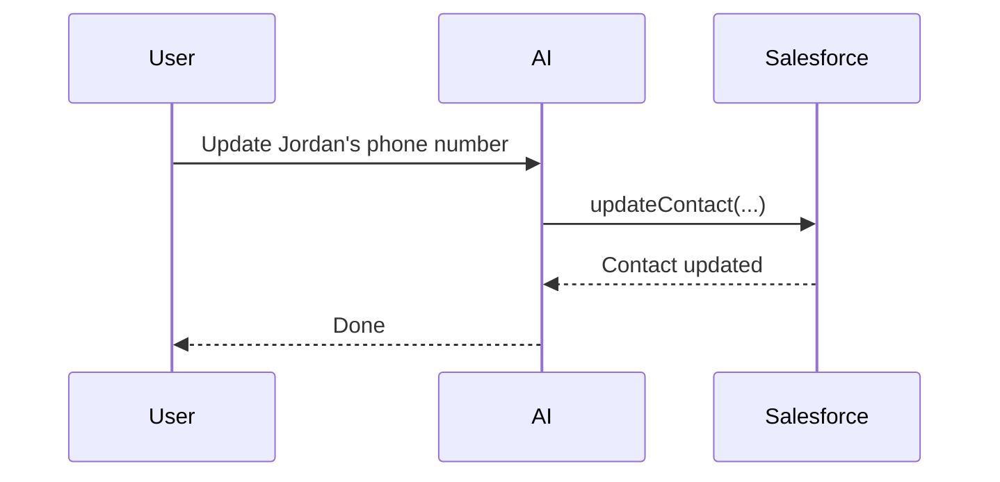
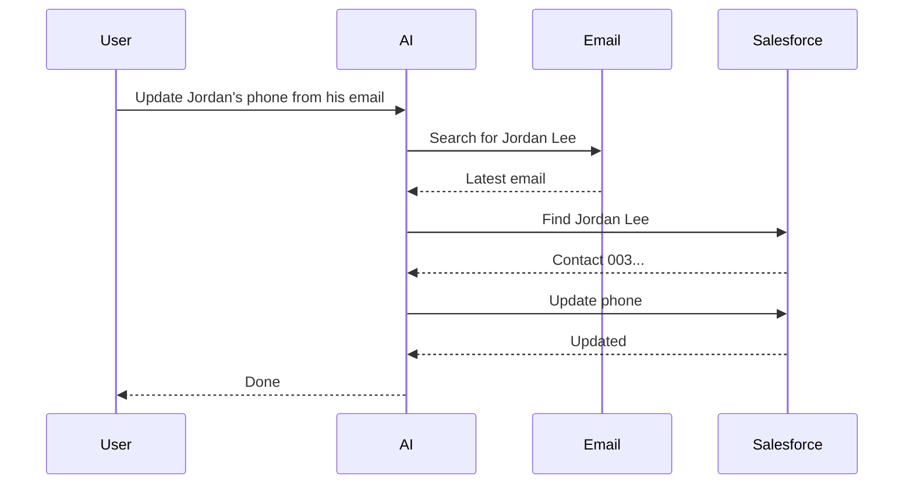
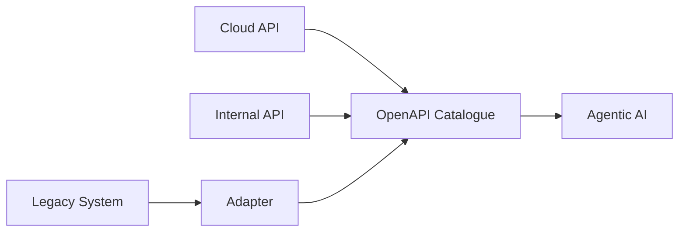

# Agentic AI: A Faster Path to Enterprise Integration

## The integration problem

This article looks at **one part of Agentic AI transformation**: connecting AI to the hundreds of systems that already exist inside a large enterprise.

Salesforce, SAP, ServiceNow, Microsoft 365, internal systems, legacy applications...

Potentially **hundreds of systems exposing thousands of API operations**.

How do we make all of that available to AI without turning every connection into its own engineering project?


---

## OpenAPI has been around forever

About a million years ago, we invented ways for computer systems to describe their APIs.

One standard that gained a *lot* of traction was **Swagger**, now known as **OpenAPI**.

An OpenAPI specification gives us a machine-readable description of what a system can do.

Here's a deliberately tiny example:

```json
{
  "paths": {
    "/contacts/{contactId}": {
      "patch": {
        "operationId": "updateContact",
        "parameters": [
          {
            "name": "contactId",
            "in": "path",
            "required": true
          }
        ]
      }
    }
  }
}
```

The real specifications are obviously much larger.

But the important thing is that we now have a machine-readable definition saying:

> **Here is something this system can do, and here is how you call it.**

### Authentication and governance

The API definition is only part of the story.

We also need to know:

- How do I authenticate?
- Who is allowed to call this?
- Which environment am I connecting to?
- What data can this operation access?

This is where we can start introducing **governance** rather than leaving every AI application to solve these problems independently.


---

## LLMs can already call tools

Modern LLMs don't just generate text.

They can decide they need to call a tool and produce something conceptually like this:

```json
{
  "name": "updateContact",
  "arguments": {
    "contactId": "0038X00001ABC",
    "phone": "+49 89 123456"
  }
}
```

That looks *remarkably similar* to something we've already described in our OpenAPI specification.



And that gives us an interesting bridge between the **AI world** and the systems we already have.

---

## We already have API management

None of this is particularly new from an enterprise architecture perspective.

Companies have been **cataloguing, securing, documenting and governing APIs for years**.

Some enterprises may already have a large part of the answer sitting inside an API catalogue or API management platform.


So my first question would be:

> **What do we already have?**

---

## Mapping the enterprise

I'd start by finding out:

1. Do we already have an **API catalogue**?
2. Do we have an **API gateway**?
3. Are teams already maintaining **OpenAPI specifications**?

Then I'd go after the *easy wins*.

### Start with cloud services

Cloud services are an obvious place to start because many already expose mature APIs.

- Salesforce
- Microsoft 365
- ServiceNow
- Jira
- Slack


Then progressively move further into the enterprise.

**Internal services → backend systems → legacy applications → and, eventually, I'm looking at you SAP.**


I'm *not* suggesting we spend two years mapping every system before anyone is allowed to build anything with AI.

**Start small and grow the catalogue while people are already using it.**

---

## Let's start with two systems

Let's make this concrete.

We'll start with **email and Salesforce**.

Here's our task:

> *Find the latest email from Jordan Lee, extract his new phone number and update his contact in Salesforce.*


The AI needs to:

1. Search email.
2. Find the right message.
3. Extract the new phone number.
4. Find Jordan in Salesforce.
5. Update his contact.



Two completely different enterprise systems.

One task.

---

## Let's actually run it

I've been building a simulator for exactly this kind of testing.

It exposes realistic enterprise APIs so I can test whether an AI system can actually complete these tasks rather than just demonstrate them in a slide deck.


I can load those OpenAPI specifications into **Bionic**.


And run the task.


Great.

We've connected **two systems**.

But now let's scale the idea.

---

## Imagine a ZIP file of OpenAPI specs

Imagine someone handed me this:

```text
enterprise-apis.zip

├── salesforce.yaml
├── microsoft-365.yaml
├── servicenow.yaml
├── jira.yaml
├── sap.yaml
├── workday.yaml
├── confluence.yaml
├── internal-finance.yaml
└── ...
```

Inside are good OpenAPI specifications for **100 enterprise systems**.


Potentially thousands of operations describing what those systems can actually *do*.

We've created something interesting:

> **A machine-readable map of a significant part of the enterprise.**

And importantly, we don't have to reach 100 before it's useful.

**5 is useful.**

**20 is more useful.**

**50 is better again.**

The capability surface grows over time.

---

## Not everything will have OpenAPI

Of course, the real world is messy.

Some systems will already have excellent OpenAPI specifications.

Some will have APIs but poor specifications.

Some will need an adapter.

And some legacy systems will require considerably more work.




The important thing is that we can **progressively bring those capabilities into the same model**.

---

## A governed enterprise capability catalogue

Now we're getting somewhere interesting.

Instead of every AI project independently figuring out how to talk to Salesforce, SAP or ServiceNow, we have a **reusable catalogue of enterprise capabilities**.


Now:

- Authentication can be managed.
- Access can be governed.
- Specifications can be versioned.
- Operations can be tested.
- Capabilities can be reused.
- Multiple AI platforms can consume them.

Most importantly:

> **Every system we add makes the next AI use case easier.**

---

## Why not MCP?

At this point there's an obvious question.

**Why not just create MCP servers for everything?**

MCP is useful.

But I think we need to be careful about *which layer becomes our source of truth*.


The enterprise already has APIs.

Those APIs aren't only there for AI. They're used by applications, integrations, developers and other systems.

My preference is therefore to keep the **API definition as the durable enterprise asset**.

> **OpenAPI describes the enterprise capability.**

MCP, tool calling or whatever comes next can be ways of exposing that capability to AI.

What I don't want to create is **another parallel integration estate that exists only for AI**.

---

## Start with the easy stuff

This doesn't need to begin as a huge transformation programme.


Start with the systems that are easiest to connect.

**Make them available. Start using them. Keep adding more.**

Five systems become twenty.

Twenty become fifty.

Fifty become a hundred.

Over time we build a **governed, machine-readable map of what our enterprise systems can do**.

And every system we add becomes available to the *next agent, the next use case and the next AI platform*.

---

## Conclusion

Connecting enterprise systems is only **one part of an Agentic AI transformation**.

But it's an important one.

If every new AI use case requires another team to hand-build integrations into the same enterprise systems, we're going to move slowly.

A reusable, governed catalogue of enterprise capabilities gives us another route.

**Start with what's easy.**

**Grow it continuously.**

And make the enterprise progressively more accessible to AI.