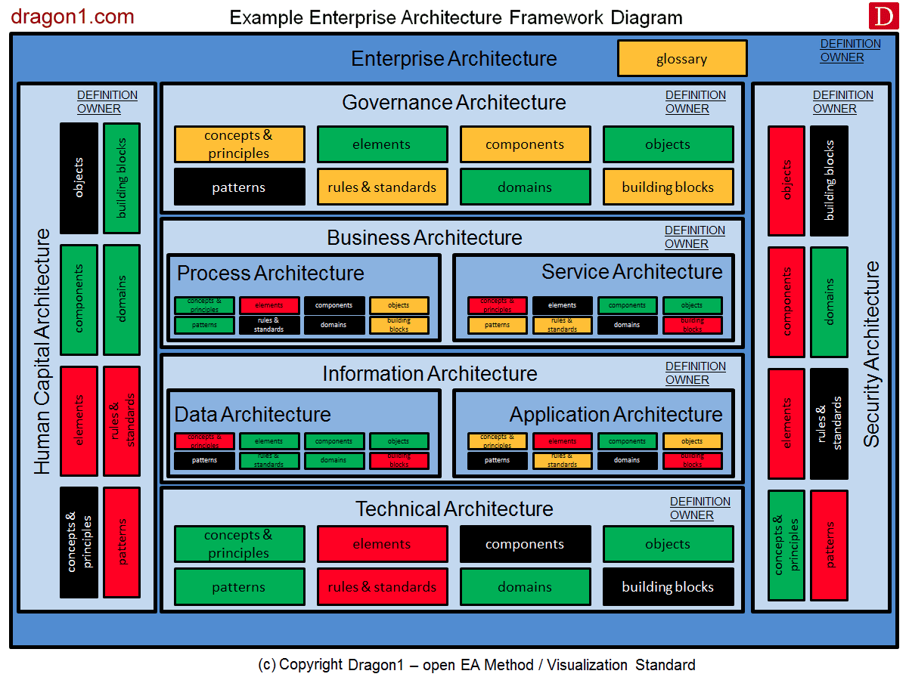

Artificial Intelligence (AI) coding tools have dominated discussions in the tech world recently. From promises of “superhuman” coding to claims that anyone can develop applications without writing a single line of code, it can be hard to separate hype from reality. If you’re a junior developer or currently studying computer science, it’s crucial to understand both the potential and the limitations of AI for coding—and, most importantly, how to position yourself for these emerging opportunities.

---

## The Hype

- **Superhuman Coders?**  
  AI coding tools have proven exceptionally good at tackling self-contained problems, especially algorithmic challenges like LeetCode questions. This has led to sensational headlines touting “superhuman” coding abilities.

- **“No-Coders” Building Apps**  
  There are also stories of non-developers creating applications with minimal coding. However, these projects often remain small-scale or run into significant roadblocks as they grow, highlighting the gap between proof-of-concept demos and complex, production-level software.

---

## The Problem

1. **Massive Codebases**  
   Most real-world applications contain thousands of lines of code, with intricate dependencies and legacy components that aren’t straightforward for AI tools to navigate.

2. **Irregular Architectures**  
   Each project has a unique architecture—its own quirks, integrations, and design patterns. AI tools trained on generalized data can produce incorrect or incomplete solutions if they aren’t carefully guided to align with these irregularities.

3. **AI Coding Tool Setup**  
   While the concept of AI-assisted coding is powerful, setting up and tuning these tools—especially at scale—requires a deep understanding of the technology, security concerns, and organizational constraints.

4. **Infrastructure & Governance**  
   - **Infrastructure**: How do you integrate AI across different teams and projects within an organization?  
   - **Data Governance**: Who owns the data? How do you maintain privacy and security? These questions must be addressed before AI tools can be fully adopted.

---

## The Opportunity

With these challenges come huge opportunities for developers who can bridge the gap between AI potential and real-world complexity:

1. **Project AI Preparedness**  
   Companies will need individuals skilled in setting up AI for existing projects. AI doesn’t “just work” out of the box—it has to be configured, integrated, and continuously refined.

2. **New Startups and GPT Wrappers**  
   The rise of startups offering specialized AI solutions (e.g., GPT-based services) means there is an increasing need for developers who understand both AI functionality and traditional coding best practices.

3. **AI Coding Training**  
   Organizations will need to train (and retrain) their development teams to use AI-assisted coding tools effectively. Junior developers who get ahead of the curve can become internal experts, offering guidance to more senior colleagues.

4. **AI Coding Consultancy**  
   Large consultancies and boutique agencies alike are positioning themselves as “AI transformation partners.” If you have AI expertise, you can become a valuable resource to guide enterprise clients through the adoption process.

---

## The Solution: AI-Powered Developers and Architects

**The trend is your friend.** Rather than fearing that “AI will replace developers,” it’s more productive to evolve and brand yourself as an AI-powered developer or architect. Here’s how:

- **Embrace the AI Label**  
  Update your online profiles (e.g., LinkedIn) to reflect your AI skill set and showcase projects where you leveraged AI tools to solve problems.

- **Stay on the Cutting Edge**  
  Follow the latest AI and developer tool trends. Keep experimenting with new features and releases—this continuous learning will differentiate you in the market.

- **Combine Experience & AI Skills**  
  More experienced engineers can step up as AI-powered architects, guiding entire teams in integrating AI solutions into existing systems.

---

## The Stack: It’s Harder Now

Despite the promise that AI coding tools can speed up software development, the overall landscape for developers is becoming more complex—not less. Here’s why:

1. **Existing Codebases**  
   - **Integration Overhauls**: Large, legacy projects rarely fit cleanly into the outputs generated by AI tools. Developers must fully understand the existing architecture to integrate AI-generated code without introducing breaking changes.  
   - **Refactoring & Maintenance**: AI might provide a quick fix or snippet, but understanding why and how it fits into the broader system still requires human oversight and thorough refactoring skills.

2. **Complex Architectures**  
   - **Modern Toolchains**: Docker, Kubernetes, and cloud-native architectures have become standard, adding layers of orchestration and deployment complexity.  
   - **Distributed Systems**: As systems grow, developers need to handle microservices, APIs, queues, and databases—not just a simple monolith.

3. **AI Coding Agents as a Skill**  
   - **Prompt Engineering**: Getting meaningful, accurate outputs from AI tools can be an art. The best results often stem from precisely crafted prompts and iterative refinement.  
   - **Monitoring & Debugging**: AI-generated code can introduce hidden bugs or inconsistencies. Developers need strong debugging skills to catch issues that AI tools may miss.  
   - **Efficiency vs. Overhead**: AI can speed up certain tasks but requires additional overhead in setup, integration, and continuous validation. The net result is not always an automatic time-saver.

To thrive in this environment, junior developers need a broad understanding of both **traditional software craftsmanship** and **AI-enabled workflows**. It’s not just about writing code anymore; it’s about orchestrating complex systems, integrating with legacy structures, and mastering AI-driven coding agents—all while consistently delivering robust, maintainable solutions.

---

## Domain Switching: An Opportunity

Large organizations, such as banks or major enterprises, often pivot technology stacks rapidly when a new skill set becomes critical. Historically, when these companies needed Java developers, they were open to hiring from diverse backgrounds as long as the candidates had the necessary skills. The same will happen with AI.

1. **Forgiving of Lack of Industry Experience**  
   If you have the in-demand Coding AI skill set, many companies (including finance, insurance, and healthcare) may overlook a lack of direct industry experience.

2. **Line Up With High-Paying Employers**  
   - **Investment Banking**: High budgets for technology and innovation  
   - **Contract Market**: Skilled consultants can command premium rates for short-term, specialized AI integrations with existing code bases.

---

## Conclusion

AI is not a magic wand that will replace developers; it’s a powerful tool that needs skilled professionals to implement, maintain, and continuously improve. For junior developers and current computer science students, this moment represents a profound opportunity:

- **Master AI Tools**: Familiarize yourself with popular AI coding assistants and foundational machine learning concepts.
- **Deepen Core Development Skills**: You still need a strong understanding of system design and architecture.
- **Position Yourself Strategically**: Market your combined skill set of software development and AI integration. Be ready to pivot into industries that value emerging technology expertise.

By proactively embracing AI in your workflow and skill set, you not only future-proof your career but also become an indispensable asset to organizations navigating the next wave of technological evolution. The key is to stay flexible, keep learning, and position yourself as an AI-powered problem solver ready to tackle the challenges of modern software development.