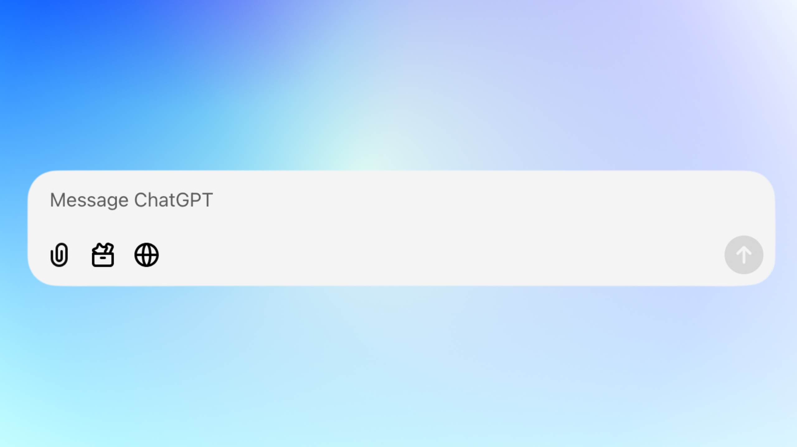
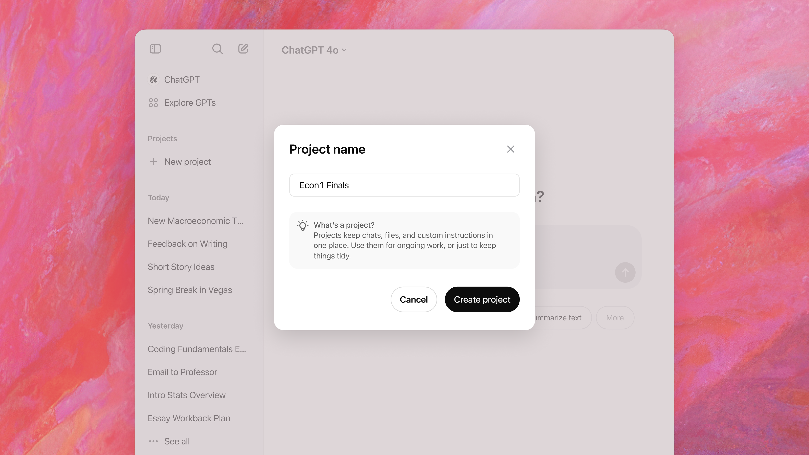
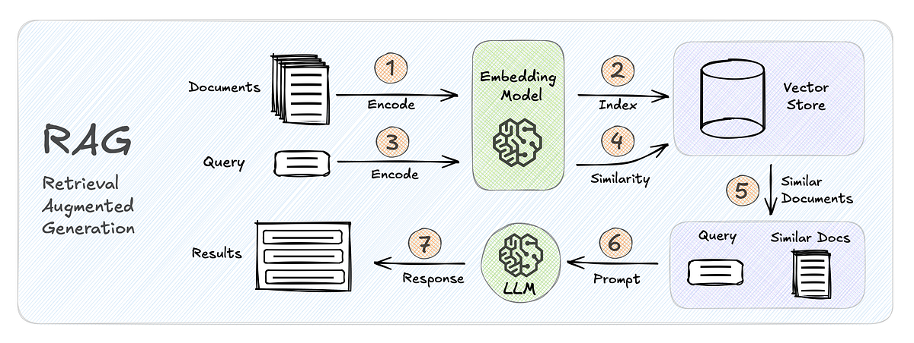
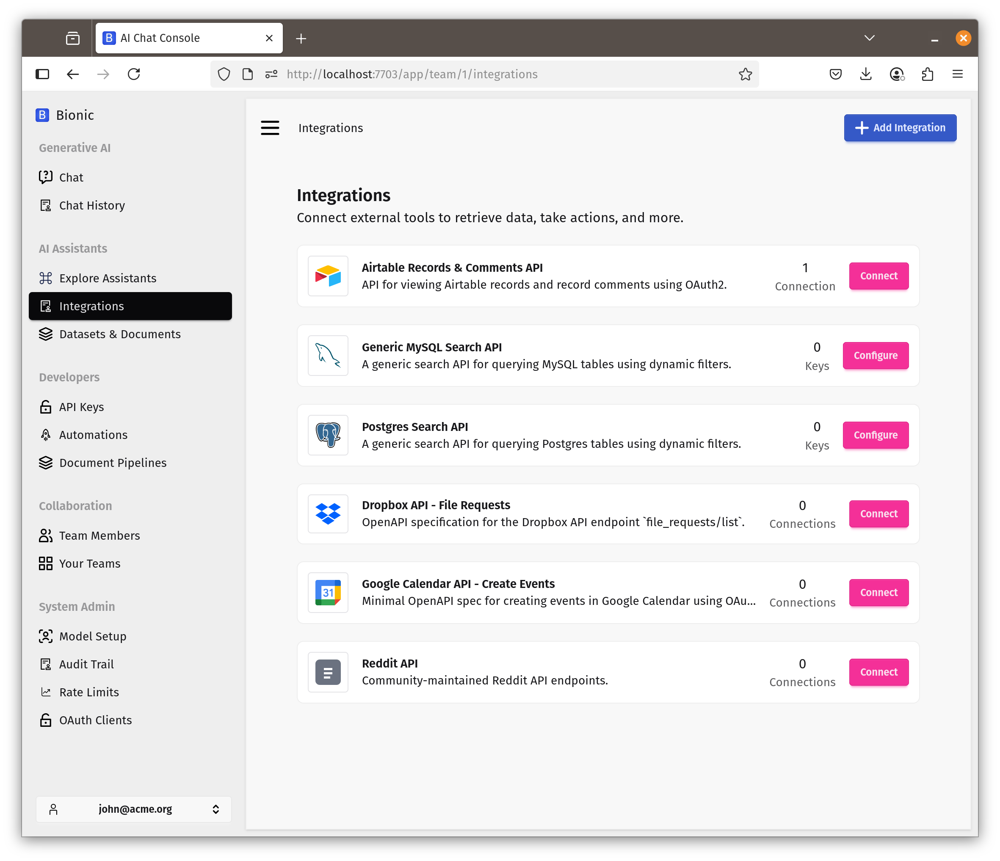

# Evaluating Self-Hosted LLM Platforms

**Audience:** technical leaders and engineers asking *“Why not just use Open WebUI?”*

This document explains the major capability categories used to evaluate self‑hosted LLM platforms (LibreChat, Open WebUI, Bionic GPT, Onyx). Each category explains *what the user sees*, *what happens underneath*, and—where relevant—*what a tool definition typically looks like*. A comparison matrix follows each section.

---

## 1. Interaction & Modalities



### What this category covers

How users interact with models and which input/output modalities are supported beyond plain text.

### What happens underneath

The platform must:

* Normalize user inputs into model‑specific request formats
* Manage binary assets (files, images) with lifecycle and access control
* Route requests to different model endpoints depending on modality

Platforms that only support chat are thin UIs. Platforms that support multiple modalities require orchestration, storage, and policy enforcement layers.

### Typical tool definition (example)

```yaml
web_search(query: string, recency_days?: number)
create_image(prompt: string, size?: string)
analyze_image(image_ref: File)
open_url(url: string)
list_attachments()
get_attachment(id:number, offset: number)
```

### Comparison matrix

| Capability                         | LibreChat | Open WebUI | Bionic GPT | Onyx |
| ---------------------------------- | --------- | ---------- | ---------- | ---- |
| Text chat                          | ✓         | ✓          | ✓          | ✓    |
| File attachments (tool‑accessible) | Partial   | Basic      | ✓          | ✓    |
| Image generation                   | ✓         | ✓          | ✓          | ✓    |
| Image analysis / vision            | Partial   | Partial    | ✓          | ✓    |
| Web search via tools               | Partial   | Limited    | ✓          | ✓    |
| Deep research mode                 | ✗         | ✗          | ✓          | ✓    |

---

## 2. Assistants, Agents & Projects



### What this category covers

How systems define persistent AI behaviour and context.

### What happens underneath

* Assistants are stored objects with system prompts, tools, and data bindings
* Projects/workspaces attach shared context across chats
* Agentic systems include planners, tool executors, and state machines

This is the dividing line between *chat UIs* and *AI systems*.

Here is project-level tool pseudocode that represents what a full platform (not just a chat UI) typically exposes to an LLM when operating inside a Project / Workspace.

### Project Context & Navigation

```js
get_project() -> Project
list_project_chats(project_id: string) -> Chat[]
get_chat(chat_id: string) -> Chat
create_chat(project_id: string, title?: string) -> Chat
rename_chat(chat_id: string, title: string)
```

### Conversation Memory & State

```js
store_memory(key: string, value: string)
read_memory(key: string) -> string
list_memory_keys() -> string[]
delete_memory(key: string)
```

### File & Artifact Management

```js
list_attachments() -> File[]
read_file(file_id: string) -> FileContent
write_file(name: string, content: bytes) -> File
delete_file(file_id: string)
```

### Comparison matrix

| Capability                 | LibreChat | Open WebUI | Bionic GPT | Onyx |
| -------------------------- | --------- | ---------- | ---------- | ---- |
| Named assistants           | ✓         | Limited    | ✓          | ✓    |
| System instructions        | ✓         | ✓          | ✓          | ✓    |
| Tool access per assistant  | Limited   | Limited    | ✓          | ✓    |
| Projects / shared context  | ✗         | Partial    | ✓          | ✓    |
| Multi‑step agent execution | ✗         | ✗          | ✓          | ✓    |

---

## 3. Knowledge & Data Ingestion (RAG)



### What this category covers

How external knowledge is ingested, indexed, and retrieved during inference.

### What happens underneath

* Documents are parsed and chunked
* Embeddings are generated and stored
* Retrieval pipelines select relevant chunks at runtime
* Permissions are enforced per chunk or source

This requires background pipelines, vector stores, and runtime binding—none of which exist in simple chat UIs.

### Rag Tools passed to the model

```js
search_knowledge(query: string, k?: number) -> RetrievedChunk[]
get_chunk(chunk_id: string) -> RetrievedChunk

request_full_document(
  source_id: string,
  justification: string
) -> DocumentHandle
```

### Comparison matrix

| Capability                   | LibreChat | Open WebUI | Bionic GPT | Onyx |
| ---------------------------- | --------- | ---------- | ---------- | ---- |
| RAG support                  | ✓         | ✓          | ✓          | ✓    |
| Multiple knowledge sources   | Limited   | Limited    | ✓          | ✓    |
| Continuous ingestion         | ✗         | ✗          | ✓          | ✓    |
| Permission‑aware retrieval   | ✗         | ✗          | ✓          | ✓    |
| Supported file types (broad) | Partial   | Partial    | ✓          | ✓    |

---

## 4. Integrations & Extensibility


### What this category covers

How the system interacts with external APIs and tools.

### What happens underneath

* OpenAPI specs are parsed into callable tools
* OAuth2 flows and secrets are managed centrally
* Tool execution is sandboxed and audited
* MCP enables cross‑system agent interoperability

This is where platforms stop being UIs and become *integration hubs*.



### Typical OpenAPI tool binding

```yaml
openapi: https://api.example.com/openapi.json
auth:
  type: oauth2
  token_ref: crm_access_token
```

### Comparison matrix

| Capability             | LibreChat | Open WebUI | Bionic GPT | Onyx    |
| ---------------------- | --------- | ---------- | ---------- | ------- |
| OpenAPI tool ingestion | Partial   | Partial    | ✓          | ✓       |
| OAuth2‑secured APIs    | ✗         | ✗          | ✓          | ✓       |
| MCP client             | ✗         | ✗          | ✓          | ✓       |
| MCP server             | ✗         | ✗          | ✓          | Limited |
| Virtual API keys       | ✗         | ✗          | ✓          | ✓       |

---

## 5. Security, Identity & Governance


### What this category covers

Controls required in multi‑user, regulated, or enterprise environments.

### What happens underneath

* Identity providers are federated via SSO
* Authorization is enforced at request and data levels
* Secrets and prompts are encrypted at runtime
* Audit events are emitted for compliance

### Comparison matrix

| Capability            | LibreChat | Open WebUI | Bionic GPT | Onyx |
| --------------------- | --------- | ---------- | ---------- | ---- |
| SSO                   | Partial   | Partial    | ✓          | ✓    |
| RBAC                  | ✗         | ✗          | ✓          | ✓    |
| Teams / multi‑tenancy | Limited   | Limited    | ✓          | ✓    |
| Sharing controls      | Basic     | Basic      | ✓          | ✓    |
| Runtime encryption    | ✗         | ✗          | ✓          | ✓    |

---

## 6. Observability & Cost Control

### What this category covers

Visibility into usage, cost, and system behaviour.

### What happens underneath

* Every request/response is metered
* Tokens are attributed to users, teams, and models
* Metrics are exported via OpenTelemetry

Without this, systems cannot be governed or scaled responsibly.

### Comparison matrix

| Capability               | LibreChat | Open WebUI | Bionic GPT | Onyx |
| ------------------------ | --------- | ---------- | ---------- | ---- |
| Token accounting         | Partial   | Partial    | ✓          | ✓    |
| Request/response storage | Partial   | Partial    | ✓          | ✓    |
| OpenTelemetry support    | ✗         | ✗          | ✓          | ✓    |
| Grafana‑ready metrics    | ✗         | ✗          | ✓          | ✓    |

---

## 7. Deployment & Platform Architecture

### What this category covers

How the system runs in real infrastructure.

### What happens underneath

* Services are decomposed and scalable
* Execution environments are isolated
* Kubernetes operators manage lifecycle and upgrades

This is the clearest separator between *tools* and *platforms*.

### Comparison matrix

| Capability               | LibreChat | Open WebUI | Bionic GPT | Onyx    |
| ------------------------ | --------- | ---------- | ---------- | ------- |
| Self‑hosted              | ✓         | ✓          | ✓          | ✓       |
| Kubernetes native        | ✗         | ✗          | ✓          | ✓       |
| Kubernetes operator      | ✗         | ✗          | ✓          | Partial |
| Sandboxed code execution | ✗         | ✗          | ✓          | ✓       |

---

## Final Takeaway

**Open WebUI answers the question:** *“How do I chat with an LLM?”*

**Platforms like Bionic GPT and Onyx answer:**
*“How do I safely, observably, and extensibility deploy AI across an organization?”*

That distinction only becomes visible once you look below the UI layer—exactly what this evaluation framework is designed to do.
