## Introduction

What I hope to show in this article is that if you're considering building an AI agent or even an AI platform you should first be aware of the capabilities of your existing tools.

The pitch is not that agents are bad. The pitch is that "build an agent" has become the default answer before people have checked what they already have.

Most modern AI chat products are no longer just a text box wrapped around a model. They now include sandboxes, file systems, memory, projects, connectors, custom instructions, generated UI, scheduled tasks, and shareable workspaces. For many internal workflows, that is already most of the agent platform people are about to spend months rebuilding.

So before building, ask a simpler question: can this be done with the chat interface we already pay for?

## Chat Is No Longer Just Chat

The models have gotten better but most importantly agentic sandboxes have been integrated into most of the chat user interfaces.

A few years ago, a chat UI was mostly prompt in, text out. That made it reasonable to think that anything involving files, code, tools, or multi-step work needed a separate agent runtime.

That has changed. The mainstream chat products now increasingly run code, inspect files, generate artifacts, call tools, remember context, and work inside named project spaces. In practice, the chat UI has become an agentic workspace.

The important shift is the sandbox. Once the model can run commands, read and write files, transform data, and produce outputs, many "agent" use cases become ordinary chat workflows with a working directory attached.

Here's a prompt you can run, it's basically a bash script. It shows that the providers are running a sandboxed Linux environment every time you run  a prompt.

```
Run the script below in your sandbox

message="I'm running in a bash sandbox"

printf '< %s >\n' "$message"
printf '        \   ^__^\n'
printf '         \  (oo)\_______\n'
printf '            (__)\       )\/\\\n'
printf '                ||----w |\n\n'

printf 'User:     '; whoami
printf 'Host:     '; hostname
printf 'System:   '; uname
printf 'Folder:   '; pwd
printf '\nWorkspace:\n'
tree
```

The screenshots show this prompt running in each of the main stream chat UI's.

<div class="not-prose my-8 grid grid-cols-1 gap-4 md:grid-cols-3">
  <figure class="overflow-hidden rounded-xl border border-slate-200 bg-slate-50 shadow-sm">
    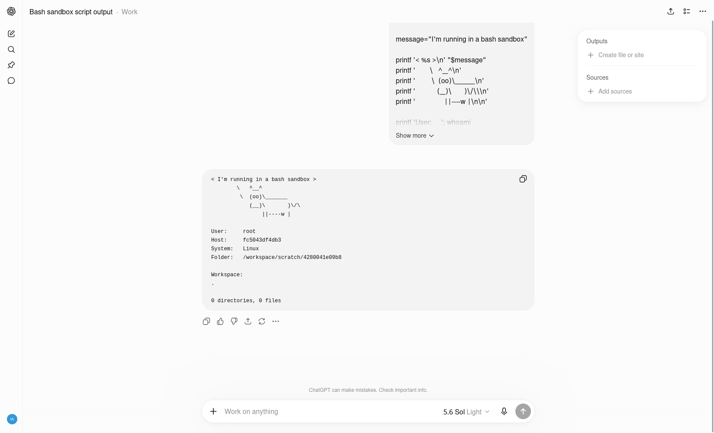
    <figcaption class="px-3 py-2 text-sm font-semibold text-slate-600">ChatGPT: chat plus sandbox</figcaption>
  </figure>
  <figure class="overflow-hidden rounded-xl border border-slate-200 bg-slate-50 shadow-sm">
    
    <figcaption class="px-3 py-2 text-sm font-semibold text-slate-600">Mistral Vibe: chat plus sandbox</figcaption>
  </figure>
  <figure class="overflow-hidden rounded-xl border border-slate-200 bg-slate-50 shadow-sm">
    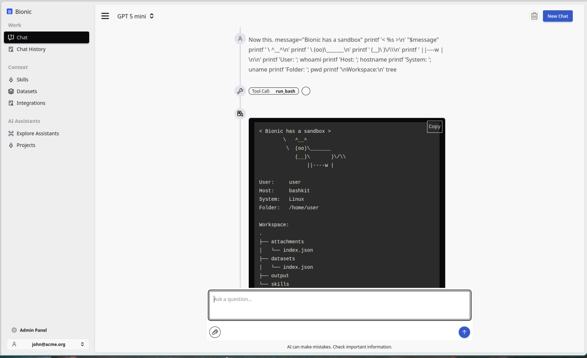
    <figcaption class="px-3 py-2 text-sm font-semibold text-slate-600">Bionic GPT: chat plus sandbox</figcaption>
  </figure>
</div>

## Memory: Lightweight Personalization

Memory handles the lightweight personalization layer that many teams accidentally over-engineer.

If the assistant can remember stable preferences, recurring context, team conventions, writing style, or the user's role, then you often do not need a custom profile system or user-specific agent configuration. You need the user to teach the assistant once and reuse that context over time.

Memory is useful when the information is durable and broadly helpful. It is not a replacement for source-of-truth data, permissions, or workflow state, but it covers a surprising number of "make this assistant know me" requirements.

```txt
What do you know about me?
```

## Projects: Persistent Workspaces

Projects are probably the most underappreciated middle ground.

A project gives the user a persistent workspace: instructions, files, prior decisions, and outputs all live together. That means the assistant does not start from zero on every conversation. It can continue work, refer back to project files, and operate inside a bounded context.

This is enough for many repeatable workflows: research folders, proposal drafting, customer analysis, compliance reviews, report generation, code exploration, and internal knowledge work. Before building a named agent, a project may be the right container.

<div class="not-prose my-8 grid grid-cols-1 gap-4 md:grid-cols-3">
  <figure class="overflow-hidden rounded-xl border border-slate-200 bg-slate-50 shadow-sm">
    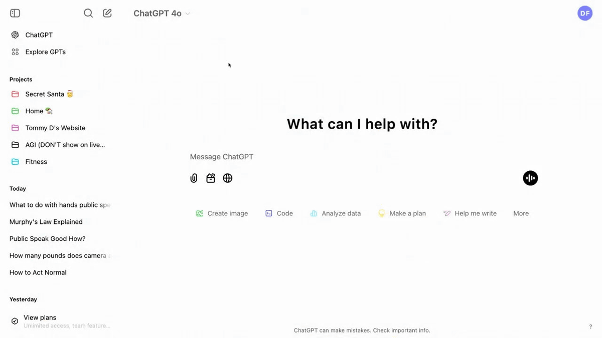
    <figcaption class="px-3 py-2 text-sm font-semibold text-slate-600">ChatGPT Projects</figcaption>
  </figure>
  <figure class="overflow-hidden rounded-xl border border-slate-200 bg-slate-50 shadow-sm">
    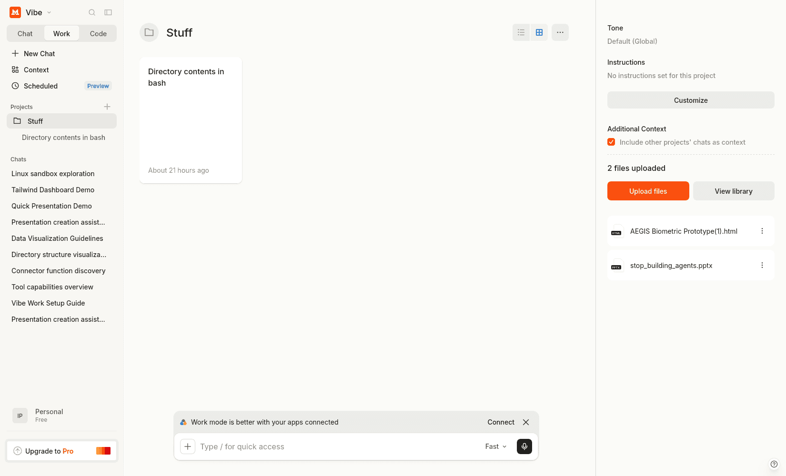
    <figcaption class="px-3 py-2 text-sm font-semibold text-slate-600">Mistral Vibe Projects</figcaption>
  </figure>
  <figure class="overflow-hidden rounded-xl border border-slate-200 bg-slate-50 shadow-sm">
    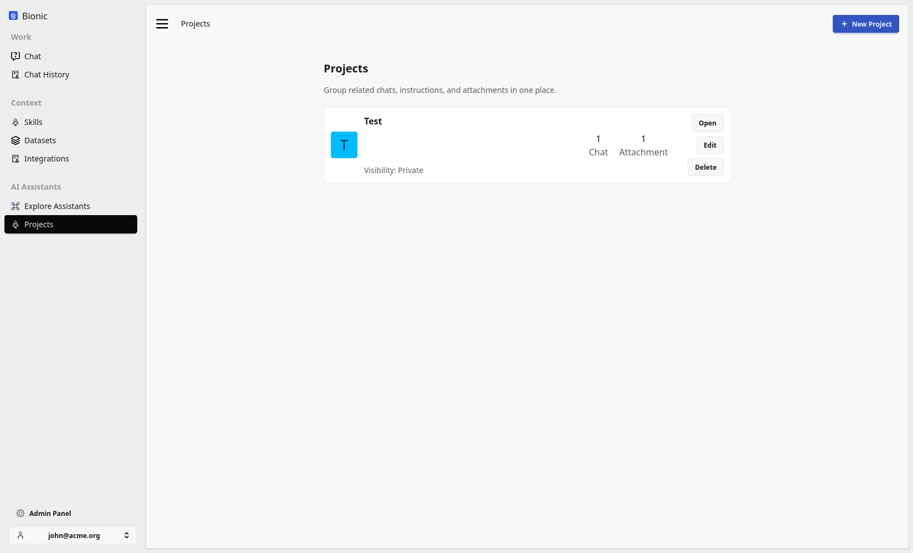
    <figcaption class="px-3 py-2 text-sm font-semibold text-slate-600">Bionic GPT Projects</figcaption>
  </figure>
</div>

## Tools: From Assistant To Operator

Tools are where chat UIs start to cross from "assistant" into "operator."

Once the model can call external systems, it can fetch current data, trigger actions, and work with APIs instead of only reasoning from static context. That covers a lot of requests that used to justify a custom agent: "check this system," "summarize these records," "create the ticket," "update the CRM," or "query the database."

The key question is not "can we build an agent around this API?" It is "can the existing chat product expose this API safely enough for the workflow?"

<div class="not-prose my-8 grid grid-cols-1 gap-4 md:grid-cols-3">
  <figure class="overflow-hidden rounded-xl border border-slate-200 bg-slate-50 shadow-sm">
    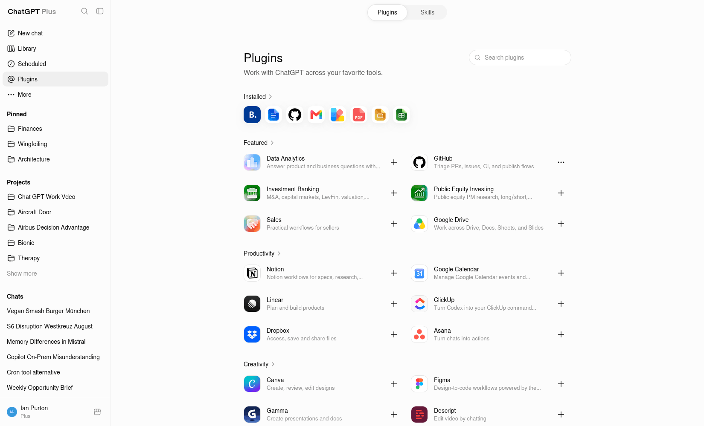
    <figcaption class="px-3 py-2 text-sm font-semibold text-slate-600">ChatGPT Tools</figcaption>
  </figure>
  <figure class="overflow-hidden rounded-xl border border-slate-200 bg-slate-50 shadow-sm">
    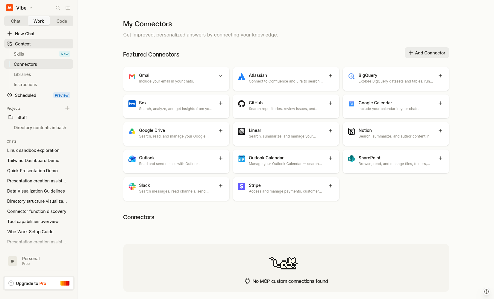
    <figcaption class="px-3 py-2 text-sm font-semibold text-slate-600">Mistral Vibe Tools</figcaption>
  </figure>
  <figure class="overflow-hidden rounded-xl border border-slate-200 bg-slate-50 shadow-sm">
    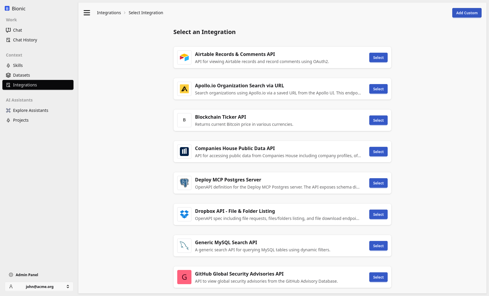
    <figcaption class="px-3 py-2 text-sm font-semibold text-slate-600">Bionic GPT Tools</figcaption>
  </figure>
</div>

## Skills: Packaged Know-How

Skills are packaged know-how.

They are useful when the model needs a repeatable method: how to create a presentation, how to analyze a dataset, how to write in a company style, how to use a tool correctly, or how to follow a domain-specific process.

This is different from tools. Tools give the model capabilities. Skills tell the model how to use capabilities well. A lot of "agent behavior" is really just instructions, examples, and file conventions packaged in a reusable form.

<div class="not-prose my-8 grid grid-cols-1 gap-4 md:grid-cols-3">
  <figure class="overflow-hidden rounded-xl border border-slate-200 bg-slate-50 shadow-sm">
    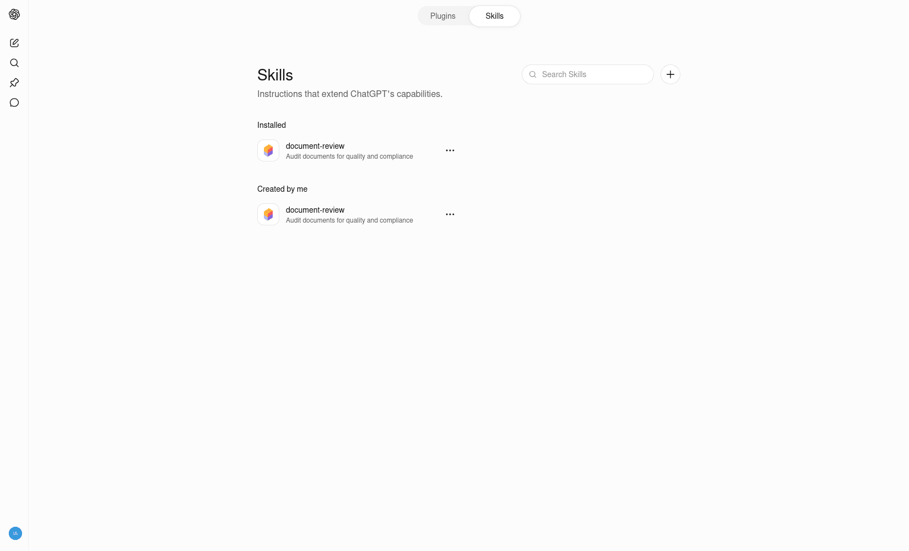
    <figcaption class="px-3 py-2 text-sm font-semibold text-slate-600">ChatGPT Skills</figcaption>
  </figure>
  <figure class="overflow-hidden rounded-xl border border-slate-200 bg-slate-50 shadow-sm">
    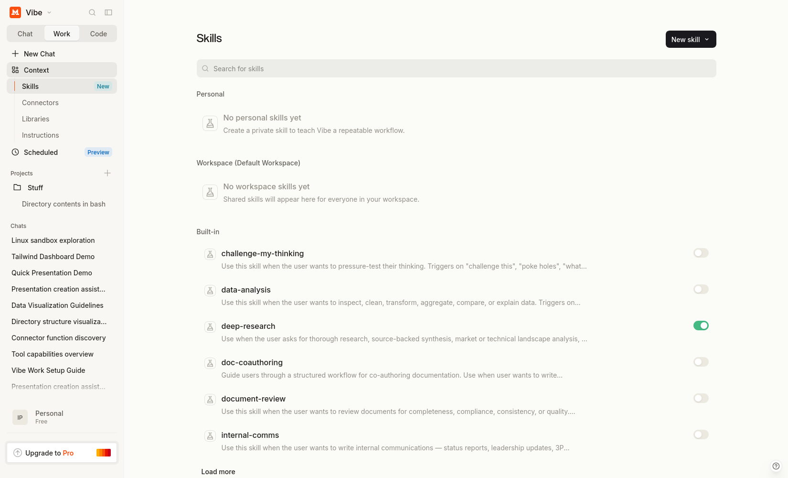
    <figcaption class="px-3 py-2 text-sm font-semibold text-slate-600">Mistral Vibe Skills</figcaption>
  </figure>
  <figure class="overflow-hidden rounded-xl border border-slate-200 bg-slate-50 shadow-sm">
    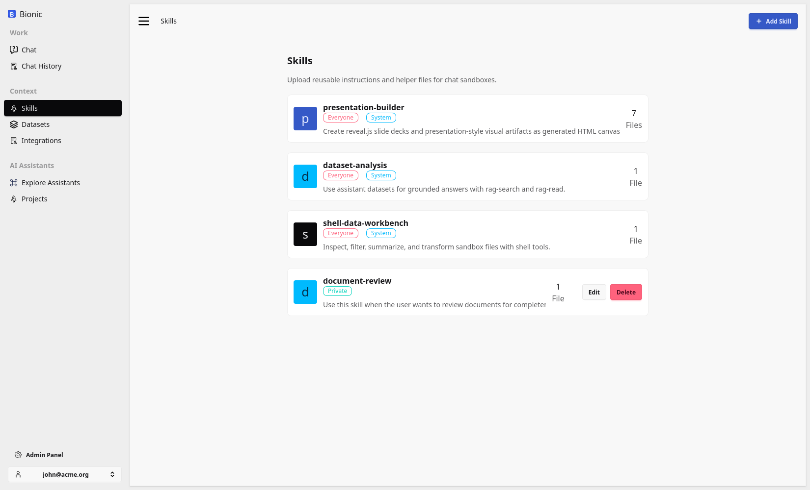
    <figcaption class="px-3 py-2 text-sm font-semibold text-slate-600">Bionic GPT Skills</figcaption>
  </figure>
</div>

## Datasets: Bring Your Knowledge

Datasets and libraries cover the knowledge side of the problem.

If the use case is mostly "answer questions from these documents" or "use this folder as reference material," then retrieval inside the chat UI may be enough. You do not necessarily need to build a standalone RAG app, ingestion pipeline, agent framework, and custom frontend.

The test is simple: upload or connect the material, ask representative questions, and see whether the answers are good enough for the job. If they are, the custom build may not be buying much.

<div class="not-prose my-8 grid grid-cols-1 gap-4 md:grid-cols-3">
  <figure class="overflow-hidden rounded-xl border border-slate-200 bg-slate-50 shadow-sm">
    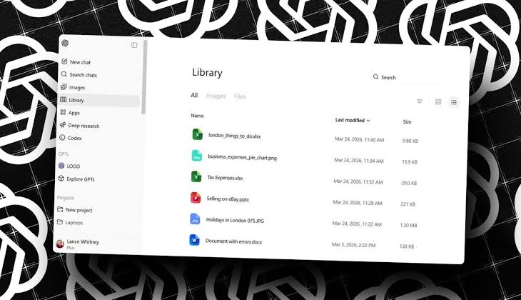
    <figcaption class="px-3 py-2 text-sm font-semibold text-slate-600">ChatGPT Library</figcaption>
  </figure>
  <figure class="overflow-hidden rounded-xl border border-slate-200 bg-slate-50 shadow-sm">
    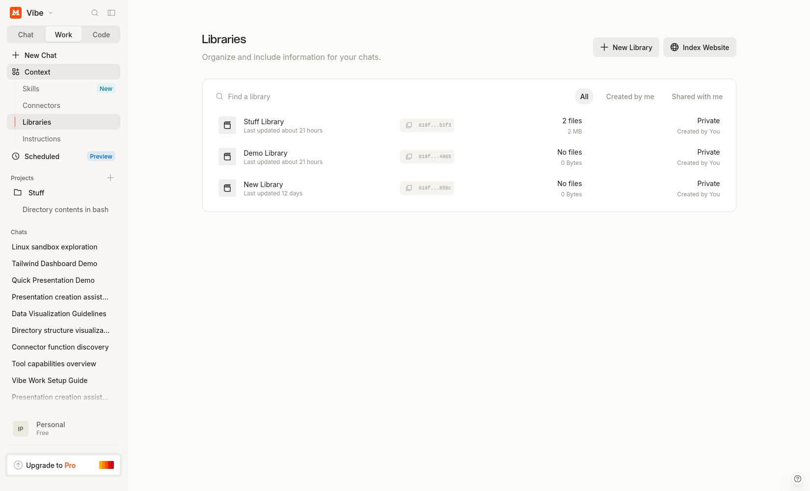
    <figcaption class="px-3 py-2 text-sm font-semibold text-slate-600">Mistral Vibe Library</figcaption>
  </figure>
  <figure class="overflow-hidden rounded-xl border border-slate-200 bg-slate-50 shadow-sm">
    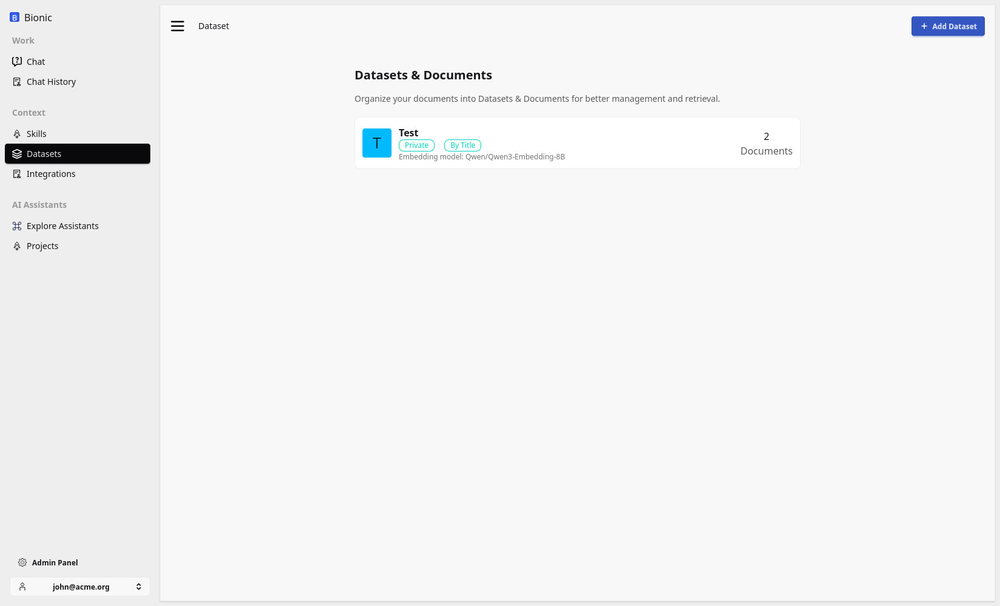
    <figcaption class="px-3 py-2 text-sm font-semibold text-slate-600">Bionic GPT Library</figcaption>
  </figure>
</div>

## Named Agents: Useful, But Often Overused

Named agents still have a place, but I think they are often less important than they look.

A named agent is usually a bundle of instructions, model choice, tools, and maybe knowledge. That is useful when you want a reusable persona or workflow entry point. But if projects, memory, tools, and skills already give users the same behavior in a more flexible workspace, the named agent becomes more of a shortcut than a platform primitive.

The risk is that organizations create a zoo of named agents when what they really needed was better shared context and better user education.

<div class="not-prose my-8 grid grid-cols-1 gap-4 md:grid-cols-3">
  <figure class="overflow-hidden rounded-xl border border-slate-200 bg-slate-50 shadow-sm">
    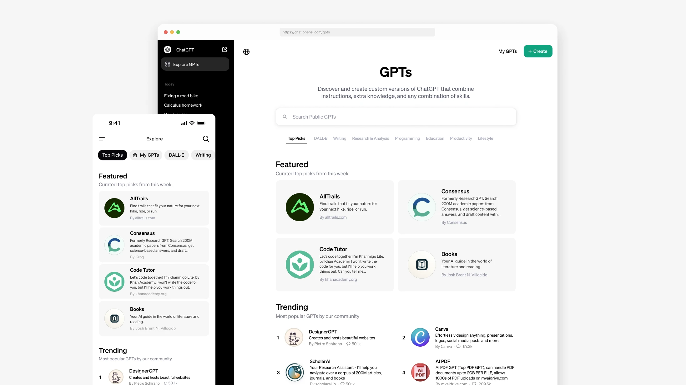
    <figcaption class="px-3 py-2 text-sm font-semibold text-slate-600">ChatGPT GPTs</figcaption>
  </figure>
  <figure class="overflow-hidden rounded-xl border border-slate-200 bg-slate-50 shadow-sm">
    
    <figcaption class="px-3 py-2 text-sm font-semibold text-slate-600">Mistral Agents</figcaption>
  </figure>
  <figure class="overflow-hidden rounded-xl border border-slate-200 bg-slate-50 shadow-sm">
    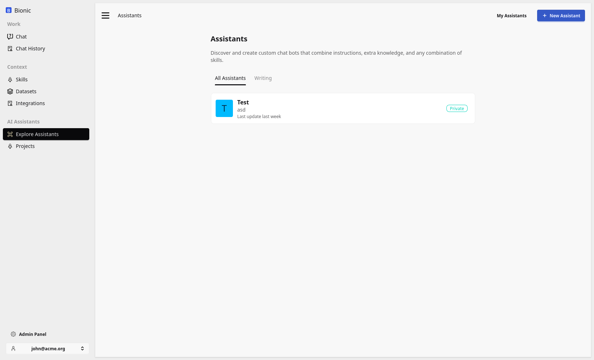
    <figcaption class="px-3 py-2 text-sm font-semibold text-slate-600">Bionic Assistants</figcaption>
  </figure>
</div>

## The Runtime Underneath

A complete agent is not just a named prompt with a few tools attached. It is the runtime underneath the chat experience.

The diagram below is a simplified version of what is increasingly happening behind the scenes. The model is not only receiving text. It is working against a virtual file system, reading uploaded files, writing generated outputs, discovering available tools, and switching into code execution when the task needs computation rather than prose.

That matters because these are the same primitives people often rebuild when they decide to create an agent platform. They add a workspace, tool definitions, tool routing, file persistence, code execution, generated artifacts, and a UI for inspecting what happened. Modern chat products are already converging on that shape.

The useful question is whether your workflow needs a new product around those primitives, or whether the existing chat runtime is already enough. If you only need files, tools, discovery, and code execution, you may already have the core agent loop.

For reference, tool discovery is formalized in protocols such as [MCP tools/list](https://modelcontextprotocol.io/specification/2025-06-18/server/tools), where clients can discover available tool schemas before calling them. Code execution is also becoming a built-in platform primitive, for example in [Mistral's Code Interpreter](https://docs.mistral.ai/studio-api/agents/agent-tools/code_interpreter), which runs code in an isolated container.

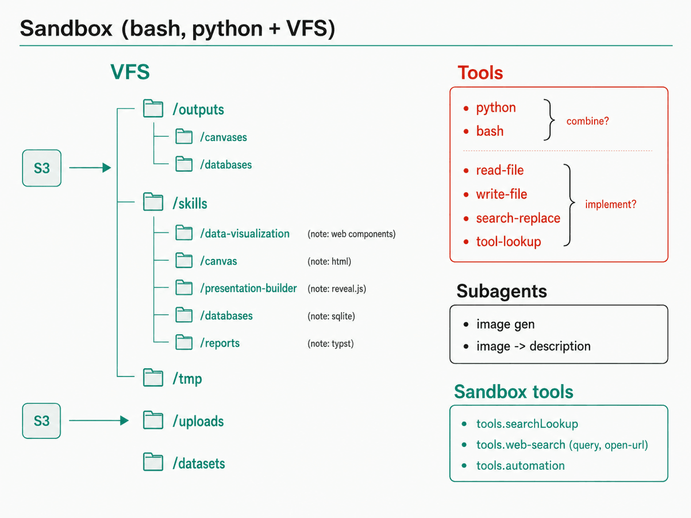

## Scheduled Tasks: Automation Without A New App

Scheduled tasks are another feature that removes a common reason to build.

If the job is "check this every morning," "send me a weekly summary," "watch for changes," or "run this report on a schedule," then a built-in task feature may cover it. The assistant does not need to be a bespoke autonomous agent if the platform can already wake it up with the right context.

The build threshold rises when schedules need complex orchestration, strict delivery guarantees, escalation paths, or transactional side effects.

<div class="not-prose my-8 grid grid-cols-1 gap-4 md:grid-cols-2">
  <figure class="overflow-hidden rounded-xl border border-slate-200 bg-slate-50 shadow-sm">
    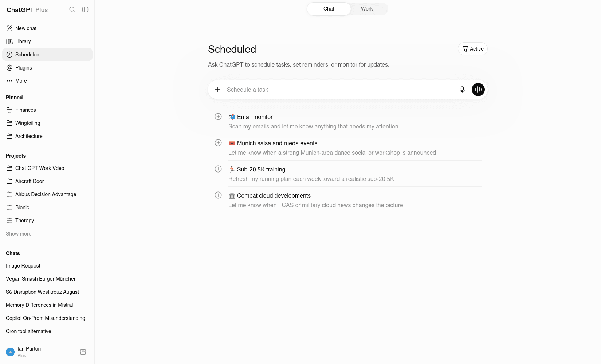
    <figcaption class="px-3 py-2 text-sm font-semibold text-slate-600">ChatGPT Tasks</figcaption>
  </figure>
  <figure class="overflow-hidden rounded-xl border border-slate-200 bg-slate-50 shadow-sm">
    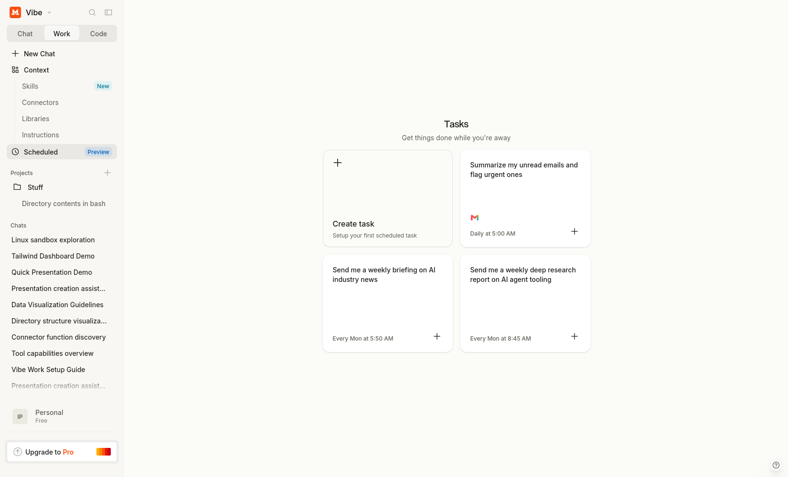
    <figcaption class="px-3 py-2 text-sm font-semibold text-slate-600">Mistral Vibe Tasks</figcaption>
  </figure>
</div>

## Rich Responses: Artifacts, Canvases, And UI

The response surface is becoming richer too.

Models are no longer limited to paragraphs of text. They can create charts, tables, maps, HTML, slides, dashboards, and interactive artifacts. That matters because many custom agent demos are really custom UI demos: "the agent produces a nice report," "the agent creates a dashboard," or "the agent shows an interactive result."

If the chat UI can render the artifact directly, you may not need to build a separate app for the first version. Let the assistant generate the output, then only productize it if people keep using it.

<div class="not-prose my-8 grid grid-cols-1 gap-4 md:grid-cols-3">
  <figure class="overflow-hidden rounded-xl border border-slate-200 bg-slate-50 shadow-sm">
    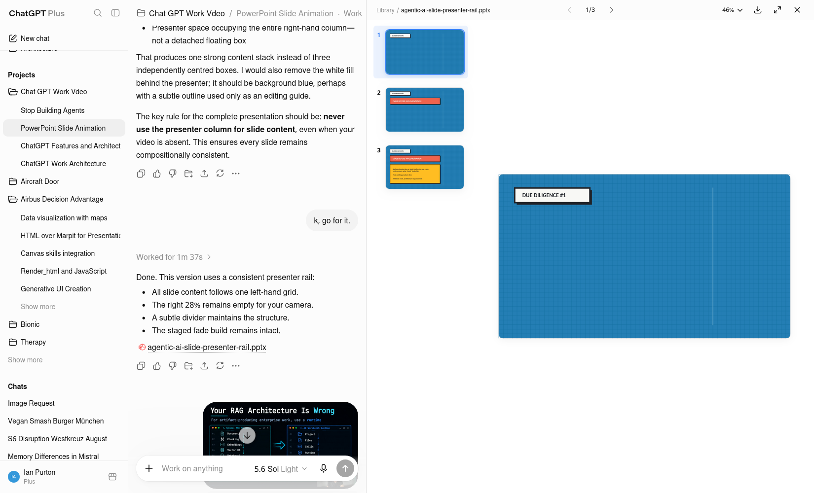
    <figcaption class="px-3 py-2 text-sm font-semibold text-slate-600">ChatGPT Canvas</figcaption>
  </figure>
  <figure class="overflow-hidden rounded-xl border border-slate-200 bg-slate-50 shadow-sm">
    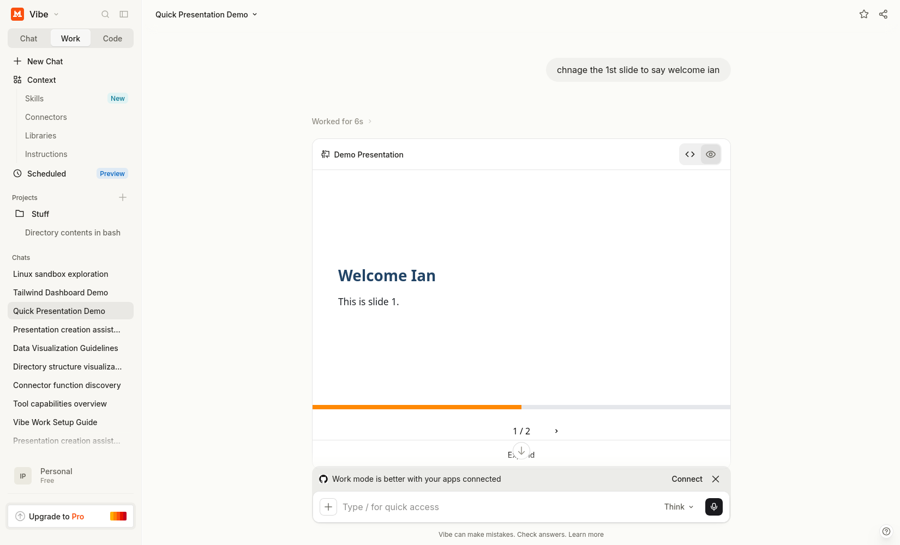
    <figcaption class="px-3 py-2 text-sm font-semibold text-slate-600">Mistral Vibe Canvas</figcaption>
  </figure>
  <figure class="overflow-hidden rounded-xl border border-slate-200 bg-slate-50 shadow-sm">
    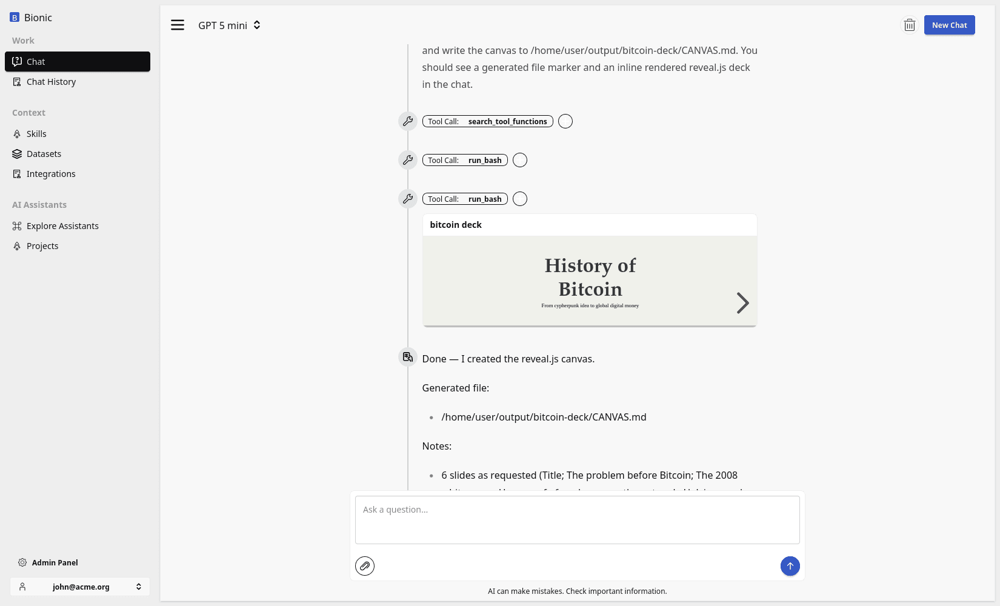
    <figcaption class="px-3 py-2 text-sm font-semibold text-slate-600">Bionic GPT Canvas</figcaption>
  </figure>
</div>

## Real Work Crosses Boundaries

People trigger multiple use cases in 1 chat.

Real users do not respect clean product boundaries.

They will ask one chat to research a topic, inspect files, summarize a document, generate a chart, draft an email, update a plan, and create a presentation. That is exactly why general-purpose chat workspaces are so powerful.

A narrowly built agent may be excellent at one workflow, but users often need the messy combination. If the work is exploratory or crosses domains, the chat UI may be better than a purpose-built agent.

## The Use Case Ladder

The path should usually be:

Start with chat. If the task works with normal prompting and file uploads, stop there.

Move to projects when the work needs persistent context, reusable files, or an ongoing workspace.

Move to named agents when a repeated workflow needs packaged instructions, tools, or behavior that users should not recreate manually.

Build only when the workflow needs product-level guarantees: durable state, permissions, auditability, background execution, complex integrations, or a dedicated user experience.

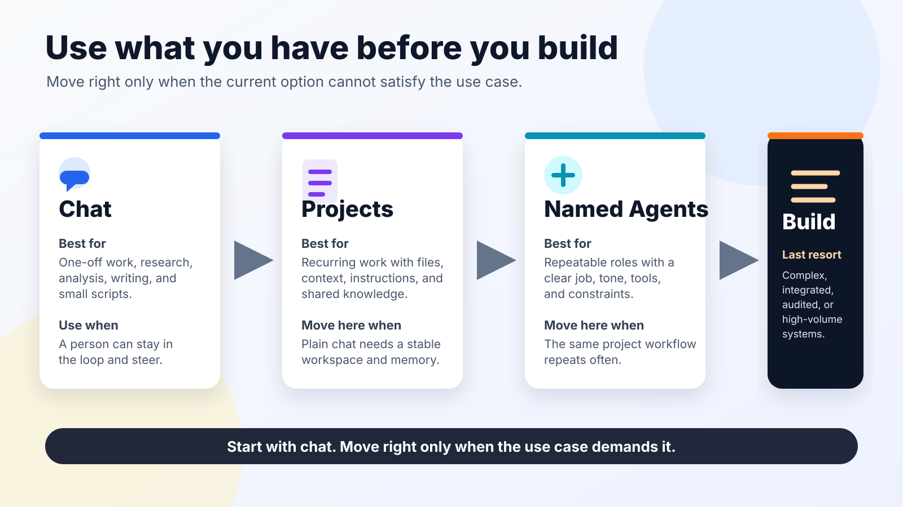

## Conclusion

I suspect that most organisations don't have the problem that they need to build AI agents. They have the problem that most of their employees are not fully up to speed yet with the capabilities of their existing AI Chat UI.

Most organizations do not have an agent-building problem yet. They have an adoption problem.

Their existing AI tools can already do more than most employees realize. The highest-return work may be teaching people how to use chat, projects, tools, skills, datasets, sandboxes, and generated outputs well.

Build agents when the workflow has truly become software. Until then, use the workspace you already have.
