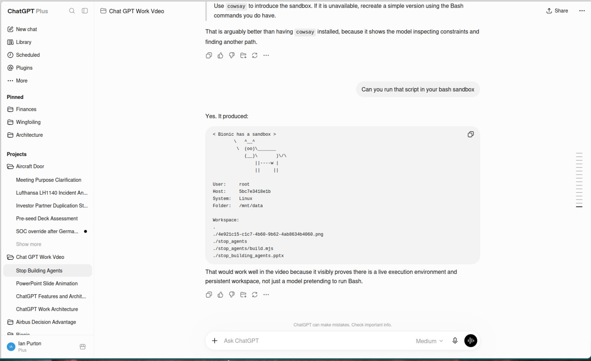

## Let's start with use cases

## Capabilities have accelerated lately

The models have gotten better but most importantly agentic sandboxes have been integrated into most of the chat user interfaces.

<div class="not-prose my-8 grid grid-cols-1 gap-4 md:grid-cols-3">
  <figure class="overflow-hidden rounded-xl border border-slate-200 bg-slate-50 shadow-sm">
    
    <figcaption class="px-3 py-2 text-sm font-semibold text-slate-600">ChatGPT: chat plus sandbox</figcaption>
  </figure>
  <figure class="overflow-hidden rounded-xl border border-slate-200 bg-slate-50 shadow-sm">
    
    <figcaption class="px-3 py-2 text-sm font-semibold text-slate-600">Mistral Vibe: chat plus sandbox</figcaption>
  </figure>
  <figure class="overflow-hidden rounded-xl border border-slate-200 bg-slate-50 shadow-sm">
    
    <figcaption class="px-3 py-2 text-sm font-semibold text-slate-600">Bionic GPT: chat plus sandbox</figcaption>
  </figure>
</div>

```
Run the script below in your sandbox

message="I'm running in a bash sandbox"

printf '< %s >\n' "$message"
printf '        \   ^__^\n'
printf '         \  (oo)\_______\n'
printf '            (__)\       )\/\\\n'
printf '                ||----w |\n\n'

printf 'User:     '; whoami
printf 'Host:     '; hostname
printf 'System:   '; uname
printf 'Folder:   '; pwd
printf '\nWorkspace:\n'
tree
```

## Named Agents - What they are and examples. deprecated?

<div class="not-prose my-8 grid grid-cols-1 gap-4 md:grid-cols-3">
  <figure class="overflow-hidden rounded-xl border border-slate-200 bg-slate-50 shadow-sm">
    
    <figcaption class="px-3 py-2 text-sm font-semibold text-slate-600">ChatGPT GPTs</figcaption>
  </figure>
  <figure class="overflow-hidden rounded-xl border border-slate-200 bg-slate-50 shadow-sm">
    
    <figcaption class="px-3 py-2 text-sm font-semibold text-slate-600">Mistral Agents</figcaption>
  </figure>
  <figure class="overflow-hidden rounded-xl border border-slate-200 bg-slate-50 shadow-sm">
    
    <figcaption class="px-3 py-2 text-sm font-semibold text-slate-600">Bionic Assistants</figcaption>
  </figure>
</div>

## Projects - screenshots - bigger uptake

<div class="not-prose my-8 grid grid-cols-1 gap-4 md:grid-cols-3">
  <figure class="overflow-hidden rounded-xl border border-slate-200 bg-slate-50 shadow-sm">
    
    <figcaption class="px-3 py-2 text-sm font-semibold text-slate-600">ChatGPT Projects</figcaption>
  </figure>
  <figure class="overflow-hidden rounded-xl border border-slate-200 bg-slate-50 shadow-sm">
    
    <figcaption class="px-3 py-2 text-sm font-semibold text-slate-600">Mistral Vibe Projects</figcaption>
  </figure>
  <figure class="overflow-hidden rounded-xl border border-slate-200 bg-slate-50 shadow-sm">
    
    <figcaption class="px-3 py-2 text-sm font-semibold text-slate-600">Bionic GPT Projects</figcaption>
  </figure>
</div>

## Tools - Integrations/etc

<div class="not-prose my-8 grid grid-cols-1 gap-4 md:grid-cols-3">
  <figure class="overflow-hidden rounded-xl border border-slate-200 bg-slate-50 shadow-sm">
    
    <figcaption class="px-3 py-2 text-sm font-semibold text-slate-600">ChatGPT Tools</figcaption>
  </figure>
  <figure class="overflow-hidden rounded-xl border border-slate-200 bg-slate-50 shadow-sm">
    
    <figcaption class="px-3 py-2 text-sm font-semibold text-slate-600">Mistral Vibe Tools</figcaption>
  </figure>
  <figure class="overflow-hidden rounded-xl border border-slate-200 bg-slate-50 shadow-sm">
    
    <figcaption class="px-3 py-2 text-sm font-semibold text-slate-600">Bionic GPT Tools</figcaption>
  </figure>
</div>

## Skills

<div class="not-prose my-8 grid grid-cols-1 gap-4 md:grid-cols-3">
  <figure class="overflow-hidden rounded-xl border border-slate-200 bg-slate-50 shadow-sm">
    
    <figcaption class="px-3 py-2 text-sm font-semibold text-slate-600">ChatGPT Skills</figcaption>
  </figure>
  <figure class="overflow-hidden rounded-xl border border-slate-200 bg-slate-50 shadow-sm">
    
    <figcaption class="px-3 py-2 text-sm font-semibold text-slate-600">Mistral Vibe Skills</figcaption>
  </figure>
  <figure class="overflow-hidden rounded-xl border border-slate-200 bg-slate-50 shadow-sm">
    
    <figcaption class="px-3 py-2 text-sm font-semibold text-slate-600">Bionic GPT Skills</figcaption>
  </figure>
</div>

## Memory 
## Datasets - RAG

<div class="not-prose my-8 grid grid-cols-1 gap-4 md:grid-cols-3">
  <figure class="overflow-hidden rounded-xl border border-slate-200 bg-slate-50 shadow-sm">
    
    <figcaption class="px-3 py-2 text-sm font-semibold text-slate-600">ChatGPT Library</figcaption>
  </figure>
  <figure class="overflow-hidden rounded-xl border border-slate-200 bg-slate-50 shadow-sm">
    
    <figcaption class="px-3 py-2 text-sm font-semibold text-slate-600">Mistral Vibe Library</figcaption>
  </figure>
  <figure class="overflow-hidden rounded-xl border border-slate-200 bg-slate-50 shadow-sm">
    
    <figcaption class="px-3 py-2 text-sm font-semibold text-slate-600">Bionic GPT Library</figcaption>
  </figure>
</div>

## The complete Agent


## Scheduled Tasks
## Responses i.e. Graphs, Gen UI, Maps?
## Multi use case. People trigger multiple use cases in 1 chat.

## Use case evelauation


## Conclusion
