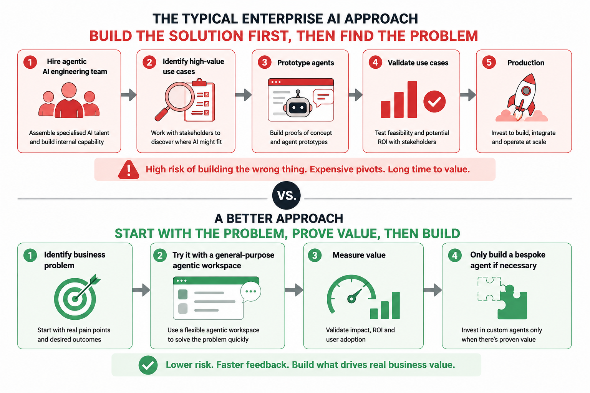

I recently saw a job advert at a prominent investment bank for an Agentic AI Engineer.

This is not the exact post but it was similar.

You can find many more like it.

There is nothing wrong with the technology in this job description. The problem is the starting point. It assumes the answer is to assemble a new platform before anyone has worked out which problems are worth solving.


```markdown
## Senior Agentic AI Engineer

We are looking for an experienced **Senior Agentic AI Engineer** to lead the development of next-generation AI solutions across our enterprise.

You will design, build and deploy production-grade agentic AI systems using the latest developments in large language models, autonomous agents and generative AI.

### What you'll be doing

* Design and build autonomous and multi-agent AI systems
* Develop sophisticated agent orchestration, planning and reasoning workflows
* Build Retrieval-Augmented Generation (RAG) pipelines over enterprise data
* Implement short-term and long-term agent memory
* Develop tool-calling frameworks connecting AI agents to enterprise systems
* Build human-in-the-loop approval and escalation mechanisms
* Design evaluation, observability and guardrail frameworks for production AI
* Deploy and operate scalable AI workloads using Kubernetes
* Build secure APIs and event-driven integrations with existing enterprise systems
* Work with business stakeholders to **identify high-value use cases for agentic AI**
* Rapidly prototype promising use cases and demonstrate them to senior leadership

### What we're looking for

You will have hands-on experience with:

* Python, TypeScript and/or Java
* LangChain, LangGraph, LlamaIndex, Semantic Kernel or equivalent agent frameworks
* OpenAI, Anthropic, Gemini and open-weight LLMs
* Hugging Face Transformers and vLLM
* PostgreSQL, pgvector, MongoDB, Redis, Elasticsearch and Neo4j
* Vector databases such as Pinecone, Weaviate or Milvus
* Kafka and event-driven architectures
* REST, GraphQL and gRPC
* Docker and Kubernetes
* AWS, Azure or Google Cloud
* Terraform and Infrastructure as Code
* CI/CD pipelines
* OAuth2, OIDC and enterprise identity management
* LLM evaluation, tracing and observability
* Prompt engineering and context engineering
* RAG, embeddings and semantic search
* Model routing and inference optimisation
* Agent memory, planning, tool use and multi-agent orchestration

Experience working in regulated enterprise environments would be advantageous.

### Your first challenge

Partner with teams across the organisation to **discover where Agentic AI can deliver the greatest business value and identify the use cases we should build.**
```

The issue I have with this, is it's a solution trying to find a problem.

## A better way

Before hiring a team to build an agent platform, look at what is already available. Start with a chat interface, then add the project, integration, skill or scheduled task that the use case actually needs.



Only build a dedicated agent when the existing workspace cannot do the job. That keeps the effort focused on a real constraint rather than a long list of impressive platform requirements.

## Err, agentic Workspace, whats that?

An agentic workspace is more than a chat window. It is a place where a model can use tools, files, integrations and scheduled tasks to get work done.

- **ChatGPT**, **Mistral Vibe** and **Bionic** already provide agentic capabilities, and may already be deployed in your organisation.
- Open-source options such as **Open WebUI** and **LibreChat** can provide a similar starting point under your control.
- These platforms can connect models to tools, files, enterprise systems and OAuth2-protected services.
- **Scheduled tasks** let agents run in the background, such as producing a daily inbox summary or monitoring a recurring process.
- Users can often solve useful problems by learning to use the platform they already have, rather than waiting for a new agent to be built.

The practical question is often: **what can we do with the agentic workspace already in front of us?**

Start with what is deployed. Build only when the existing capabilities cannot meet the requirement.

## Human in the loop

Many apparent platform gaps are actually training and discoverability problems. Users need to know which tools, files, integrations, prompts and scheduled tasks are available.

- When people can solve their own problems, capability scales across the organisation instead of becoming a queue for one central AI team.
- A team that builds every use case in Python becomes a bottleneck.
- A team that teaches people how to use the available agentic workspace creates more distributed capability while keeping governance centralised.

The scalable model is not one team building every agent. It is one team creating the foundation, and many teams learning how to use it well.
