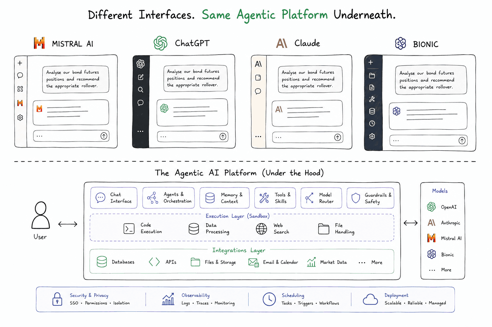
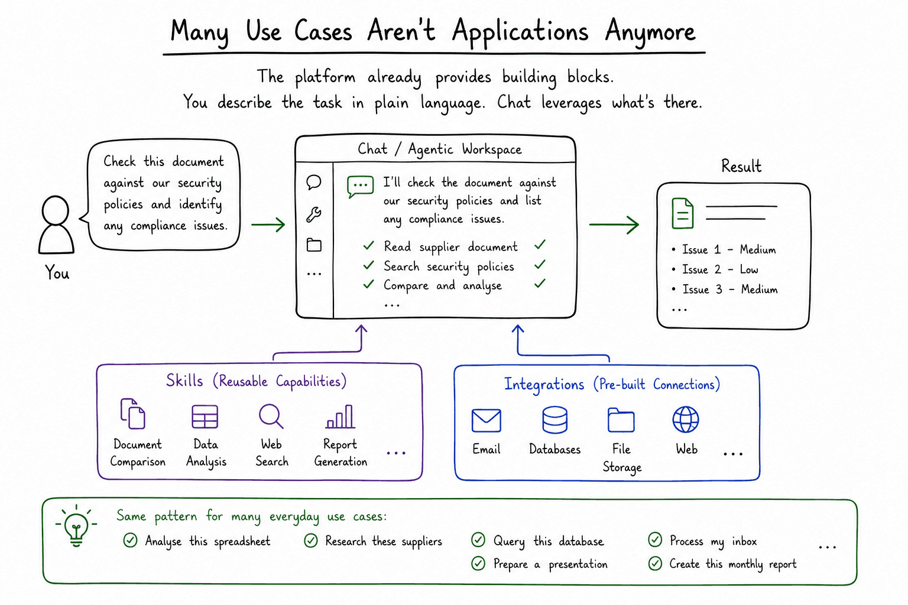
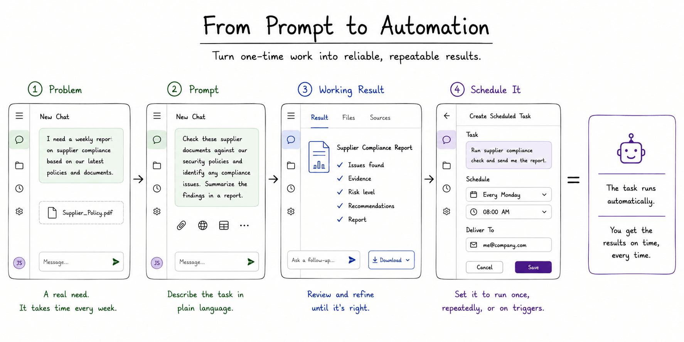
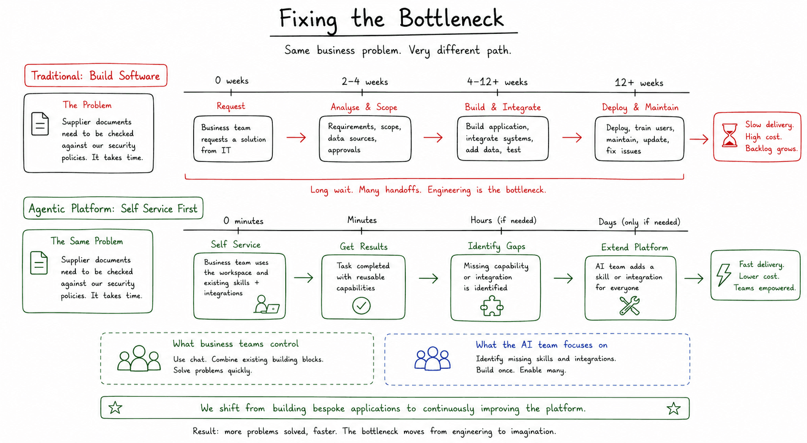
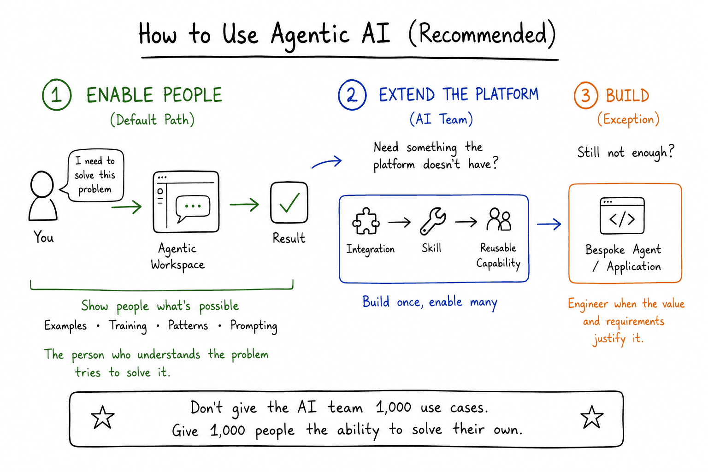

Enterprise AI has a scaling problem.

A typical Agentic AI job advert might look something like this.

## Typical Agentic AI Job Advert

```
We're looking for a Senior Agentic AI Engineer with experience in:

- Python, TypeScript and Java
- LangGraph, LlamaIndex and Semantic Kernel
- RAG and vector databases
- PostgreSQL, MongoDB, Redis, Elasticsearch and Neo4j
- Kafka and event-driven architectures
- Docker and Kubernetes
- AWS, Azure or Google Cloud
- LLM evaluation and observability
- Agent memory, planning and tool use
- Multi-agent orchestration
- Guardrails and human-in-the-loop workflows

You will work with business stakeholders to **identify high-value use cases for Agentic AI**.
```

There's something backwards here.

We've specified the solution in extraordinary detail before we've identified the problem.

This creates two problems.

### Problem #1 - We build before we know what we need

We've already decided that the answer involves agents, RAG, vector databases, orchestration and infrastructure.

The use case might not need any of it.

### Problem #2 - The AI team becomes the bottleneck

Large organisations don't have ten potential AI use cases.

They have thousands.

If every one requires an AI engineer to design, build and deploy an agent, most will never get built.

## The Agentic Platform You May Already Have

A few years ago, giving employees access to an LLM mostly meant giving them a chatbot.

That has changed.

Platforms such as ChatGPT, Claude, Mistral and Bionic are becoming general-purpose agentic workspaces.




They increasingly provide:

| Connect | Work | Automate | Platform |
|---|---|---|---|
| Enterprise integrations | Skills | Scheduled tasks | Model selection |
| Web & enterprise search | File & document processing | Memory | Sandboxed execution |
| Authentication & permissions | Code execution | Artifact generation | Security & governance |

A lot of the infrastructure we previously needed to build for an AI application is becoming part of the platform.

So before asking:

> How do we build an agent for this?

Ask:

> Can the platform already do it?

## Many Use Cases Aren't Applications Anymore

Consider a potential problem that users are having:

> We regularly receive supplier documents that need checking against our security policies. The checks are mostly manual and take time.

You could build an application for that.

Or an agentic workspace can combine capabilities it already has: access the documents, apply a **document comparison skill**, and produce the result.



### Skills and Integrations

**Skills** are reusable ways of doing a task. They can contain instructions, examples, scripts and other resources that teach the platform how your organisation wants something done. OpenAI describes them as ["reusable, shareable workflows"](https://help.openai.com/en/articles/20001066-skills-in-chatgpt).

A skill might know how to compare two documents, analyse a spreadsheet or produce a report in your company's preferred format.

**Integrations** connect the workspace to the systems where the work and data already live: email, databases, file stores, APIs, market data and other enterprise systems. OpenAI's [connected apps](https://help.openai.com/en/articles/11487775-connected-apps-in-chatgpt) similarly allow ChatGPT to access information and perform supported actions in external services.

Together they provide the building blocks:

`User request + Skills + Integrations → Result`

No new application. No deployment. No engineering backlog.

The important change is that modern agentic platforms provide **reusable building blocks**. Skills define what the platform can do. Integrations give it access to the systems and data it needs.

### Typical Skills

| Documents | Data | Research |
|---|---|---|
| Document comparison | Spreadsheet analysis | Web research |
| PDF generation | Data visualisation | Summarisation |
| Presentation creation | Database analysis | Report writing |
| Document extraction | Code execution | Deep research |

### Typical Integrations

| Productivity | Enterprise Data | External |
|---|---|---|
| Email | Databases | Web |
| Calendar | Data warehouses | APIs |
| File storage | Knowledge bases | Market data |
| Office documents | Internal APIs | SaaS applications |

Combine these building blocks and a surprisingly large number of enterprise use cases become things a user can simply ask the platform to do.

### Potential Use Cases

| Analyse | Research | Automate |
|---|---|---|
| Check a contract against policy | Research potential suppliers | Process an inbox |
| Analyse a spreadsheet | Investigate a market movement | Produce a monthly report |
| Query operational data | Compare competing products | Monitor for changes |
| Review financial positions | Prepare a management briefing | Run a scheduled analysis |

These aren't necessarily applications anymore.

## From Prompt to Automation

Some tasks don't just happen once.

Suppose the user gets the result they want and then says:

> Do this every Monday morning and send me the report.

Agentic platforms are increasingly able to schedule the same work to run later or repeatedly. ChatGPT, for example, supports [scheduled tasks](https://help.openai.com/en/articles/10291617-scheduled-tasks-in-chatgpt) for recurring work, monitoring and supported connected apps.

That creates a surprisingly short path:



The user can first prove that the workflow is useful interactively. Only then do they automate it.

Again, that doesn't necessarily require a new application.


**They're tasks assembled from capabilities the platform already has.**

## Fixing the Bottleneck

But the bigger change isn't technical.

It's who solves the next problem.

The first time, our trader might need help from an AI specialist.

They learn how to provide data, use integrations, apply skills, validate the result and automate the workflow.

Next time they have a different problem, they don't necessarily need another AI project.

They can solve it themselves.



Instead of:

> Tell us your use case and we'll build you an agent.

It becomes:

> We'll give you the platform, integrations, skills and training to solve many of your own problems.

Some problems will still require engineering.

That's fine.

Engineering becomes the escalation path, not the starting point.

**The goal isn't to build thousands of agents.**

**It's to enable thousands of people to solve problems using agents.**

## Conclusion

Agentic AI doesn't have to mean building an agent for every use case.

The platforms are increasingly already there. They have tools, skills, integrations, secure execution and automation. The first step should be to see what users can solve with those capabilities.

Help people understand what's possible. Let them solve their own problems. When they hit a limitation, add the missing skill or integration so everyone benefits.

And when a problem genuinely requires bespoke engineering, build it.



**Start with the problem. Use the platform. Extend it when necessary. Build last.**