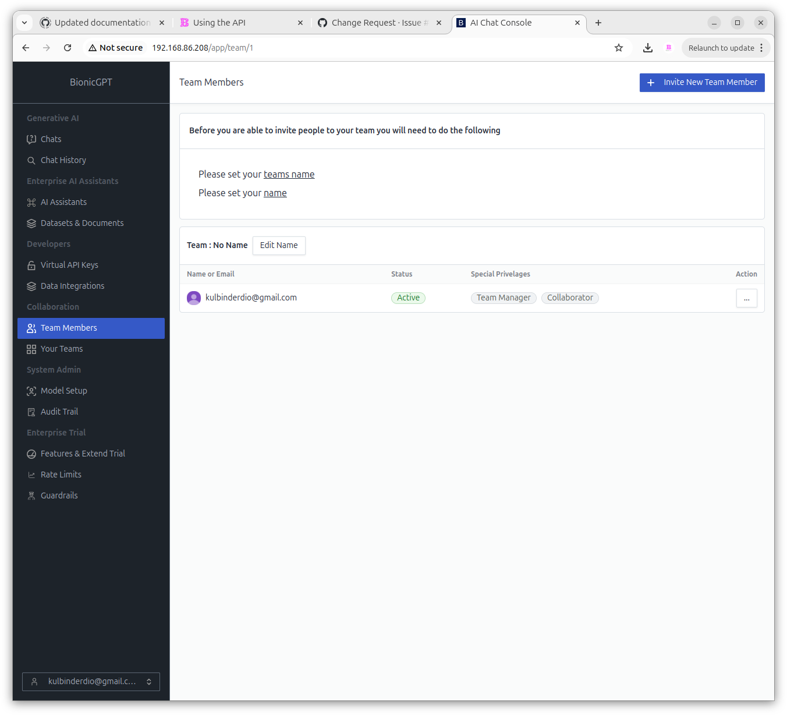
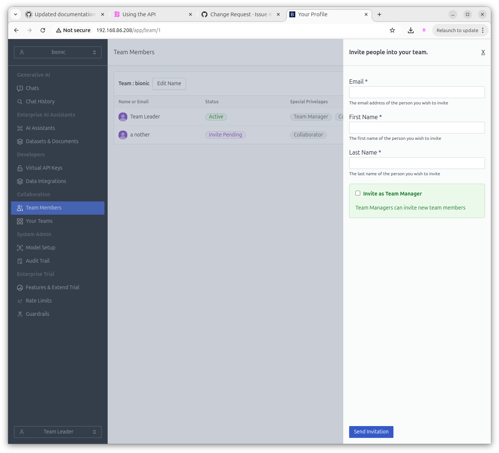
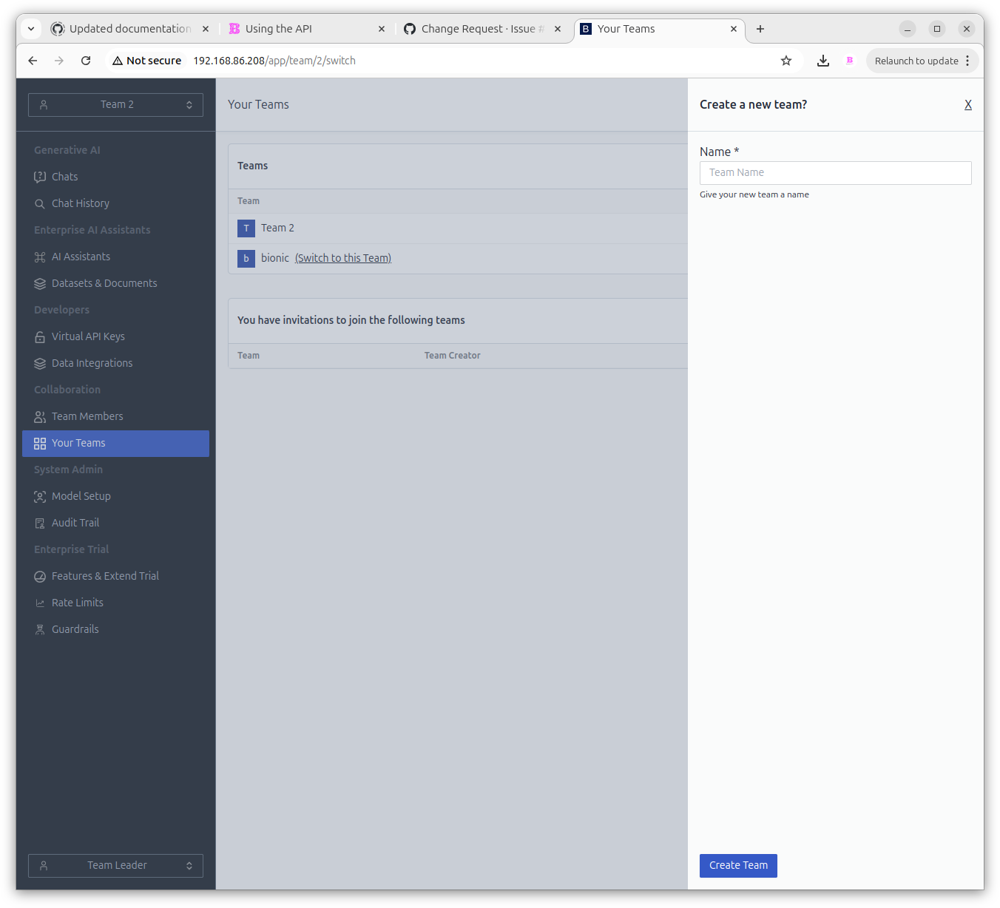

# Teams

**Bionic** provides a team-based permission model that lets you decide who has access to datasets, Projects, and other shared resources.

### Invite Team Members

To add members to your team requires the user to accept an invitation sent by email

### Your Teams

This screen shows all Teams the current user is a member or leader of.
This screen also allows you to create new Teams.

