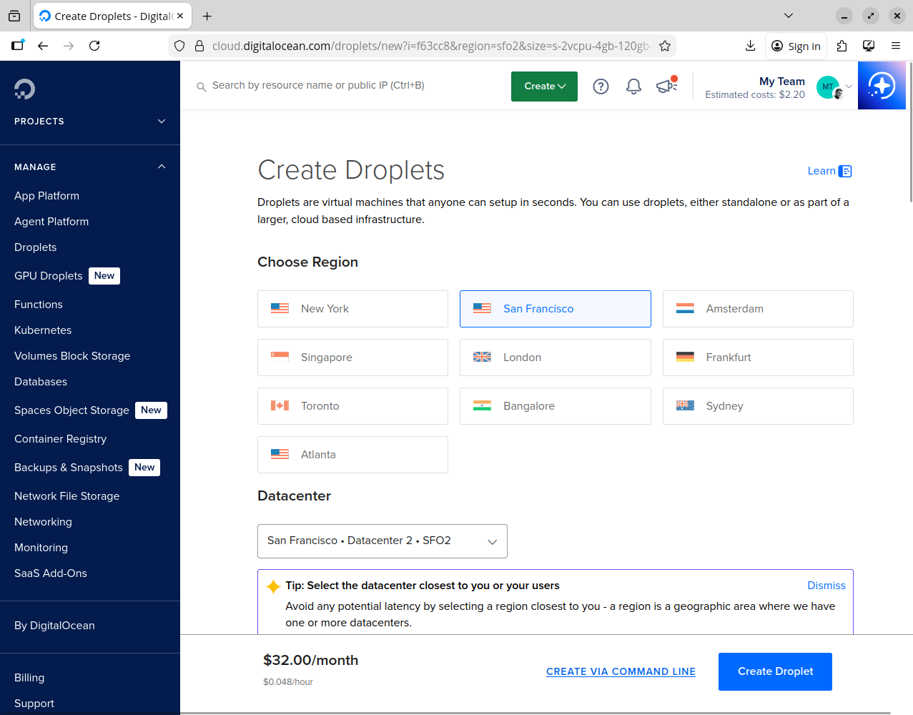
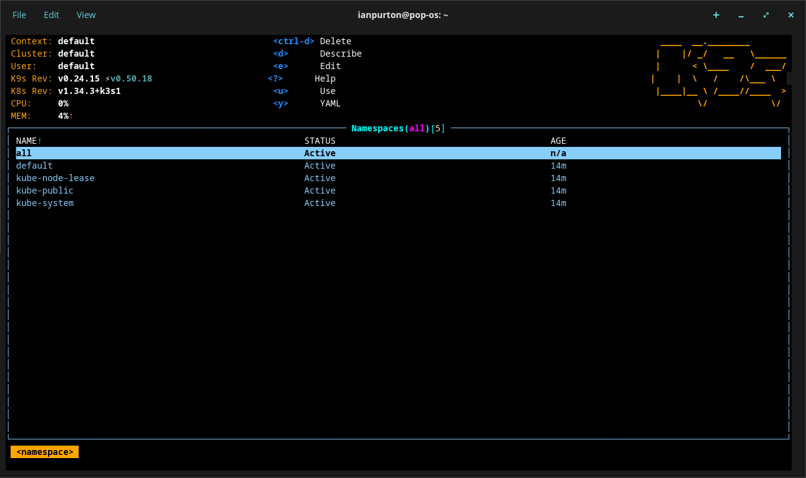
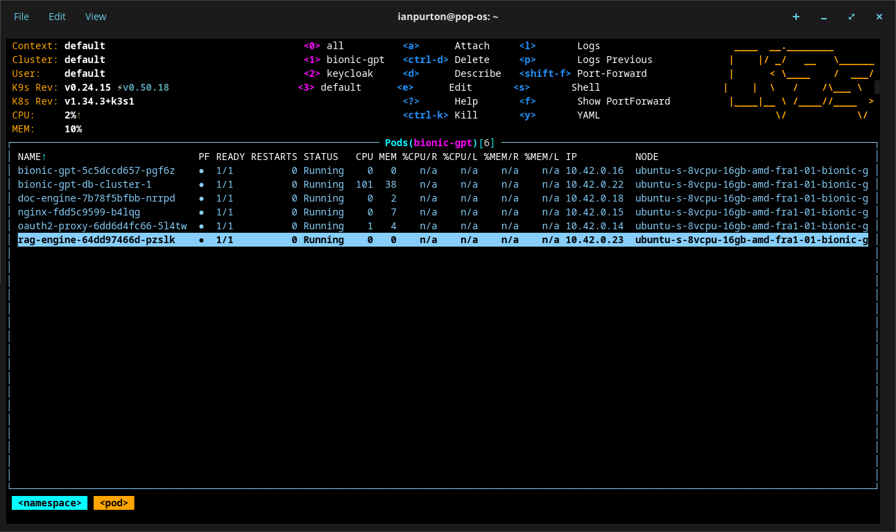

# Installing on Digital Ocean

## Step 1 - Create a new Droplet



## Step 2 - Access the Droplet


```sh
ssh root@.......
```

## Step 3 - Install k3s

```sh
curl -sfL https://get.k3s.io  | INSTALL_K3S_EXEC="--disable=traefik" sh -
```


## Step 4 - Access K8s form your local machine

Get the kubeconfig to your local machine

```sh
export K3S_IP=<DROPLET_PUBLIC_IP>
scp root@$K3S_IP:/etc/rancher/k3s/k3s.yaml ~/.kube/config
sed -i.bak "s#127.0.0.1#$K3S_IP#" ~/.kube/config
```

You can see if everything has worked with [k9s](https://k9scli.io/)

```
k9s
```



## Step 5 - Install Stack

Install the Stack CLI

```sh
curl -fsSL https://stack-cli.com/install.sh | bash
```

## Step 6 - Run Stack Init

```sh
stack init
```

## Step 6 Deploy Bionic with Stack

```sh
curl -fsSL https://raw.githubusercontent.com/bionic-gpt/bionic-gpt/main/infra-as-code/stack.yaml \
  -o bionic.stack.yaml
```

```sh
stack deploy --manifest bionic.stack.yaml --profile dev
```

If you get a "service unavailable" error, wait a bit longer for the cluster to finish starting.

After a while you should be able to see all pods started.

