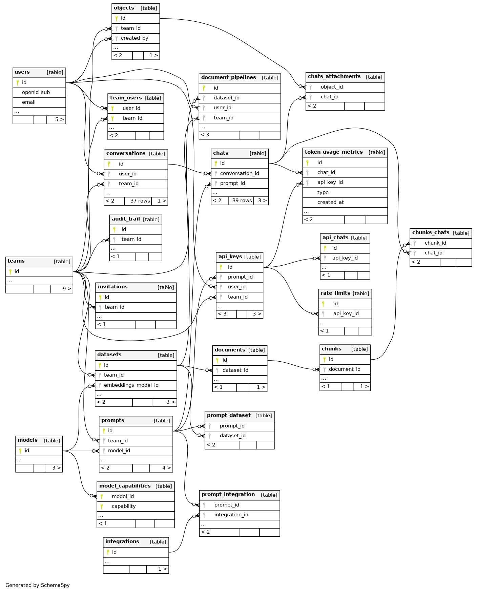
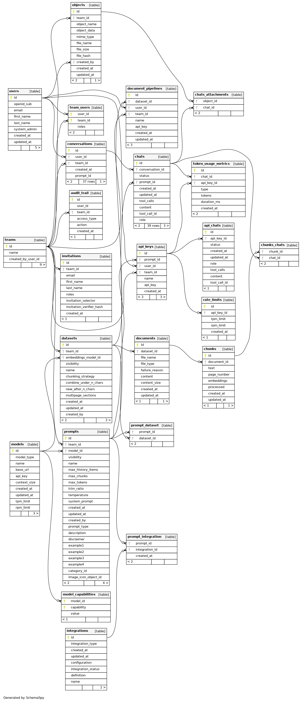
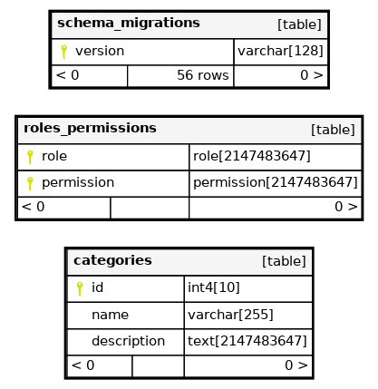

## The Database

We use 2 main tools to manage the database

- `dbmate` For schema migrations
- `cornucopia` for generating rust code from `sql` files.

## Database Schema: Compact

## Database Schema: Full

## Database Schema: Orphans

