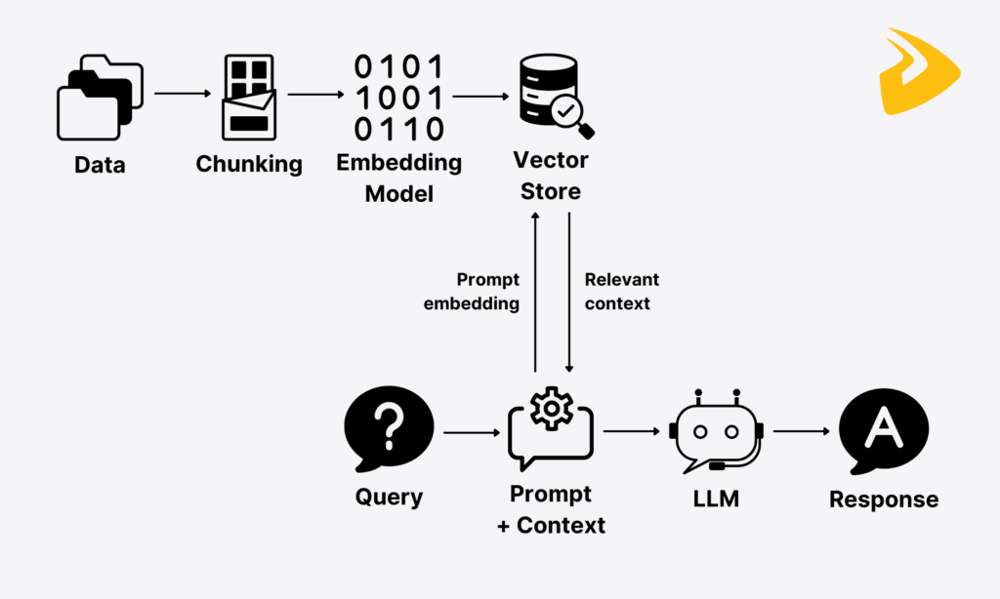

## Summary

1. Legacy Retrieval-Augmented Generation
1. Tool Calls
1. Agentic RAG
1. Real World Examples

## Legacy Retrieval-Augmented Generation


> My Falcon X2 is vibrating after a rotor swap; how do I replace the rotor blades?

#### 1) Ask the model without context

*Spoiler: it hallucinates or shrugs, because nothing tells it what applies to this drone.*

```sh
curl https://api.openai.com/v1/chat/completions \
  -H "Authorization: Bearer $OPENAI_API_KEY" \
  -H "Content-Type: application/json" \
  -d '{
    "model": "o3-mini",
    "messages": [
      {"role":"system","content":"If the answer is not explicitly known, say I do not have enough information. Do not guess."},
      {"role":"user","content":"My Falcon X2 is vibrating after a rotor swap; how do I replace the rotor blades?"}
    ]
  }'
```

#### 2) Embed the user's question

**Why?** Embeddings align the question with the maintenance corpus without dumping the entire manual into the prompt.




```sh
# 2) Get an embedding for the user prompt (only store its ID/handle)
# - Never print the full vector in logs or UI
# - Use any small embedding model you like
curl https://api.openai.com/v1/embeddings \
  -H "Authorization: Bearer $OPENAI_API_KEY" \
  -H "Content-Type: application/json" \
  -d '{
    "model": "text-embedding-3-small",
    "input": "How do I replace the rotor blades on the Falcon X2 drone?"
  }' \
| jq -r '.data[0].embedding' > /tmp/embedding.json
# Persist as a parameter only (not shown to readers)

```

#### 3) Retrieve top-k relevant chunks with pgvector

*Same question, but now the database gives you candidates that actually reference rotor swaps.*

```sql
-- 3) Vector search (pgvector)
-- - $1 is the embedding parameter (binary/JSON array bound by your client)
-- - <-> is the distance operator; choose ops class per metric (cosine/L2/IP)
-- - LIMIT k keeps the context small
SELECT
  id,
  text
FROM chunks
ORDER BY embedding <-> $1
LIMIT 5;

```

#### 4) Ask the model again, now with retrieved context

**Result.** We just glue retrieved snippets under the user’s message and hope the model cites only those lines.

```sh
# 4) Compose a grounded prompt (system or user content) with the retrieved chunks
# - Keep a short, explicit instruction to "cite from context only"
# - Keep history light to avoid runaway token growth
curl https://api.openai.com/v1/chat/completions \
  -H "Authorization: Bearer $OPENAI_API_KEY" \
  -H "Content-Type: application/json" \
  -d '{
    "model": "gpt-4.1",
    "messages": [
      {"role":"system","content":"Answer using the provided context only. If unsure, say so."},
      {"role":"user","content":"How do I replace the rotor blades on the Falcon X2 drone?"},
      {"role":"user","content":"CONTEXT:\n- <chunk 1 text>\n- <chunk 2 text>\n- <chunk 3 text>\n- <chunk 4 text>\n- <chunk 5 text>"}
    ]
  }'

```

### Problems

1. **Fixed retrieval** → Same `k` every time → either too much or too little context.
2. **Model has no control** → It can’t decide when or how to search.
3. **One-shot search** → If retrieval misses, answer is wrong.
4. **Chat history bloat** → Context gets bigger and messier each turn.
5. **Manual tuning required** → Humans keep tweaking chunk size / k / prompts.


## Tool Calls

Tool calling hands the model a menu of actions so it can decide when to reach outside the prompt. Instead of cramming all context up front, we expose a `search_context` function and let the model ask for it if the question needs fresh evidence.

```sh
curl https://api.openai.com/v1/chat/completions \
  -H "Content-Type: application/json" \
  -H "Authorization: Bearer $OPENAI_API_KEY" \
  -d '{
    "model": "gpt-5",
    "messages": [
      {"role": "user", "content": "How do I replace the rotor blades on the Falcon X2 drone?"}
    ],
    "tools": [
      {
        "type": "function",
        "function": {
          "name": "lookup_drone_manual_section",
          "description": "Look up information from the drone maintenance manual based on a query.",
          "parameters": {
            "type": "object",
            "properties": {
              "query": {
                "type": "string",
                "description": "User question or topic to search for in the drone manual."
              }
            },
            "required": ["query"]
          }
        }
      }
    ],
    "tool_choice": "auto"
  }'
```

### Response

```json
{
  "id": "chatcmpl-87b9",
  "object": "chat.completion",
  "choices": [
    {
      "index": 0,
      "message": {
        "role": "assistant",
        "tool_call": {
          "id": "call_01F6",
          "type": "function",
          "function": {
            "name": "lookup_drone_manual_section",
            "arguments": "{\"query\":\"replace rotor blades on Falcon X2\"}"
          }
        }
      },
      "finish_reason": "tool_calls"
    }
  ]
}
```

That hand-off turns raw Agentic RAG plumbing into a reusable capability. The model can inspect the user's request, trigger a search if needed, and keep going if not—no human babysitting required.

## Agentic RAG

Agentic RAG strings together those tool calls into a feedback loop: observe the question, fetch targeted evidence, reason, and then repeat if gaps remain.

#### 1) Model chooses to search (tool call)

**Decision.** The agent inspects the request, chooses the `search_context` tool, and sets the scope (`limit`) it needs for this turn.

```sh
curl https://api.openai.com/v1/chat/completions \
  -H "Content-Type: application/json" \
  -H "Authorization: Bearer $OPENAI_API_KEY" \
  -d '{
    "model": "gpt-5",
    "messages": [{"role": "user", "content": "How do I replace the rotor blades on the Falcon X2 drone?"}],
    "tools": [{"type": "function","function": {"name": "search_context", "parameters": {"type": "object"}}}],
    "tool_choice": "auto"
  }'
```

```json
{
  "message": {
    "role": "assistant",
    "tool_call": {
      "type": "function",
      "function": {"name": "search_context", "arguments": "{\"query\":\"rotor blades Falcon X2\",\"limit\":3}"}
    }
  }
}
```

#### 2) Tool returns scoped chunks

*Payload stays tight—only the vetted chunks and their IDs come back for grounding.*

```json
{
  "tool_call_id": "call_02AB",
  "role": "tool",
  "name": "search_context",
  "content": "{\"chunks\":[{\"id\":123,\"text\":\"Step 1 remove battery\"},{\"id\":982,\"text\":\"Torque specs\"}]}"
}
```

#### 3) Model reasons with fresh evidence

**Synthesis.** The agent crafts the answer with explicit citations and decides whether another tool call is warranted.

```json
{
  "role": "assistant",
  "content": "Here is the replacement procedure… (citing chunks 123, 982)"
}
```

The agent can immediately follow up with another search, a planner, or a write-back tool—each call informed by the chunks that were actually useful. The context stays tight, decisions stay explainable.


| Legacy Retrieval-Augmented Generation | Agentic RAG |
| --- | --- |
| ✗ Fixed `k` per query | ✓ Model selects `limit` per turn |
| ✗ Retrieval always runs | ✓ Tool call only when useful |
| ✗ Context copied inline | ✓ Chunks tracked and reused |
| ✗ Manual prompt dialing | ✓ Policy lives in the tool |
| ✗ Hard to mix other actions | ✓ Retrieval chains with planners/tools |

## Real World Examples

Drone customer support email. The agent inspects the complaint, pulls only the maintenance snippets that match that drone's serial configuration, and replies with torque specs plus a short troubleshooting script without drowning the user in irrelevant docs. Retrieval here pulls maintenance bulletins, repair manuals, and post-flight inspection checklists tied to the Falcon X2.

> My Falcon X2 is vibrating after a rotor swap; what torque should I use and in what order?

Compliance. A risk officer asks about a new regulation and the agent fetches recent policy memos, highlights prior decisions tagged to the same product line, and drafts a review checklist that cites source IDs for auditing. The agent mixes regulatory updates, past compliance rulings, and product-specific risk assessments so legal can trace the answer.

> Does Regulation 42/2024 apply to bundled FX products we sold in Q3 and what precedent did we set last year?
