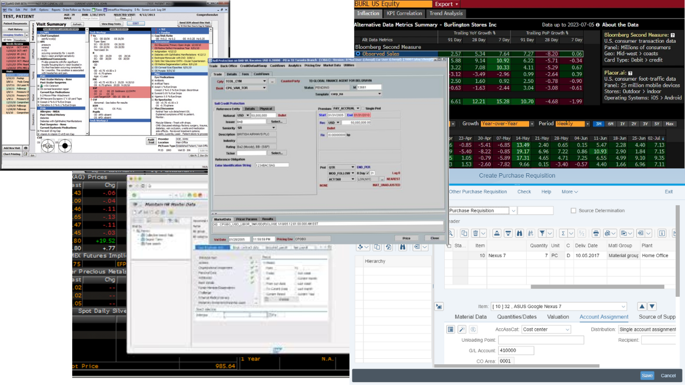
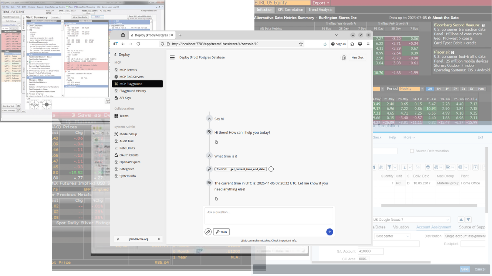
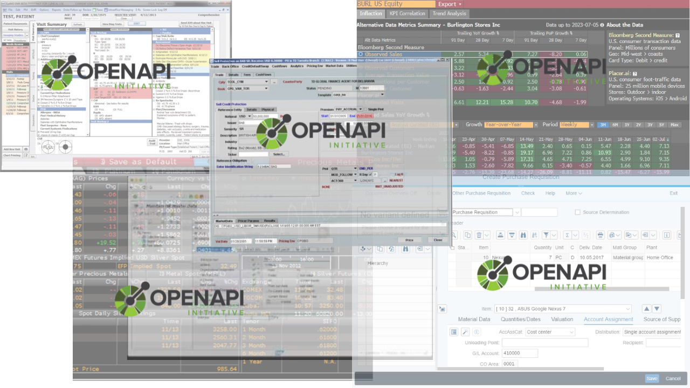
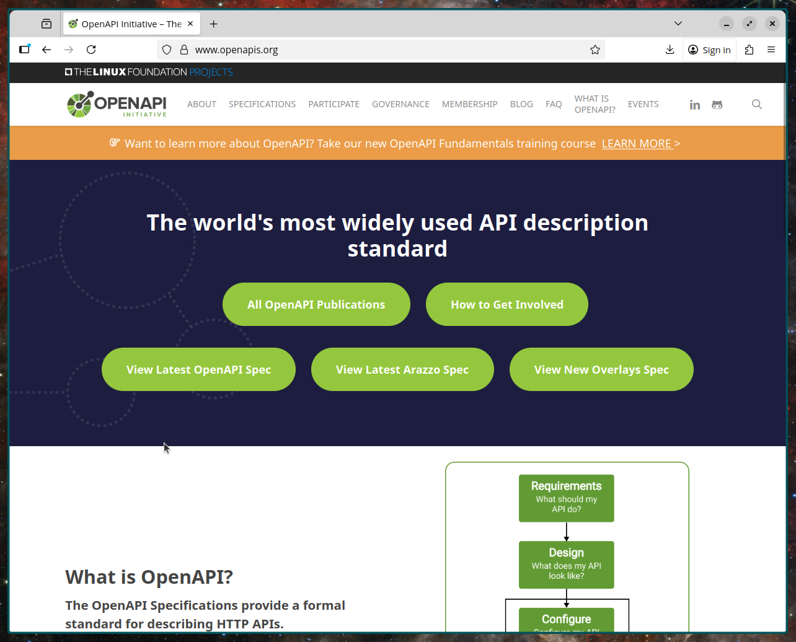
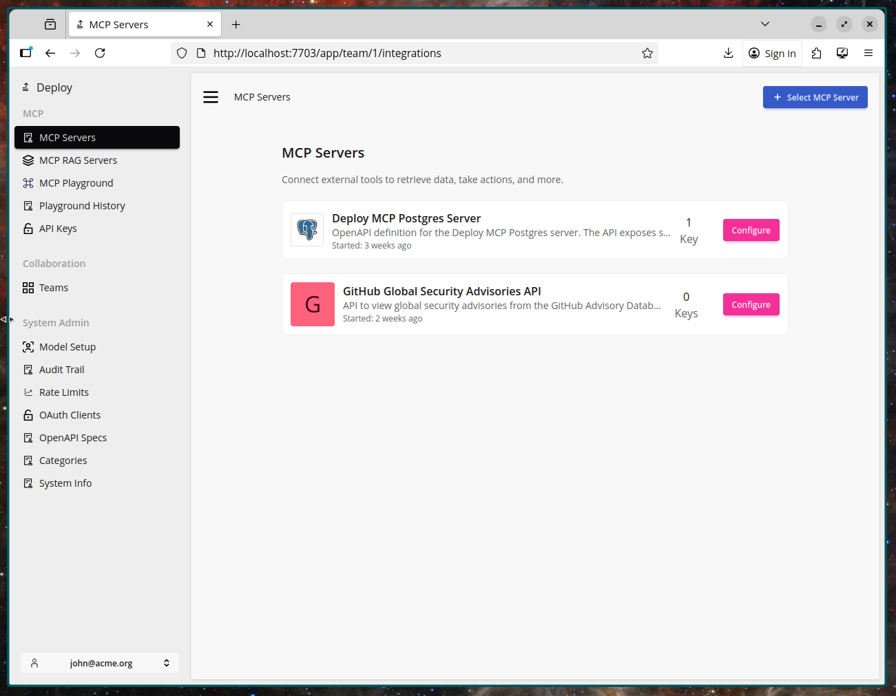
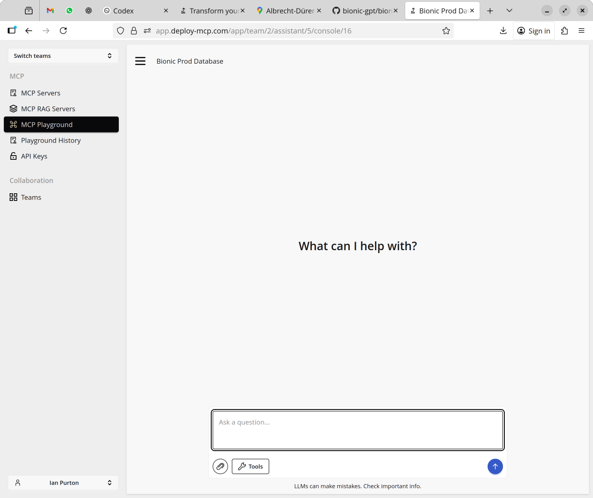

## We now have the technology to connect LLMs to Enterprise Systems

The *Model Context Protocol (MCP)* allows large, regulated organizations to safely connect the systems they already rely on to a **governed, auditable AI assistant** — without changing permissions, ownership, or governance models. Each user continues to operate strictly within their existing entitlements, and every action is fully logged.

This pattern applies across industries:

- Financial Services: trade amendments, risk checks, client onboarding
- Healthcare: prior auth, claims resolution, clinical summaries
- Manufacturing: maintenance requests, inventory queries, production scheduling

### This Leads To...

- *Simpler workflows:* teams move through one guided chat instead of juggling a patchwork of consoles and green screens.
- Reduced dependence on *institutional expertise*: processes become explicit, documented, and repeatable.
- *Stronger oversight:* every tool call is logged, routed through the same approval queue, and can be replayed when auditors or safety teams need proof.

## Running a Pilot or Proof of Concept

Start by identifying where your systems already expose stable contracts — OpenAPI specs, service endpoints, internal gateways, or batch interfaces.
These become the source of truth the assistant relies on.

### 1. Mapping out existing systems

Here we'll demonstrate a possible Proof of Concept using Open API specifications.

This gives us the following benefits:

- Shared artifact for architecture, security, and compliance review
- Auto-generated docs, SDKs, and contract tests
- Clear blast radius before anything touches production data

OpenAPI specs provide the contract agents rely on.

### 2. Turning Specifications into MCP Servers

Once the interface is defined, it can be fed into Deploy and published as an MCP tool inside your controlled environment.

- Attach metadata: owners, environment boundaries, data classification
- Apply standard controls: RBAC, logging, throttling, approvals
- No change to the underlying system — only the interface layer

### 3. Connecting a Chat UI

With the MCP server registered, a chat interface becomes the front door.

- Prompts resolve into structured tool calls with guardrails
- The assistant summarizes results and asks for confirmation when needed
- Operators approve or deny actions with clear visibility into what will run

With the specs and tools published, a chat surface becomes the control plane.

## The future is the console

A chat interface becomes the front door to enterprise systems.
Users describe the outcome; the model coordinates the necessary tools, systems, and approvals.

- Natural language becomes the request layer
- Tool calls become the execution layer
- Logging and governance remain consistent and centralized

Conversation becomes the API.
