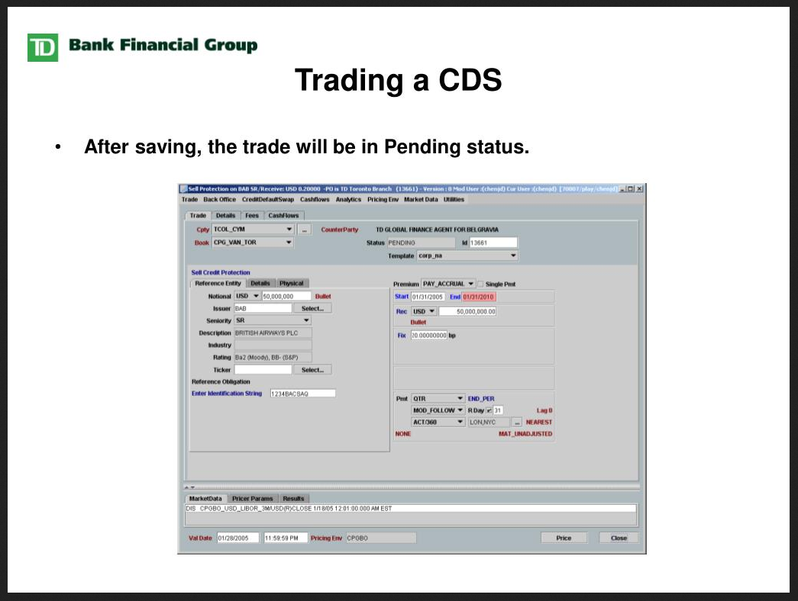
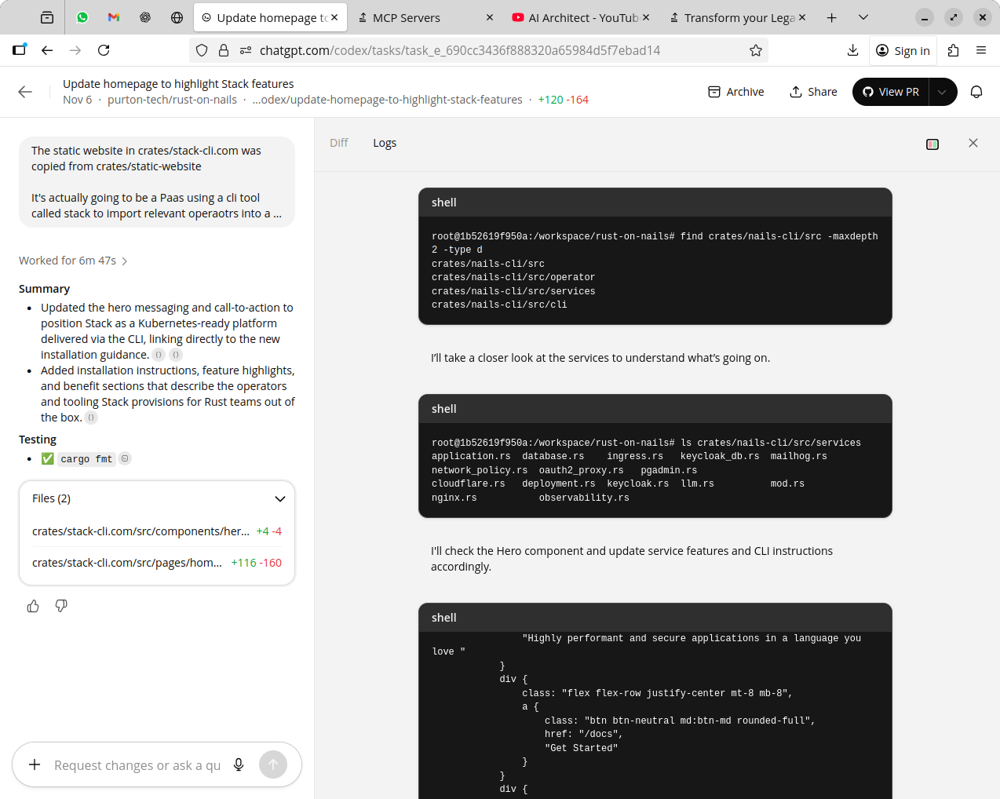

## Wouldn't it be nice if...

> Book wednesday off next week


> Do a bond roll over



## What Agentic AI Looks Like




## First Spec out the Systems


## The spec

```json
```

## Deploying the Spec

## Chat with your legacy system

## Authentication and Access

## The Chat is the UI