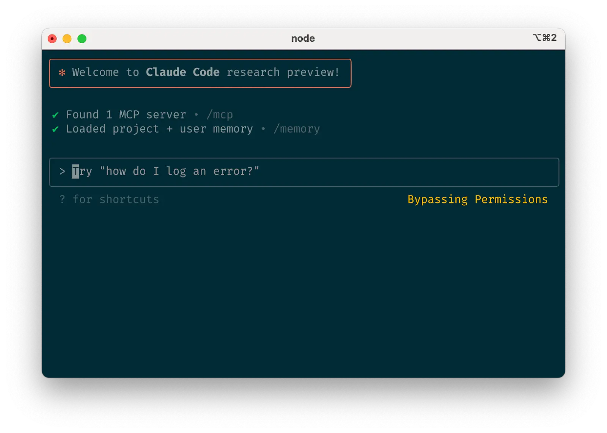

Thanks to [Josh beckman](https://www.joshbeckman.org/blog/practicing/dont-forget-remote-mcp-servers-are-just-curl-calls) for the inspiration for this artice.

## LLM's and Tool Calls

Modern language models can call external tools when you describe those tools in the request. Before we look at the Model Context Protocol (MCP), let's review a plain chat completion with [Groq](https://groq.com/) to set the baseline.

Grab an API key from Groq (or a compatible OpenAI-style provider) and export it for later use.

```sh
export API_KEY=sk-your-key-here
```

This first request is a regular chat completion: the model only sees text and there is no tool access yet.

```sh
curl https://api.groq.com/openai/v1/chat/completions \
  -H "Content-Type: application/json" \
  -H "Authorization: Bearer $API_KEY" \
  -d '{
    "model": "meta-llama/llama-4-maverick-17b-128e-instruct",
    "messages": [
      {"role": "user", "content": "What is the current price of bitcoin?"}
    ]
  }'
```

The response contains the assistant's best guess taken from its training data, plus usage metadata. No live price lookup happens because the model was not allowed to call anything.

### Adding Tool Call Definitions

To let the model call a tool, we describe the function contract in the `tools` array. The model will decide if it needs to call it, and it will return a `tool_calls` block instead of a final answer when it does.

```sh
curl https://api.groq.com/openai/v1/chat/completions \
  -H "Content-Type: application/json" \
  -H "Authorization: Bearer $API_KEY" \
  -d '{
    "model": "meta-llama/llama-4-maverick-17b-128e-instruct",
    "messages": [
      {"role": "user", "content": "What is the current price of bitcoin?"}
    ],
    "tools": [
      {
        "type": "function",
        "function": {
          "name": "get_bitcoin_price",
          "description": "Get the current price of Bitcoin in the requested fiat currency.",
          "parameters": {
            "type": "object",
            "properties": {
              "currency": {
                "type": "string",
                "enum": ["USD", "EUR", "GBP"],
                "description": "Fiat currency to quote the price in"
              }
            },
            "required": ["currency"]
          }
        }
      }
    ]
  }'
```

This time the JSON response looks like this (edited to show the important bits):

```json
{
  "choices": [
    {
      "message": {
        "tool_calls": [
          {
            "id": "tool-call-id",
            "function": {
              "name": "get_bitcoin_price",
              "arguments": "{\"currency\":\"USD\"}"
            }
          }
        ]
      },
      "finish_reason": "tool_calls"
    }
  ]
}
```

The model has stopped so we can run the requested function. Now we need something that can actually resolve `get_bitcoin_price`. That is where MCP comes in.

### Running a Bitcoin MCP server

The Model Context Protocol standardises how tools are exposed to language models. Deploy spins up an MCP server for us; for example the blockchain server exposes a `getTicker` tool. When Deploy finishes provisioning you'll get a base URL such as `https://app.deploy-mcp.com/v1/mcp/blockchain/<connection-id>`.

```sh
export MCP_URL=https://app.deploy-mcp.com/v1/mcp/blockchain/e4a99bcf-82c2-4b26-a979-0ff668da42b6
```

### Authenticate with Deploy

Generate an MCP API key from the Deploy dashboard (App -> API Keys) and export it so `curl` can send it on every request.

```sh
export DEPLOY_API_KEY=deploy_your-key-here
```

Each call to the MCP endpoint must now include the key as a bearer token.

### Listing tools from the MCP server

The MCP interface is JSON-RPC. We can enumerate tools to confirm what the server offers.

```sh
curl \
  -H "Content-Type: application/json" \
  -H "Accept: application/json" \
  -H "Authorization: Bearer $DEPLOY_API_KEY" \
  -d '{"jsonrpc":"2.0","id":1,"method":"tools/list","params":{}}' \
  $MCP_URL \
  | jq '{tools: [.result.tools[] | {name, description}]}'
```

```json
{
  "tools": [
    {
      "name": "getTicker",
      "description": "Get Bitcoin prices by currency"
    }
  ]
}
```

We now know the tool name we need to call to fulfil the model's request.

### Calling a tool on the MCP server

Next, trigger the tool and ask the server for a live quote. The raw response includes prices for many fiat currencies, so we trim it to the few we care about.

```sh
curl -X POST $MCP_URL \
  -H "Content-Type: application/json" \
  -H "Accept: application/json" \
  -H "Authorization: Bearer $DEPLOY_API_KEY" \
  -d '{
    "jsonrpc": "2.0",
    "id": "example-session-id",
    "method": "tools/call",
    "params": {
      "name": "getTicker"
    }
  }' \
  | jq '{
      id,
      price: {
        USD: .result.output.USD,
        EUR: .result.output.EUR,
        GBP: .result.output.GBP
      }
    }'
```

```json
{
  "id": "example-session-id",
  "price": {
    "USD": {"last": 114583.17, "symbol": "USD"},
    "EUR": {"last": 97422.73, "symbol": "EUR"},
    "GBP": {"last": 85049.36, "symbol": "GBP"}
  }
}
```

The `price` block above is exactly what we need to hand back to the LLM so it can finish answering the user.

### Passing the tool result back to the model

We now resume the chat, providing the tool output as a `tool` role message keyed by the `tool_call_id` the model gave us. The messages array mirrors the full conversation: user question → assistant tool call → tool response → assistant final answer. Swap in the actual `tool_call_id` you received from the first response.

```sh
curl https://api.groq.com/openai/v1/chat/completions \
  -H "Content-Type: application/json" \
  -H "Authorization: Bearer $API_KEY" \
  -d '{
    "model": "meta-llama/llama-4-maverick-17b-128e-instruct",
    "messages": [
      {"role": "user", "content": "What is the current price of bitcoin?"},
      {
        "role": "assistant",
        "tool_calls": [
          {
            "id": "tool-call-id",
            "type": "function",
            "function": {
              "name": "get_bitcoin_price",
              "arguments": "{\"currency\":\"USD\"}"
            }
          }
        ]
      },
      {
        "role": "tool",
        "tool_call_id": "tool-call-id",
        "name": "get_bitcoin_price",
        "content": "{\"USD\":{\"last\":114583.17,\"symbol\":\"USD\"},\"EUR\":{\"last\":97422.73,\"symbol\":\"EUR\"},\"GBP\":{\"last\":85049.36,\"symbol\":\"GBP\"}}"
      }
    ]
  }'
```

The final response will look similar to:

```json
{
  "choices": [
    {
      "message": {
        "role": "assistant",
        "content": "The current price of bitcoin is $114,583.17 USD. Please note that cryptocurrency prices are highly volatile and can change rapidly. For the most up-to-date information, I recommend checking a reliable cryptocurrency exchange or price tracking website."
      },
      "finish_reason": "stop"
    }
  ]
}
```

### The MCP Clients

So claude code and other MCP clients manage taking the tool call requests from the models, passing those to the relevant MCP server and returning the results back to the model.




It's the same for any tools or services that connect to external systems.

### That's Agentic AI Folks!

This tool-calling dance is how most agentic systems are stitched together today. The model orchestrates the workflow: detect a need, request tool execution, ingest the result, and finally communicate an answer. MCP standardises the tooling side so your agents can discover capabilities at runtime and call them over a single JSON-RPC channel. Chain a few of these steps—planning, tool execution, reflection—and you have the core loop behind modern AI assistants, copilots, and automation bots.
