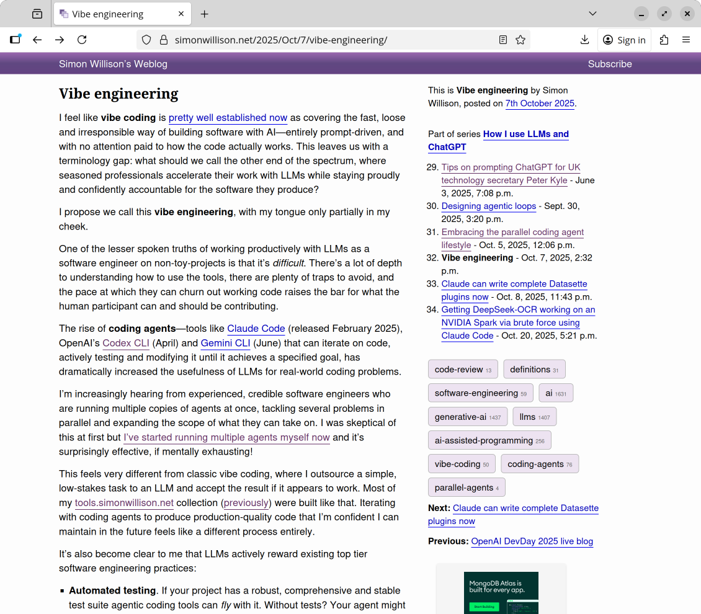
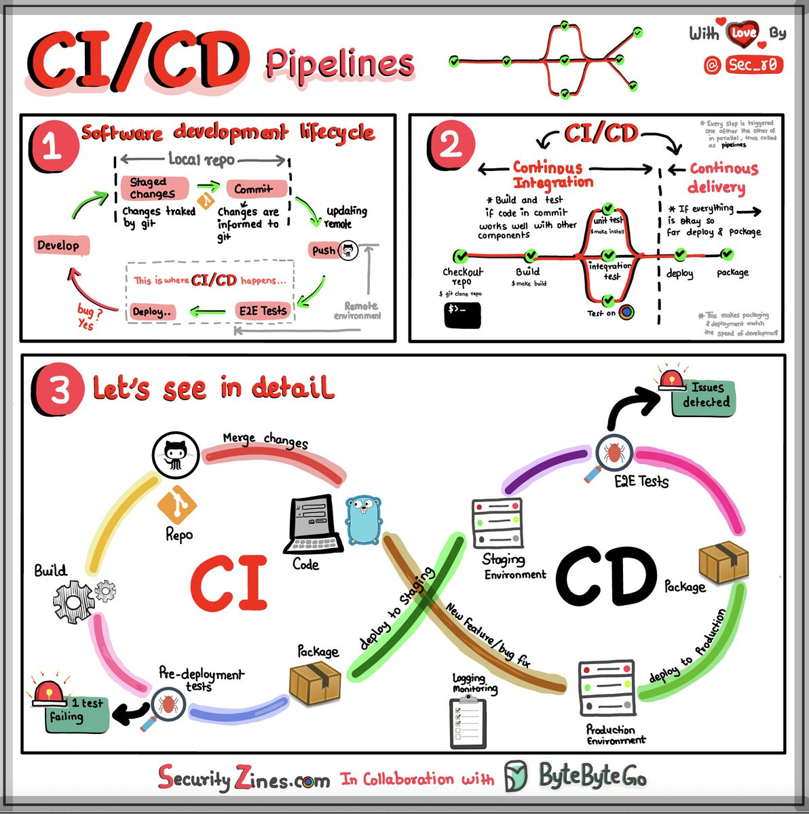
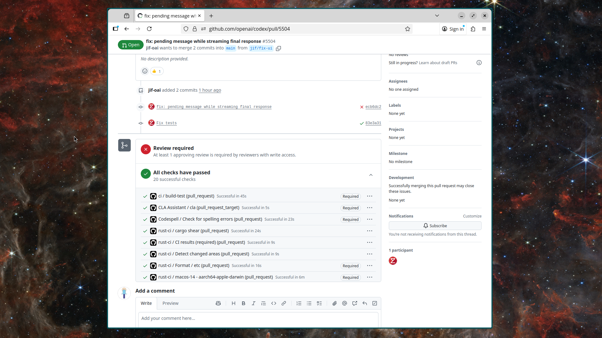
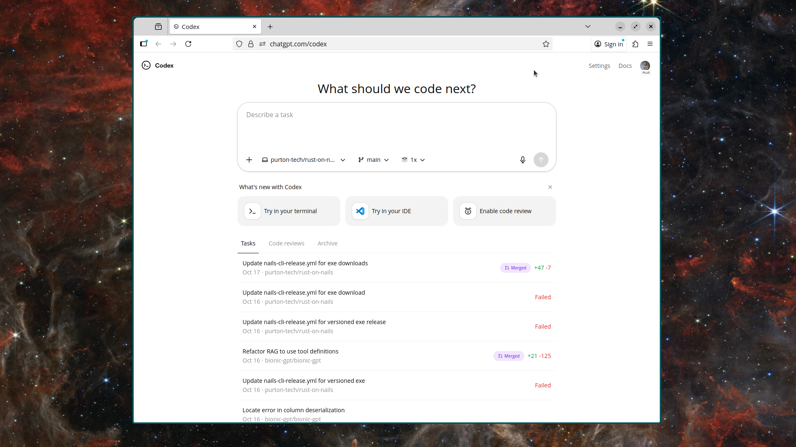

## Vibe Engineering Definition

The term “vibe engineering” comes from an article by [Simon Willison](https://simonwillison.net/2025/Oct/7/vibe-engineering/). He never nails down a formal definition, so I fed the piece into ChatGPT to capture the spirit of what he described.

> Vibe engineering is the practice where experienced software engineers leverage large-language-model tools and agentic coding loops to build production-quality software with full accountability, rather than simply handing off tasks to AI and hoping it works.

To me, vibe engineering is the antidote to “vibe coding,” where you let an AI sling changes into production without taking responsibility. The goal is to keep craftsmanship intact while embracing the velocity good tooling can provide.

The article resonated because it matches how I’ve been working over the last few months. I still own the outcome, I simply have a tireless assistant sitting in my terminal.

## It's the Software Development Life Cycle

Putting consistent software-engineering practices in place is hard, and in most teams I work with it is the first thing to slip. Recruiting may be humming along, but without a clear SDLC they leave a lot of value on the table: code reviews pile up, infrastructure drifts, regressions sneak into production.

Good vibe engineering starts with the unglamorous fundamentals: reliable tests, automated deployments, observability, and runbooks that tell future you what just happened. When those are dialed in, your AI helper has a stable system to plug into—and so does every new human joining the project.

## The Pull Request

When you zoom out, our main job is to produce solid pull requests. Every PR is a chance to document why a change exists, link the context, and make it easy to review.

- [Example from Codex](https://github.com/openai/codex/pull/5504)

Pull requests are where all the quality controls live: tests, linters, security scanners, and human judgment. An agent can tee up the work, but you decide whether the diff is safe to merge.

## Preparing Projects for AI

An agent walks into your repository blind; it has the code, but no shared history. The better we frame the project, the faster it gets productive. Onboard it like you would a senior hire: share the architecture, the naming conventions, the “don’t touch this” modules.

I’ve found [AGENTS.md](https://agents.md/) to be a helpful format for that orientation. Outline the domain, the data flows, and the processes the agent should follow. Humans benefit from the same clarity, so the effort pays off twice.

Spin up a solid [Devcontainer](https://containers.dev/) while you’re at it. It keeps the environment deterministic, surfaces all the tooling to the agent, and saves everyone from “works on my machine” sessions.

## The New Software Development Lifecycle

Once the groundwork is done, the lifecycle bends but doesn’t break. We still discover work, design solutions, write code, review, and ship. The difference is how quickly we can move through each phase with an agent at our elbow.

### Using AI for Planning (Optional)

I sometimes ask the model to sketch a plan before I touch the code. A simple prompt like this gives me a concrete starting point:

> I want to add payments to this application. Come up with a technical specification and suggestions for how we can best do this.

- The agent sees the existing code and can match patterns that already work.
- Given a clear requirement it can outline architecture, risks, and open questions.
- I iterate on that plan, keep what makes sense, and discard the rest.

Most days I skip the planning step and go straight to the editor, but having the option helps when the change touches multiple systems.

### The Code Loop

- Everything sits in version control, so we can revert or branch off safely.
- The agent uses the same tools we do—formatters, test runners, editors—no hidden magic.
- We review every diff, request adjustments, and make sure the change matches the intent.
- When we’re happy, the agent can prepare the PR, but we are the ones who press merge.

## Back to the PR

- The pull request remains the quality gatekeeper.
- Continuous integration kicks off with the exact same rigor for humans and AI.
- Accountability stays with us; the tooling just helps us make better calls faster.

Vibe engineering isn’t about ceding control to automation. It is about embracing the new tools while keeping the professional guardrails that make software reliable. That combination is how we ship faster **and** sleep at night.
