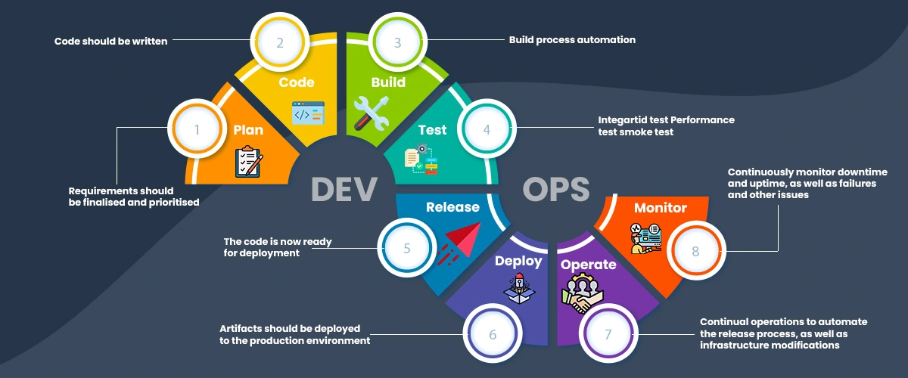

## Vibe Engineering Definition

The term vibe engineering comes form an article by [Simon Willison](https://simonwillison.net/)

## I think he means SDLC or DevOps

## Plan

This could mean planning meets. Its demand management.

Some of the things I've seen.

- Meetings taking longer than implentation
- Incrorrect communication of customer requirements

It could also mean architecture

So this bit got faster.

## Code

This bit also got faster.

## Build

This bit is still fuvked.

## Test

It would be nice.

https://github.com/openai/codex/blob/main/.github/workflows/rust-release.yml

## The Pull Request

## Best Parcytice Take Aways

- Devcontainer
- Agents.md
- CI/CD
