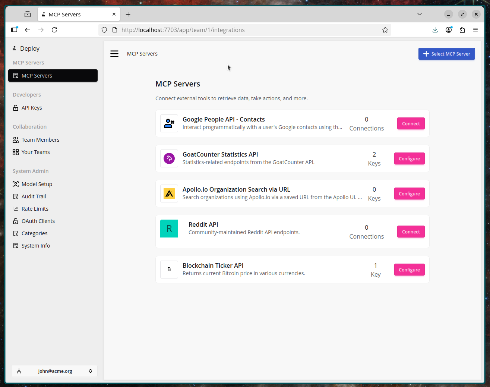
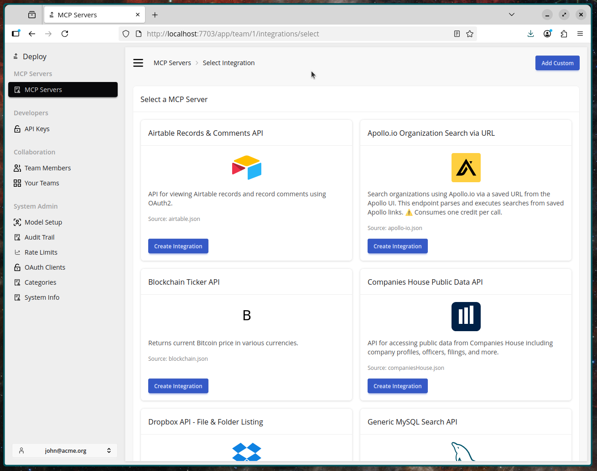
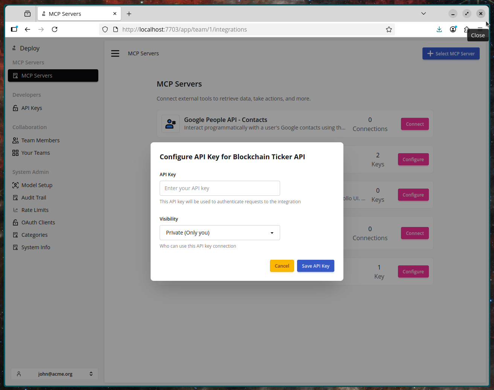
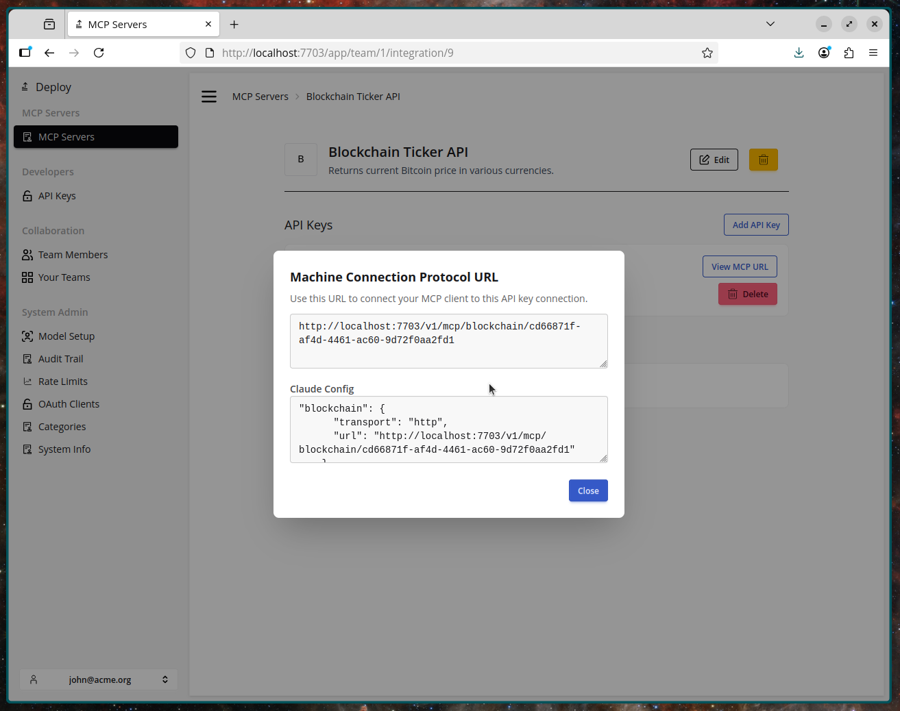

# Run Your First MCP Server

Deploy lets you run MCP servers on our infrastructure and takes away the pain of authentication and resource management.

## 1. From the MCP Servers

Select the option to "Select MCP Server"

## 2. Select an MCP Server

Run a server by clicking the "Run MCP Server" button.

You can choose any but for this case let's choose the Blockchain MCP server.

## 3. Connect and Configure your MCP Server

Here you need to add API keys from the relevant provider or use Oauth2. In the case of the Blockchain MCP server you can enter anything as an API key.

## 4. Get your MCP server URL

You can now add the URL to the remote MCP servers section in your client.
