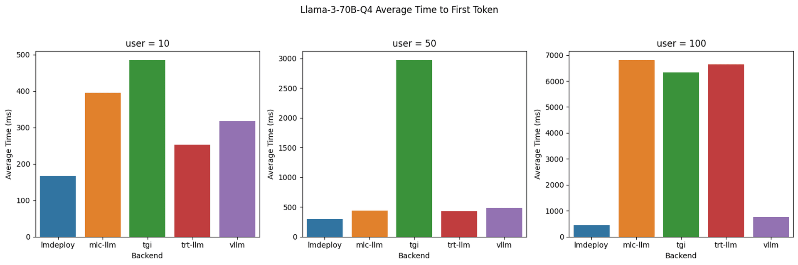
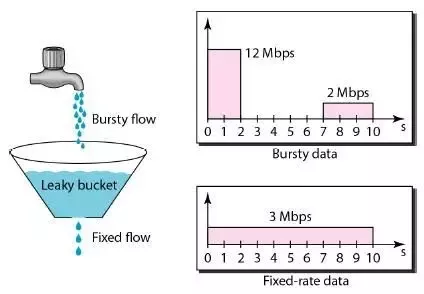
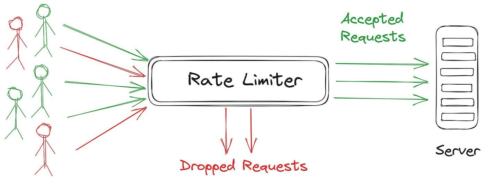
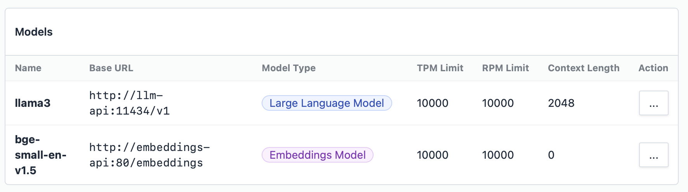

## What is Model Denial of Service?

Model Denial of Service (DoS) on large language models (LLMs) and other machine learning (ML) systems can disrupt normal operations or degrade performance. These attacks can take various forms, each exploiting different aspects of the model's functionality or its supporting infrastructure. [Model Denial of Service](https://genai.owasp.org/llmrisk/llm04-model-denial-of-service/) is on the Owasp Top 10 List for LLM and Generative AI applications.

Note: We call them *attacks* but **often these can be unintentional** i.e. a script left running overnight or just normal day to day usage.

Here are some of the types of DoS. 

1. Adversarial Example Attacks
**Perturbation Attacks:** Small, crafted changes to inputs can mislead the model into incorrect outputs, increasing computational load.

2. Resource Exhaustion Attacks
**Query Flooding:** Sending a high volume of queries overwhelms the model's processing capacity.

3. Algorithmic Complexity Attacks
**Input Crafting for High Complexity:** Designing inputs to exploit worst-case performance characteristics can significantly slow down the model.

4. Data Poisoning Attacks
**Injecting Malicious Data:** Introducing bad data into the training set causes long-term performance degradation.

5. Model Overload Attacks
**Concurrent Query Flooding:** Overloading the model with simultaneous queries from multiple sources exceeds its capacity for handling concurrent processes.

6. Infrastructure Attacks
**Network Saturation:** Saturating the network bandwidth of the model's server infrastructure disrupts service.

## Resource Exhaustion

In this article we'll focus on Resource Exhaustion as its the most likely DoS that you'll see in a production Generative AI Application.

There's a great article [Benchmarking LLM Inference Backends](https://www.bentoml.com/blog/benchmarking-llm-inference-backends) that gives us an insight into what performance we can expect when simulating LLM usage on an A100 GPU.


The main issue is that GPUs are expensive, non trivial to install and it's very difficult to know how many users a card will support.

How do we ensure our investment will be successful?

### LLMs are Memory Bound

This means you need **very fast memory** to get the best performance and the very fastest memory you can get is on the most expensive GPU cards.



## We need to take care of two scenarios

### 1. High Volume of Queries

A high volume of queries to a large language model (LLM) can significantly strain its computational resources, leading to performance degradation and potential unavailability. 

This makes sense and is the same problem for any API that gets deployed into production.

### 2. Large Prompt and Response Sizes

LLMs have an additional problem that is not often seen with other API endpoints. A single call to an LLM can be large, especially in the case of Retrieval Augmented Generation where the **prompt may contain whole documents**.


**RAG** puts extra strain on the Inference Engine.

It also works both ways. Ask an LLM to write a __10,000 word essay__ and although the initial prompt is small the LLM will need to generate thousands of tokens.

So we need a way to limit query volumes and sizes and still give our users the best results.

## Prevention using a Gateway or Reverse Proxy

A gateway or reverse proxy acts as an intermediary server that forwards client requests to other servers, enhancing security, load balancing, and performance.

LLM Inference engines actually have a relatively simple API. Nearly all popular engines support the [Open AI API](https://platform.openai.com/docs/api-reference/completions) Completions endpoint.

So when we talk about prevention we're applying protection to more or less just one main endpoint. Below is an example of calling an LLM.

```sh
curl https://api.openai.com/v1/completions \
-H "Content-Type: application/json" \
-H "Authorization: Bearer YOUR_API_KEY" \
-d '{"model": "text-davinci-003", 
    "prompt": "Say this is a test", 
    "temperature": 0, 
    "max_tokens": 7}'
```

So ideally we'd like to put a Gateway or Reverse Proxy in front of our chosen inference engine so that we can **throttle requests**.

Ask any budding interviewee who's studied for their [System Design Interview](https://interviewing.io/guides/system-design-interview) how they would solve this and they would reply [Token Buckets](https://en.wikipedia.org/wiki/Token_bucket).

### Token Buckets

A token bucket is a mechanism used in network traffic management to control the amount of data that can be sent over a network.

- It generates tokens at a fixed rate, storing them in a bucket.
- Each token permits the sending of a certain amount of data.
- Tokens are removed from the bucket when data is sent.
- If the bucket is empty, data transmission halts until more tokens are added.
- Regulates data flow and ensures network stability.



So ideally we want to expand on this concept and add not just rate limiting but **token usage limiting**. We'd also like to use a pre-built production ready proxy so we don't have to re-invent the wheel.

### Proxies with Rate Limiting and LLM Awareness?

To be useful our proxy needs to manage request rate limiting, throttling based on over use of token/request response sizes and to be **user aware**. By user aware we mean the proxy should not just limit all users but just those users who are overusing resources.



#### Envoy, Kong and Other API Gateways

Most of the mainstream Gateways support Token Buckets and have mixed support for LLM specific API calls.

They all seem to lack the ability to support throttling based on specific users. So for example we would like to have the ability to pass in user details with each call.

#### LLM-Lite

[LLM Lite](https://www.litellm.ai) is an LLM aware proxy and has support for rate limiting based on users which it calls a budget manager.

To make this work you'll need to setup a database for Lite LLM and then also add users based on an API that Lite LLM provides.

This is not ideal as it adds complexity to your production setup.

#### How we manage this in Bionic

Bionic comes with a built in proxy that is both **user aware** and **API key** aware. We custom built our solution as no solution quite fitted all the use cases we needed to handle.



Bionic allows you to dynamically adjust the load on your inference engines in real time and give your users the best and most fair experience.

## Join the Discussion

I have you [have any comments](https://www.reddit.com/r/LocalLLaMA/comments/1dch7bv/model_denial_of_service_prevention_for_production/please let us know on Reddit.