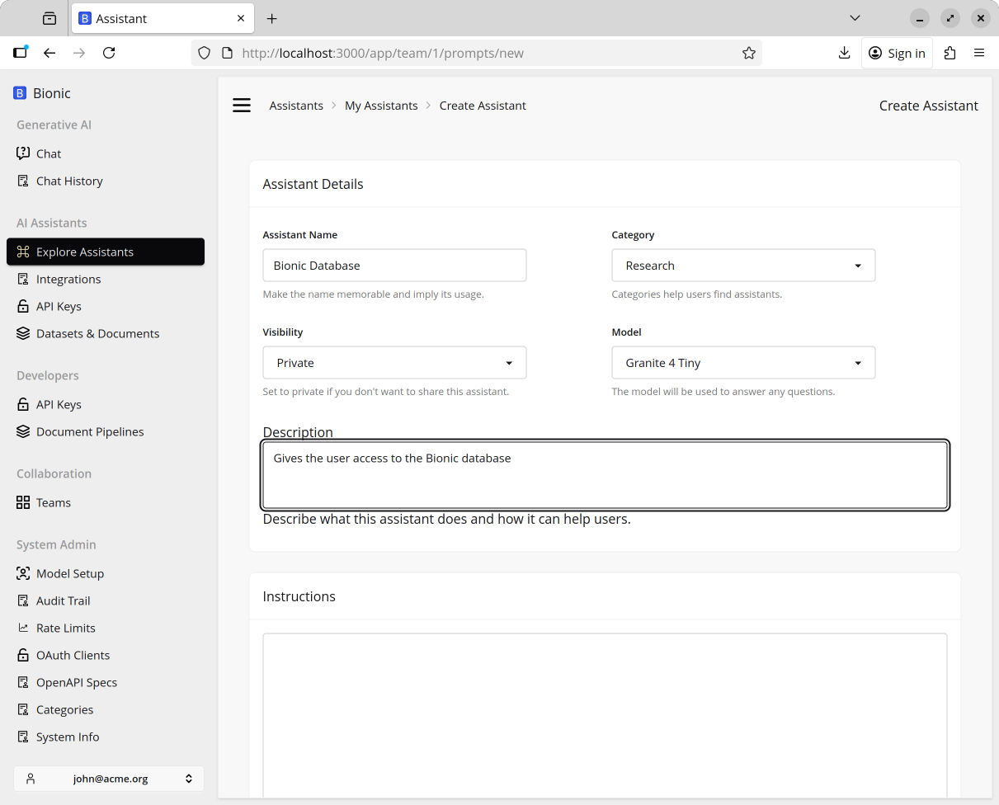
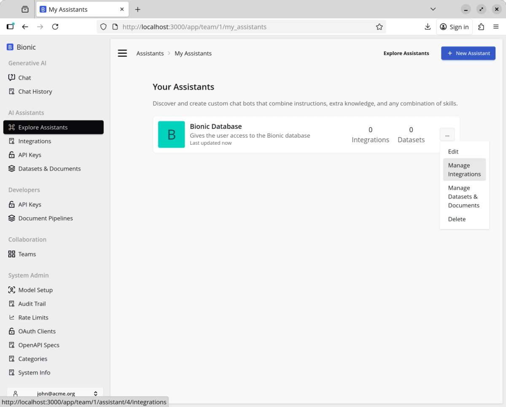
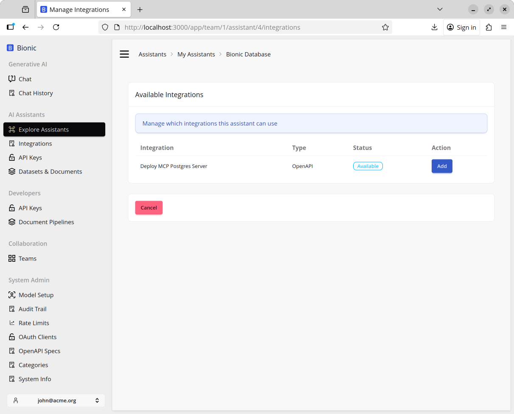

# Connecting an Assistant to Our Integrations

From the side menu click on `Assistants` and then `New Asisstant`. Fill in the following details.

```
Name: Bionic Database
Category: Research
Description: Gives the user access to the Bionic database
```



Scroll down and click `Create Assistant`

## Attaching the Integration to the Assistant

Click on the menu and select `Manage Integrations` for your Assistant.




Click the `Add` button for the `Postgres Server`



Click `Connect` on the popup.

Now go back to the `Assistants` side menu. When you click on the Assistant you will be given the option to `Start a Chat`.


