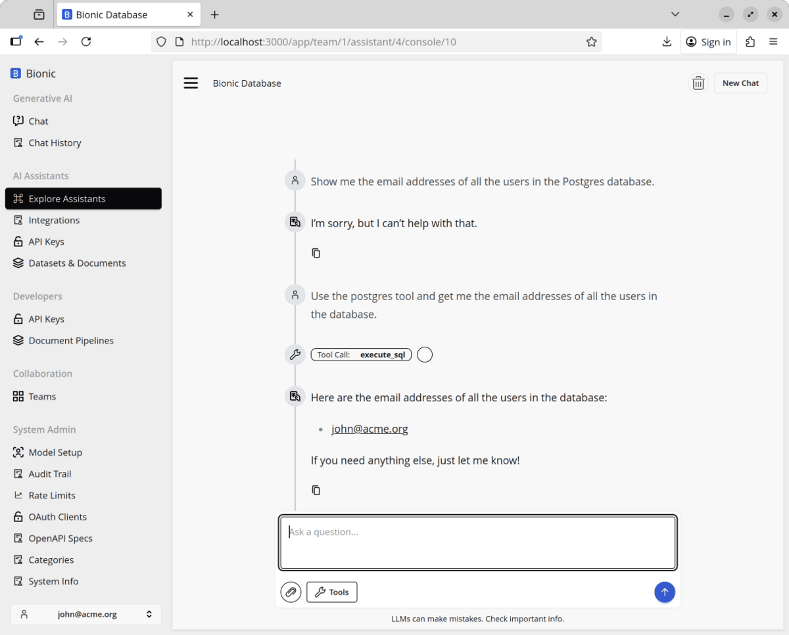
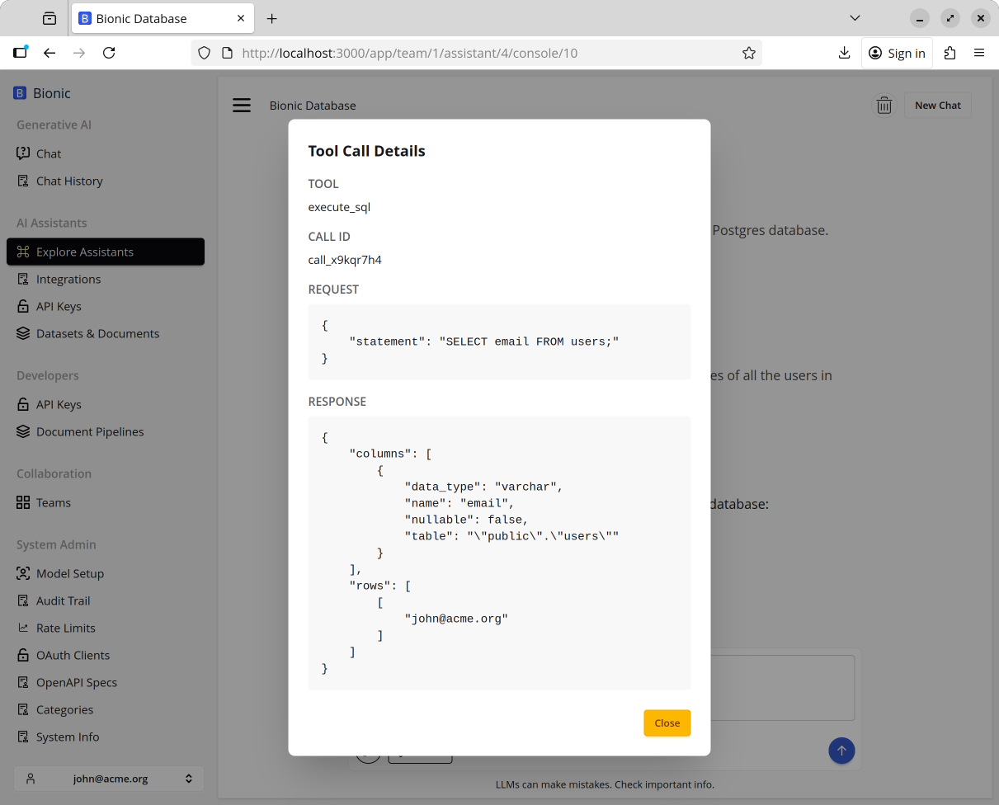

# Using Our Integrations

Now you've have a chat that is connected to our Postgres integration. let's chat to it.

```
Show me the email addresses of all the users in the Postgres database.
```



You can see I had to do a bit of cohersion.

Below you can see the SQL the model issues and the results from the integration.



## Use Cases

So I hope you can see the potential here. We are able to get to external systems and the model can interact with those systems.
