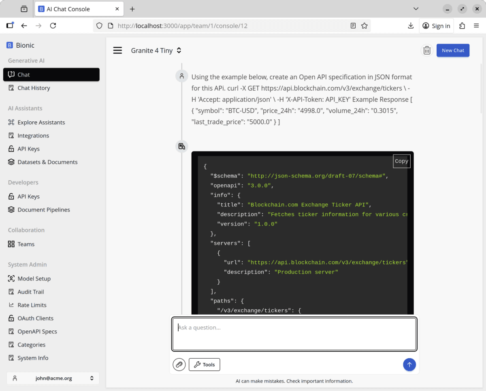

# Creating your Own Integration

Use the console to generate a starter OpenAPI spec for a target API. Paste this prompt:

```
Using the example below, create an Open API specification in JSON format for this API.

Make sure every operation has an operationid.

curl -X GET https://api.blockchain.com/v3/exchange/tickers \
  -H 'Accept: application/json' \
  -H 'X-API-Token: API_KEY'

Example Response

[
  {
    "symbol": "BTC-USD",
    "price_24h": "4998.0",
    "volume_24h": "0.3015",
    "last_trade_price": "5000.0"
  }
]
```

You should get a JSON spec back that resembles this structure.



Now add the spec to Bionic. Go to `Integrations > Select Integration > Add Custom` and paste your OpenAPI JSON into the textarea.


Click `Submit` to create the integration.


Finally, connect the integration to an assistant (as shown in the Postgres example) and start chatting with that system.
