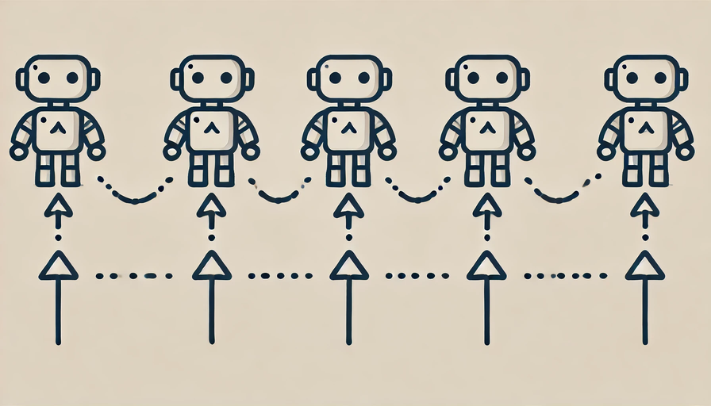

The landscape of AI technology is rapidly evolving, yet one aspect remains elusive: a clear, universally accepted definition of what constitutes an AI agent. This ambiguity can often complicate discussions around the capabilities and implications of these systems. For this article, we aim to explore the concept of AI agents, hopefully,  without muddying the waters further.


### What Are AI Agents?

At its core, an AI agent is a software program designed to interact with its environment, gather data, and perform tasks independently to achieve predetermined goals. These agents choose the best actions needed to meet their objectives, highlighting their ability to operate autonomously. Generative AI agents can orchestrate complex workflows and augment both workers and customers, facilitating the digitalization of underlying processes.


This foundational aspect allows them to streamline workflows and enhance productivity, utilising large language models (LLMs) to decide the control flow of an application.

AI agents are equipped to reason through complex problems, create actionable plans, and execute these plans using various tools. This combination of reasoning capabilities, memory retention, and task execution makes them invaluable in a business context.

We are seeing the introduction of frameworks like CrewAI with built in tools to help build this new agentic future.

Examples of such agentic systems include customer outreach campaigns for sales, financial analysis systems, customer support and many more. CrewAI have a system of agents to automatically create all their system’s documentation.



### How AI Agents Work

AI agents operate using a combination of algorithms, machine learning, and data analytics. They gather data from their environment, process it, and then use that information to inform their actions. These agents can work independently or in coordination with other agents, enabling them to tackle complex tasks and workflows efficiently.

**1. Data Collection**
The first step in an AI agent's workflow is gathering relevant data from its environment. AI agents can interact with various data sources, including databases, user interactions, sensors, or even external information such as market trends or social media. The data collected can be structured or unstructured, and this wide-ranging input allows the agent to build a comprehensive understanding of its operational context.


**2. Data Processing**
Once data is collected, the next step is processing and interpreting it. AI agents use machine learning algorithms, natural language processing (NLP), and data analytics to analyse the incoming data. This is a crucial stage, as it transforms raw data into actionable insights. By recognizing patterns, detecting anomalies, or understanding user intent, AI agents can form a clear picture of the current situation, allowing them to make better-informed decisions.


**3. Decision-Making**
After processing the data, AI agents move on to decision-making. Using their analytical capabilities, they evaluate various options and select the best course of action based on their goals. Depending on the complexity of the task, AI agents can make decisions independently or collaborate with other agents to optimise workflows. Advanced AI agents use reinforcement learning to improve their decision-making over time, learning from past actions to enhance future outcomes.


**4. Action Execution**
Once a decision has been made, the AI agent proceeds to execute the necessary tasks. These actions could involve automating a process, communicating with users, making adjustments to workflows, or even coordinating with other AI agents to complete multi-step operations. The autonomous execution of tasks ensures that AI agents can perform complex activities without human intervention, providing significant productivity gains.


```
planner = Agent(
    role="Content Planner",
    goal="Plan engaging and factually accurate content on {topic}",
    backstory="You're working on planning a blog article "
              "about the topic: {topic}."
              "You collect information that helps the "
              "audience learn something "
              "and make informed decisions. "
              "Your work is the basis for "
              "the Content Writer to write an article on this topic."
)


plan = Task(
    description=(
        "1. Prioritize the latest trends, key players, "
            "and noteworthy news on {topic}.\n"
        "2. Identify the target audience, considering "
            "their interests and pain points.\n"
        "3. Develop a detailed content outline-solid including "
            "an introduction, key points, and a call to action.\n"
        "4. Include SEO keywords and relevant data or sources."
    ),
    expected_output="A comprehensive content plan document "
        "with an outline, audience analysis, "
        "SEO keywords, and resources.",
    agent=planner,
)


```


### Key Benefits of AI Agents
AI agents are revolutionising the way businesses operate by offering a wide range of advantages that directly impact productivity, cost-efficiency, and customer satisfaction. Below are some of the key benefits that AI agents bring to the table:


**1. Increased Efficiency**
One of the most immediate benefits of AI agents is their ability to automate repetitive and time-consuming tasks. By taking over routine processes, such as data entry, report generation, or basic customer inquiries, AI agents free up human employees to focus on higher-value, strategic activities that require creativity, problem-solving, and critical thinking. This shift not only boosts individual productivity but also enhances overall business efficiency.

**2. Cost Reduction**
AI agents significantly reduce operational costs by automating tasks that would otherwise require human labour. Once deployed, AI agents can manage high volumes of work without the need for salary, benefits, or additional human resources. This cost-saving effect is particularly valuable for businesses looking to scale operations efficiently while maintaining budget constraints.


**3. Scalability**
As businesses grow, their operations become more complex and demanding. AI agents are highly adaptable and can easily scale alongside business needs without requiring substantial additional investment. Unlike human workers, AI agents can be deployed rapidly to handle increasing workloads, customer demands, or new tasks.


**4. Data-Driven Insights**
AI agents are capable of analysing large datasets in real-time, extracting meaningful insights that help businesses make more informed decisions. By processing and interpreting data from various sources, AI agents can identify patterns, trends, and opportunities that may otherwise go unnoticed. These insights enable businesses to optimise performance, reduce risks, and capitalise on emerging market trends.


**5. 24/7 Availability**
Unlike human workers, AI agents can operate around the clock, providing businesses with continuous service and support. This 24/7 availability ensures that customers receive assistance whenever they need it, regardless of time zones or business hours. It also allows companies to maintain seamless operations, especially in customer service, IT support, and order processing.


### Challenges and Ethical Considerations
While the rise of AI agents offers exciting potential for innovation, efficiency, and new business opportunities, their deployment is not without challenges. There are significant ethical concerns and practical issues that businesses must navigate carefully to ensure responsible and effective use of AI agents. Below are some of the most pressing challenges and ethical considerations that need to be addressed.

**1. Data Privacy and Security**
AI agents rely on large volumes of data to make informed decisions, often processing sensitive information such as personal, financial, or healthcare data. This heavy reliance on data creates serious risks related to data breaches and privacy violations. If improperly secured, AI agents can become attractive targets for cyberattacks, potentially exposing confidential customer or business information.

**2. Bias in Decision-Making**
AI agents use data that LLMs have been trained on, and if this data contains biases, the agents may perpetuate or even amplify these biases in their decision-making processes. This issue is particularly concerning in areas like hiring, lending, and law enforcement, where biassed decisions can have significant consequences for individuals. For example, AI agents used in recruitment may favour certain demographic groups if the training data reflects historical inequalities. Similarly, AI agents used by banks or insurers may discriminate against certain applicants if their data contains embedded biases related to race, gender, or socioeconomic status.

**3. Lack of Transparency**
One of the major challenges with AI agents is the "black box" nature of many machine learning models. In many cases, the decision-making process of an AI agent is not easily understood. This lack of transparency makes it difficult to explain how an AI agent arrived at a particular decision, which can undermine trust from both consumers and regulators. For businesses, this opacity can lead to challenges in accountability and compliance, especially in highly regulated industries like finance, healthcare, or law.

**4. Accountability**
As AI agents take on more autonomous decision-making roles, the question of accountability becomes increasingly complex. Who is responsible when an AI agent makes a mistake or causes harm? This challenge is particularly relevant when AI agents operate with little to no human oversight, raising concerns about liability in cases of system failure, inaccurate predictions, or harmful outcomes. Businesses must carefully navigate these issues to ensure that they maintain accountability, even when decisions are made by AI agents.

**5. Job Displacement**
The increasing automation of tasks by AI agents raises concerns about job displacement, particularly in industries where routine tasks are easily automated. From customer service and manufacturing to data processing and administrative work, AI agents have the potential to take over roles traditionally filled by human workers. While this can lead to cost savings and efficiency gains, it also raises fears about large-scale unemployment, workforce displacement, and social inequality.

**6. Dependence on AI**
As businesses increasingly rely on AI agents to handle critical operations, there is a growing risk of over-dependence. This dependence can create vulnerabilities if AI agents fail, deliver inaccurate results, or are unable to adapt to unexpected circumstances. Moreover, excessive reliance on AI may lead to the deskilling of human workers, where employees become less proficient in tasks that are fully automated. This over-reliance could become a significant issue if businesses are unable to function effectively without their AI systems.


### The Future of AI Agents

**1. Increased Autonomy**
Advances in machine learning and AI architectures will enable AI agents to function with greater autonomy, allowing them to take on more complex tasks without human intervention. Currently, AI agents often rely on human oversight for strategic decisions or complex problem-solving. However, as reinforcement learning and deep learning models become more sophisticated, these agents will gain the ability to make nuanced decisions and adapt dynamically to unforeseen scenarios.

**2. Multi-Agent Systems**
In the future, AI agents will no longer operate in isolation but as part of multi-agent systems. These collaborative networks of AI agents will communicate, coordinate, and share data with one another to optimise processes across business functions. By working together, agents can distribute tasks more efficiently, solve problems collaboratively, and provide real-time responses to dynamic changes in business environments.

**3. Proactive Decision-Making**
One of the most exciting developments in AI agent technology will be their ability to shift from reactive decision-making to proactive, predictive behaviours. Using real-time data and predictive analytics, AI agents will not only respond to immediate tasks but also anticipate future needs and trends, allowing businesses to stay ahead of the curve.

**4. Wider Industry Adoption**
As AI agents continue to demonstrate their value, we will see wider adoption across various industries, from healthcare and agriculture to finance and manufacturing. The flexibility of AI agents to be customised and integrated into industry-specific processes will drive this growth. As barriers to AI adoption—such as cost, technical challenges, and regulatory hurdles—are lowered, more businesses will leverage AI agents to drive innovation and efficiency.


### Conclusion

AI agents are revolutionising the way businesses operate, offering unprecedented opportunities for automation, efficiency, and personalised customer engagement. As these agents evolve, they will increasingly become integral to various business processes, enabling companies to streamline operations, enhance decision-making, and adapt to ever-changing market dynamics.

However, the implementation of AI agents also brings forth significant challenges and ethical considerations that must be addressed. Data privacy, bias, transparency, accountability, and the potential for job displacement are critical issues that organisations need to navigate thoughtfully. In many ways a lot of these came with the introduction of Generative AI itself.  By prioritising ethical practices and fostering collaboration between humans and AI, businesses can harness the full potential of AI agents while maintaining trust and responsibility.

Looking ahead, the future of AI agents is bright, characterised by increased autonomy, advanced intelligence, and seamless integration across industries. As organisations embrace these advancements, they will unlock new levels of innovation and competitiveness, paving the way for a more efficient and responsive business landscape.

The journey toward a future powered by AI agents is not just about technology; it’s about reshaping how businesses interact with their customers, optimise their processes, and empower their workforce. By navigating the challenges and seizing the opportunities presented by AI agents, companies can thrive in an increasingly AI-driven world.


