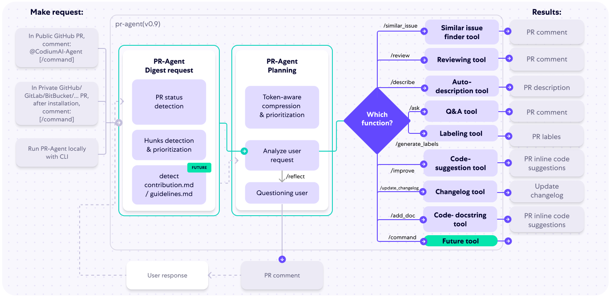

As artificial intelligence (AI) continues to evolve, it’s reshaping various industries, including software development and autonomous driving. Both fields share a common journey—from AI as an assistant to AI as a fully autonomous agent. Just as the Society of Automotive Engineers (SAE) [defined levels of autonomy](https://www.sae.org/news/2019/01/sae-updates-j3016-automated-driving-graphic#:~:text=The%20J3016%20standard%20defines%20six,%2Dvehicle%20(AV)%20capabilities.) for self-driving cars, we can imagine similar levels for **AI in software development**. Let’s explore this analogy and see how the path to AI-driven coding parallels the evolution of autonomous vehicles, along with the *impact on software development jobs* at each stage and the probability of each becoming a reality.

---

### **Level 0: No Autonomy (Manual Coding)**
**Autonomous Driving**: At Level 0, there is no automation. The driver is fully in control of the vehicle, handling all driving tasks without any assistance.

**AI in Development**: In the early days of coding, everything was manual. Developers wrote every line of code themselves without AI support. While coding tools existed, they didn’t have the intelligence to assist with the development process actively.

**Impact on Jobs**: The demand for skilled software developers is high, as every task, from problem-solving to implementation, requires human input. There is little risk to job security, but the work can be labor-intensive and repetitive.

**Probability**: **100% (Current Reality)**—This level represents the starting point of both journeys and is the default for software development until recently. However, we're moving rapidly beyond this stage.

---

### **Level 1: Driver Assistance (AI as a Coding Assistant)**
**Autonomous Driving**: At Level 1, the car can assist the driver with a single task, like adaptive cruise control or lane keeping. The driver remains in control but receives help with specific actions.

**AI in Development**: Today’s coding assistants, such as [GitHub Copilot](https://github.com/features/copilot), fall into this category. They can autocomplete code, suggest snippets, and provide recommendations, speeding up the process but still requiring the developer to lead the way.

**Impact on Jobs**: AI enhances productivity, allowing developers to complete tasks faster. **This makes experienced developers more valuable**, as they can now achieve more in less time. However, the demand for entry-level roles may decline slightly as the easier tasks become automated, making it more challenging for new developers to break into the field.

**Probability**: **95% (Already Here)**—AI tools like Copilot are already in widespread use, and many developers are adopting these tools to increase efficiency.

---

### **Level 2: Partial Automation (AI Generating Code)**
**Autonomous Driving**: At Level 2, the vehicle can handle two or more tasks simultaneously—like steering and acceleration—but the driver must always stay alert and ready to intervene.

**AI in Development**: Similarly, AI can generate more significant chunks of code, like entire functions or modules, based on a problem statement. It can also suggest tests or optimizations, yet it still requires a human to verify its output.

**Impact on Jobs**: With AI handling more routine coding, developers might shift toward roles that emphasize architecture, design, and oversight. Junior-level roles could face increased pressure, as fewer manual coding tasks remain. However, demand for skilled developers who can guide AI and integrate its output into larger systems will remain strong.

**Probability**: **80% (Within 3-5 Years)**—Advancements in AI models make this stage highly likely, with many companies already experimenting with AI that generates significant portions of code based on user prompts.

---

### **Level 3: Conditional Automation (AI Making Pull/Change Requests)**
**Autonomous Driving**: At Level 3, the car can handle most driving tasks under specific conditions (e.g., on highways). The driver can take their hands off the wheel but must be ready to take over if the system requests it.

**AI in Development**: In this stage, AI takes on a more proactive role, creating pull requests or suggesting code changes autonomously. It can identify bugs, propose feature implementations, or refactor existing code based on analysis of the codebase.

**Impact on Jobs**: This level could lead to a reduction in the number of developers required for maintaining large codebases, as AI can autonomously handle many updates and optimizations. However, the demand for developers who can oversee, review, and validate AI-generated code will still be significant. New roles may emerge that focus on managing and optimizing the interaction between AI and human contributors.

**Probability**: **60% (Within 5-8 Years)**—AI creating pull requests is already in its infancy, but full adoption requires trust in AI’s ability to maintain code quality. Many companies might adopt this for low-risk tasks initially.

You can already get AI code reviews of pull requests with [PR Agent](https://github.com/Codium-ai/pr-agent)

---

### **Level 4: High Automation (AI-Driven Development with Human Oversight)**
**Autonomous Driving**: At Level 4, the car can handle all aspects of driving in certain environments or conditions without needing human intervention. However, the car might still rely on a human in more complex or unfamiliar situations.

**AI in Development**: At this point, AI takes a leading role in the software development process. It can plan and build features, refactor systems, and adapt the code based on real-time feedback from users or performance data. Human developers step in mainly to set objectives or handle highly nuanced scenarios that require deeper understanding.

**Impact on Jobs**: A significant portion of coding work becomes automated, potentially reducing the demand for hands-on coding roles. However, opportunities may increase for those who can direct AI, manage projects, and focus on user experience, security, and strategic planning. Developers may need to adapt their skills to work alongside AI, emphasizing higher-level decision-making over direct implementation.

**Probability**: **40% (Within 10-15 Years)**—The technology could be there, but widespread adoption depends on businesses being comfortable with AI-driven decisions and the AI's ability to handle complex edge cases.

---

### **Level 5: Full Automation (Autonomous AI Development)**
**Autonomous Driving**: Level 5 represents full autonomy, where the car can handle all driving tasks under all conditions without human intervention. No steering wheel or pedals are needed.

**AI in Development**: In this vision of the future, AI can handle the entire software development lifecycle—from feature ideation to deployment—without needing human input. It can adapt software dynamically based on user needs, integrate new features, and self-optimize for performance.

**Impact on Jobs**: The demand for traditional coding roles could decline sharply as AI takes over most development tasks. However, new roles may emerge in guiding the overall direction of AI, handling edge cases that require deep human insight, and focusing on the ethical implications of autonomous systems. Developers might pivot to more strategic roles, such as setting goals for AI systems or providing industry-specific expertise that AI cannot replicate.

**Probability**: **15% (Beyond 15 Years, or Theoretical)**—True full automation in software development faces significant challenges, including AI’s understanding of highly specific business contexts, creativity, and the ethical considerations of autonomous decision-making. It remains more speculative but could become possible with major advances in AI and computing.

---

### **Conclusion: The Path to Autonomy in AI-Driven Development**

If Generative AI is going to progress along these levels developers will probably need to adapt their roles to stay competitive.

Even if AI stays at the level we are now, tools like Copilot or even just getting models to create code and cut and paste allows developers to reduce the cognitive burden they experience day to day.