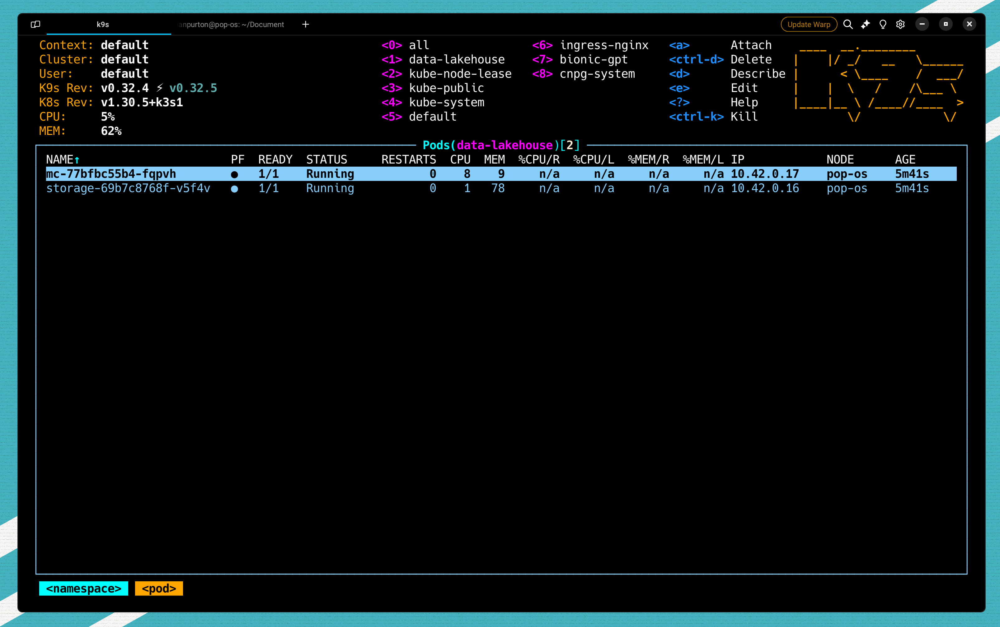
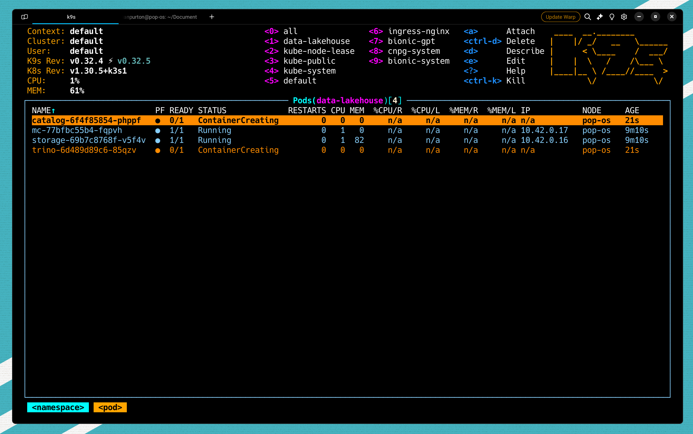
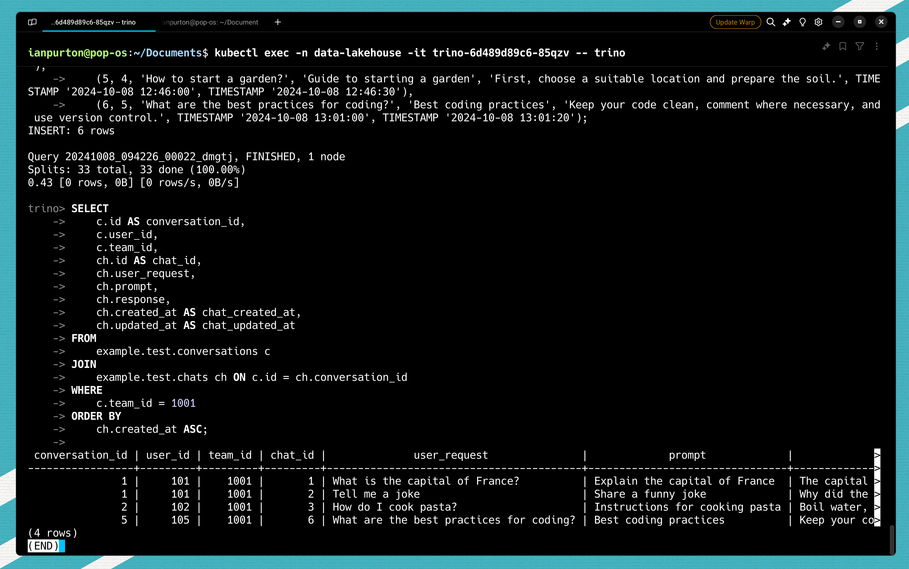

## What is a Lakehouse?

A **Lakehouse** is a modern data architecture that blends the best of data lakes and data warehouses, providing a unified platform for data storage, management, and analysis. Here are the key characteristics:

- **Unified Architecture**: Combines the low-cost storage of a **data lake** with the structure and performance of a **data warehouse**.
- **Supports Multiple Data Types**: Can handle **structured**, **semi-structured**, and **unstructured** data, making it ideal for diverse datasets.
- **ACID Transactions**: Provides support for **ACID transactions** for data consistency, which is crucial for real-time analytics.
- **Scalability**: Offers **scalable** storage and compute, allowing users to handle large datasets efficiently.
- **Single Source of Truth**: Acts as a **centralized repository** where data can be accessed directly by **AI/ML**, **BI**, and **analytics** tools.
- **Performance Optimization**: Utilizes **caching**, **indexing**, and other optimizations to deliver **fast query performance** on large datasets.

A Lakehouse is ideal for organizations looking to consolidate their data architecture while maintaining **cost-efficiency** and **high performance** for analytics.

## The architecture and why

- **Nessie**:
  - Acts as a **versioned catalog** for metadata management.
  - Offers **Git-like branching** and **version control**, making it easier to track changes and collaborate on data. Supports Apache Iceberg.

- **Apache Iceberg**:
  - Provides a **highly performant** and **ACID-compliant table format**.
  - Ensures **data consistency** and **efficient querying** for large datasets in the lakehouse storage.

- **Trino**:
  - Serves as a **high-performance distributed SQL query engine**.
  - Enables **fast analytics** directly on the lakehouse, supporting **complex queries** and **a wide range of data sources**.

- Together, they enable a **flexible** and **scalable** architecture ideal for **advanced analytics** and **data management**.

## Deploying our Lakehouse to Kubernetes

Here's the Kubernetes manifest to deploy the services (Nessie, Trino, MinIO, and MinIO Client) into a namespace called `data-lakehouse`. It includes a `ConfigMap` for the Trino configuration and `PersistentVolumeClaims` for MinIO storage. Each service is deployed using a `Deployment` with a corresponding `Service` for networking.

### 1. `minio.yaml` (MinIO and MinIO Client)

If you don't have access to S3 storage to test your lakehouse then we'll deploy minio into out clusters which is an S3 compatible service.

Create a `minio.yaml` using the below config.

```yaml
apiVersion: v1
kind: Namespace
metadata:
  name: data-lakehouse
---
apiVersion: apps/v1
kind: Deployment
metadata:
  name: storage
  namespace: data-lakehouse
spec:
  replicas: 1
  selector:
    matchLabels:
      app: storage
  template:
    metadata:
      labels:
        app: storage
    spec:
      containers:
        - name: storage
          image: minio/minio
          ports:
            - containerPort: 9000
            - containerPort: 9001
          env:
            - name: MINIO_ROOT_USER
              value: "admin"
            - name: MINIO_ROOT_PASSWORD
              value: "password"
            - name: MINIO_DOMAIN
              value: "storage"
            - name: MINIO_REGION_NAME
              value: "us-east-1"
            - name: MINIO_REGION
              value: "us-east-1"
          args:
            - "server"
            - "/data"
            - "--console-address"
            - ":9001"
          volumeMounts:
            - name: storage-data
              mountPath: /data
      volumes:
        - name: storage-data
          emptyDir: {}
---
apiVersion: v1
kind: Service
metadata:
  name: storage
  namespace: data-lakehouse
spec:
  selector:
    app: storage
  ports:
    - name: "minio-api"
      protocol: TCP
      port: 9000
      targetPort: 9000
    - name: "minio-console"
      protocol: TCP
      port: 9001
      targetPort: 9001
---
apiVersion: apps/v1
kind: Deployment
metadata:
  name: mc
  namespace: data-lakehouse
spec:
  replicas: 1
  selector:
    matchLabels:
      app: mc
  template:
    metadata:
      labels:
        app: mc
    spec:
      containers:
        - name: mc
          image: minio/mc
          env:
            - name: AWS_ACCESS_KEY_ID
              value: "admin"
            - name: AWS_SECRET_ACCESS_KEY
              value: "password"
            - name: AWS_REGION
              value: "us-east-1"
            - name: AWS_DEFAULT_REGION
              value: "us-east-1"
          command:
            - "/bin/sh"
            - "-c"
            - |
              until (/usr/bin/mc config host add minio http://storage:9000 admin password) do echo '...waiting...' && sleep 1; done;
              /usr/bin/mc rm -r --force minio/warehouse;
              /usr/bin/mc mb minio/warehouse;
              /usr/bin/mc mb minio/iceberg;
              /usr/bin/mc policy set public minio/warehouse;
              /usr/bin/mc policy set public minio/iceberg;
              tail -f /dev/null
```

Apply the config using

```sh
kubectl apply -f minio.yaml
```

When you access your cluster (We're using k9s) you should see minio running in the *data-lakehouse* namespace.



### 2. `trino-configmap.yaml` (Trino ConfigMap)

The configuration below works with Minio. If you want to connect it to another S3 provider then change the settings to match your provider.

```yaml
apiVersion: v1
kind: ConfigMap
metadata:
  name: trino-config
  namespace: data-lakehouse
data:
  example.properties: |
    connector.name=iceberg
    iceberg.catalog.type=nessie
    iceberg.nessie-catalog.uri=http://catalog:19120/api/v1
    iceberg.nessie-catalog.default-warehouse-dir=s3://warehouse
    fs.native-s3.enabled=true
    s3.endpoint=http://storage:9000
    s3.region=us-east-1
    s3.path-style-access=true
    s3.aws-access-key=admin
    s3.aws-secret-key=password
```

Apply the config using

```sh
kubectl apply -f trino-configmap.yaml
```

No we've setup our config, let's install out lakehouse.

### 3. `lakehouse.yaml` (Namespace, Nessie, Trino)
```yaml
apiVersion: apps/v1
kind: Deployment
metadata:
  name: catalog
  namespace: data-lakehouse
spec:
  replicas: 1
  selector:
    matchLabels:
      app: catalog
  template:
    metadata:
      labels:
        app: catalog
    spec:
      containers:
        - name: catalog
          image: projectnessie/nessie
          ports:
            - containerPort: 19120
---
apiVersion: v1
kind: Service
metadata:
  name: catalog
  namespace: data-lakehouse
spec:
  selector:
    app: catalog
  ports:
    - protocol: TCP
      port: 19120
      targetPort: 19120
---
apiVersion: apps/v1
kind: Deployment
metadata:
  name: trino
  namespace: data-lakehouse
spec:
  replicas: 1
  selector:
    matchLabels:
      app: trino
  template:
    metadata:
      labels:
        app: trino
    spec:
      containers:
        - name: trino
          image: trinodb/trino
          ports:
            - containerPort: 8080
          volumeMounts:
            - name: trino-config
              mountPath: /etc/trino/catalog/example.properties
              subPath: example.properties
      volumes:
        - name: trino-config
          configMap:
            name: trino-config
---
apiVersion: v1
kind: Service
metadata:
  name: trino
  namespace: data-lakehouse
spec:
  selector:
    app: trino
  ports:
    - protocol: TCP
      port: 8080
      targetPort: 8080
```

Apply the config using

```sh
kubectl apply -f trino-configmap.yaml
```

You should have a something like the image below.



## Connecting to Trino and Creating a Table to store Chats

To access the Trino CLI inside the Trino pod, you can use the `kubectl exec` command. Assuming the Trino pod is running in the `data-lakehouse` namespace, you can find the exact name of the Trino pod and then use the `exec` command to get access to the CLI. Here’s how:

1. **Find the Trino pod name** (if you don't already know it):
   ```bash
   kubectl get pods -n data-lakehouse -l app=trino
   ```

   This command lists the pods with the `app=trino` label in the `data-lakehouse` namespace.

2. **Run the Trino CLI**:
   Once you have the pod name, use the following command to access the Trino CLI:
   ```bash
   kubectl exec -n data-lakehouse -it <trino-pod-name> -- trino
   ```

   Replace `<trino-pod-name>` with the actual name of the Trino pod you retrieved from the first command.

### Example:
If your Trino pod name is `trino-6d489d89c6-85qzv`, the command would look like:
```bash
kubectl exec -n data-lakehouse -it trino-6d489d89c6-85qzv -- trino
```

This will give you an interactive terminal session within the Trino pod, running the Trino CLI. From there, you can run SQL queries and interact with your Trino cluster.

Create a schema

```sql
create schema example.test;
```

Create our conversation tables

```sql
CREATE TABLE example.test.conversations (
    id INT,
    user_id INT NOT NULL, 
    team_id INT NOT NULL, 
    created_at TIMESTAMP
);

COMMENT ON TABLE example.test.conversations IS 
'Collect together the users chats a bit like a history';
```

Create our chats tables

```sql
CREATE TABLE example.test.chats (
    id INT, 
    conversation_id INT NOT NULL, 
    user_request VARCHAR NOT NULL, 
    prompt VARCHAR NOT NULL, 
    response VARCHAR, 
    created_at TIMESTAMP,
    updated_at TIMESTAMP
);

COMMENT ON TABLE example.test.chats IS 
'Questions from the user and the response from the LLM';
```

Insert some test data into our tables

```sql
INSERT INTO example.test.conversations (id, user_id, team_id, created_at)
VALUES 
    (1, 101, 1001, TIMESTAMP '2024-10-08 12:00:00'),
    (2, 102, 1001, TIMESTAMP '2024-10-08 12:15:00'),
    (3, 103, 1002, TIMESTAMP '2024-10-08 12:30:00'),
    (4, 104, 1003, TIMESTAMP '2024-10-08 12:45:00'),
    (5, 105, 1001, TIMESTAMP '2024-10-08 13:00:00');
```

And some chats

```sql
INSERT INTO example.test.chats (id, conversation_id, user_request, prompt, response, created_at, updated_at)
VALUES 
    (1, 1, 'What is the capital of France?', 'Explain the capital of France', 'The capital of France is Paris.', TIMESTAMP '2024-10-08 12:01:00', TIMESTAMP '2024-10-08 12:01:10'),
    (2, 1, 'Tell me a joke', 'Share a funny joke', 'Why did the chicken join a band? Because it had the drumsticks!', TIMESTAMP '2024-10-08 12:02:00', TIMESTAMP '2024-10-08 12:02:05'),
    (3, 2, 'How do I cook pasta?', 'Instructions for cooking pasta', 'Boil water, add pasta, cook for 10-12 minutes.', TIMESTAMP '2024-10-08 12:16:00', TIMESTAMP '2024-10-08 12:16:20'),
    (4, 3, 'What is 2 + 2?', 'Calculate 2 + 2', '2 + 2 equals 4.', TIMESTAMP '2024-10-08 12:31:00', TIMESTAMP '2024-10-08 12:31:05'),
    (5, 4, 'How to start a garden?', 'Guide to starting a garden', 'First, choose a suitable location and prepare the soil.', TIMESTAMP '2024-10-08 12:46:00', TIMESTAMP '2024-10-08 12:46:30'),
    (6, 5, 'What are the best practices for coding?', 'Best coding practices', 'Keep your code clean, comment where necessary, and use version control.', TIMESTAMP '2024-10-08 13:01:00', TIMESTAMP '2024-10-08 13:01:20');
```

And query the database

```sql
SELECT 
    c.id AS conversation_id,
    c.user_id,
    c.team_id,
    ch.id AS chat_id,
    ch.user_request,
    ch.prompt,
    ch.response,
    ch.created_at AS chat_created_at,
    ch.updated_at AS chat_updated_at
FROM 
    example.test.conversations c
JOIN 
    example.test.chats ch ON c.id = ch.conversation_id
WHERE 
    c.team_id = 1001
ORDER BY 
    ch.created_at ASC;
```

You should see something like the below in your trino console.



## Ingesting data from Postgres

To move data from a PostgreSQL table into an Iceberg table using **Trino**, you would typically use a **`INSERT INTO ... SELECT ...`** query. This allows you to select data from the PostgreSQL table and insert it directly into the Iceberg table through Trino, leveraging Trino's support for multiple data sources. 

Here is an example query that does this:

### Query Example
```sql
INSERT INTO example.test.conversations (id, user_id, team_id, created_at)
SELECT 
    id, 
    user_id, 
    team_id, 
    created_at
FROM 
    postgresql_db.example_schema.conversations;
```

### Explanation:
- **`INSERT INTO`**: Inserts the selected data into the Iceberg table `example.test.conversations`.
- **`example.test.conversations`**: This is the destination table, which is an Iceberg table.
- **`SELECT`**: Retrieves the data from the PostgreSQL table.
- **`postgresql_db.example_schema.conversations`**: This represents the source table in PostgreSQL, accessed via Trino's PostgreSQL connector.
  
### Prerequisites:
- **Trino PostgreSQL Connector**: Ensure Trino is configured with a PostgreSQL connector. This allows Trino to query tables in the PostgreSQL database.
- **Correct Mapping**: The columns between the source PostgreSQL table and the destination Iceberg table should match in terms of data types to avoid errors during the insertion.

### Example for `chats` Table
If you want to migrate data into the `chats` table in Iceberg, you would use a similar approach:

```sql
INSERT INTO example.test.chats (id, conversation_id, user_request, prompt, response, created_at, updated_at)
SELECT 
    id, 
    conversation_id, 
    user_request, 
    prompt, 
    response, 
    created_at, 
    updated_at
FROM 
    postgresql_db.example_schema.chats;
```

This query transfers data from the `chats` table in PostgreSQL into the `example.test.chats` Iceberg table. Remember to replace `postgresql_db.example_schema` with the actual PostgreSQL catalog and schema name as configured in your Trino setup.

## Running a Kubernetes Job to migrate data

Here's a Kubernetes `CronJob` definition that runs every hour to migrate data from a PostgreSQL table to the Iceberg table using Trino. This job assumes that you have a Trino CLI container or Trino client available that can run the SQL commands, and it can access both the PostgreSQL and Iceberg tables.

### Kubernetes `CronJob` YAML
```yaml
apiVersion: batch/v1
kind: CronJob
metadata:
  name: trino-data-migration
  namespace: data-lakehouse
spec:
  schedule: "0 * * * *" # Runs every hour
  jobTemplate:
    spec:
      template:
        spec:
          containers:
            - name: trino-client
              image: trinodb/trino:latest # Replace with your preferred Trino client image
              env:
                - name: TRINO_SERVER
                  value: "http://trino:8080" # Trino server URL, make sure it matches your setup
              command:
                - /bin/sh
                - -c
                - |
                  trino --server ${TRINO_SERVER} --execute "
                  INSERT INTO example.test.conversations (id, user_id, team_id, created_at)
                  SELECT id, user_id, team_id, created_at
                  FROM postgresql_db.example_schema.conversations;
                  
                  INSERT INTO example.test.chats (id, conversation_id, user_request, prompt, response, created_at, updated_at)
                  SELECT id, conversation_id, user_request, prompt, response, created_at, updated_at
                  FROM postgresql_db.example_schema.chats;
                  "
          restartPolicy: OnFailure
          # Optionally, you can add resources and limits to control the job's resource consumption
          # resources:
          #   limits:
          #     cpu: "500m"
          #     memory: "1Gi"
          #   requests:
          #     cpu: "250m"
          #     memory: "512Mi"
  successfulJobsHistoryLimit: 3
  failedJobsHistoryLimit: 3
```

### Prerequisites:
- **Trino Server**: Ensure the `TRINO_SERVER` environment points to a valid Trino server endpoint that can access both PostgreSQL and Iceberg.
- **Trino PostgreSQL Connector**: Make sure Trino has access to the PostgreSQL connector and that the `postgresql_db.example_schema` is properly configured.
- **Network Access**: Verify that the Trino client container can communicate with the Trino server and that the server has access to PostgreSQL and Iceberg.

This `CronJob` will automate the data migration process, ensuring that the data is kept in sync every hour. Adjust the schedule as needed for your requirements.

## Conclusion

We hope this helps you see how quickly you can setup a Data Lakehouse and how flexible it can be in terms of creating value for your enterprise.