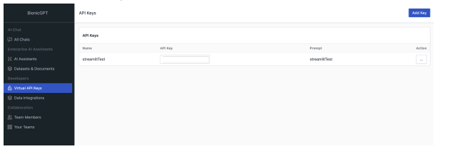
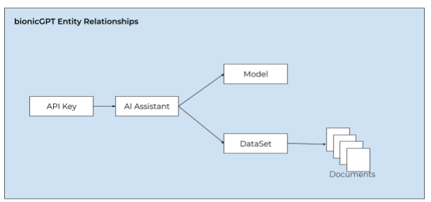

Are you tired of clunky chatbot interfaces that limit your creativity? Do you want to harness the power of artificial intelligence to build a conversational app that meets your unique needs? Look no further! With bionicGPT's OpenAI-compatible API, you can create a simple yet powerful chatbot in just a few lines of code.

**The Ultimate Flexibility**

bionicGPT offers a vast range of options, but what if you want to create a minimalist interface that still leverages the models and RAG functionality already implemented? That's where bionicGPT's API comes in! With just two libraries - Streamlit and OpenAI - you can unlock the full potential of AI-powered chatbots.

**Get Started in Minutes**

1. Obtain an API key from bionicGPT and unlock access to a world of AI possibilities.


2. Install the required libraries: Streamlit and OpenAI.

3. Copy and paste the code below to get started.


**The Code**
```python:
import streamlit as st
from openai import OpenAI

st.title("bionicGPT API example")

# Set OpenAI API key from Streamlit secrets
client = OpenAI(api_key=st.secrets["OPENAI_API_KEY"],base_url=st.secrets["OPENAI_API_BASE"])

# Set a default model
if "openai_model" not in st.session_state:
   st.session_state["openai_model"] = "llama3-70b-8192"

# Initialize chat history
if "messages" not in st.session_state:
   st.session_state.messages = []

# Display chat messages from history on app rerun
for message in st.session_state.messages:
   with st.chat_message(message["role"]):
       st.markdown(message["content"])

if prompt := st.chat_input("What is up?"):
   st.session_state.messages.append({"role": "user", "content": prompt})
   with st.chat_message("user"):
       st.markdown(prompt)

   with st.chat_message("assistant"):
       stream = client.chat.completions.create(
           model=st.session_state["openai_model"],
           messages=[
               {"role": m["role"], "content": m["content"]}
               for m in st.session_state.messages
           ],
           stream=True,
       )
       response = st.write_stream(stream)
   st.session_state.messages.append({"role": "assistant", "content": response})

```

For the above to work you need to create a secrets.toml file under a folder call .streamlit with the following contents

```
OPENAI_API_KEY = "bionicAPIKey"
OPENAI_API_BASE= "URL of your bionicGPT instance /v1"
```

You run the code using ```streamlit run app.py``` and you now have a web enabled chatbot for your specific needs

For further details on using Streamlit to build LLM chat apps see
[Build a basic LLM chat app](https://docs.streamlit.io/develop/tutorials/llms/build-conversational-apps)


Note : A bionicGPT API key gives you full access to an AI Assistant that you create. The AI Assistant in turn specifies a model and optionally a Dataset that has been populated with your documents



The beauty of having an OpenAI compatible API means we can cut down on the code we need to write. You just have to be aware of specifying a different base address so it accesses your version of bionicGPT or even our SaaS offering.


