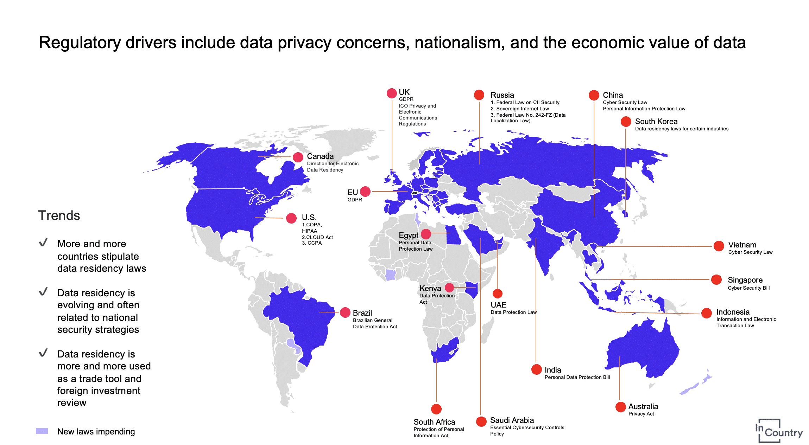
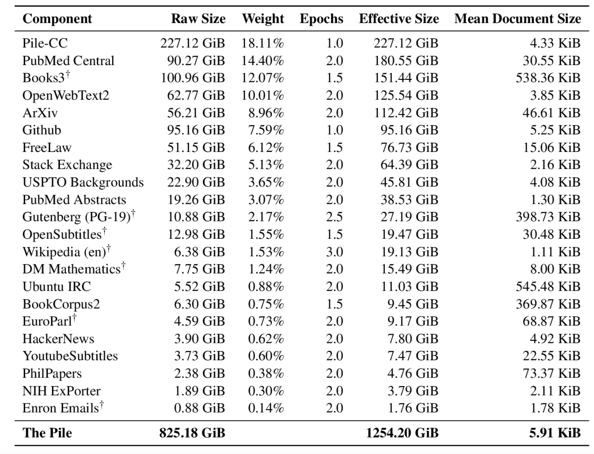
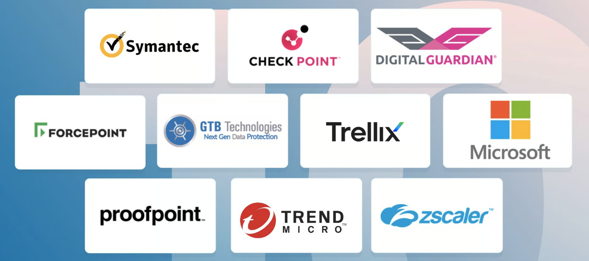
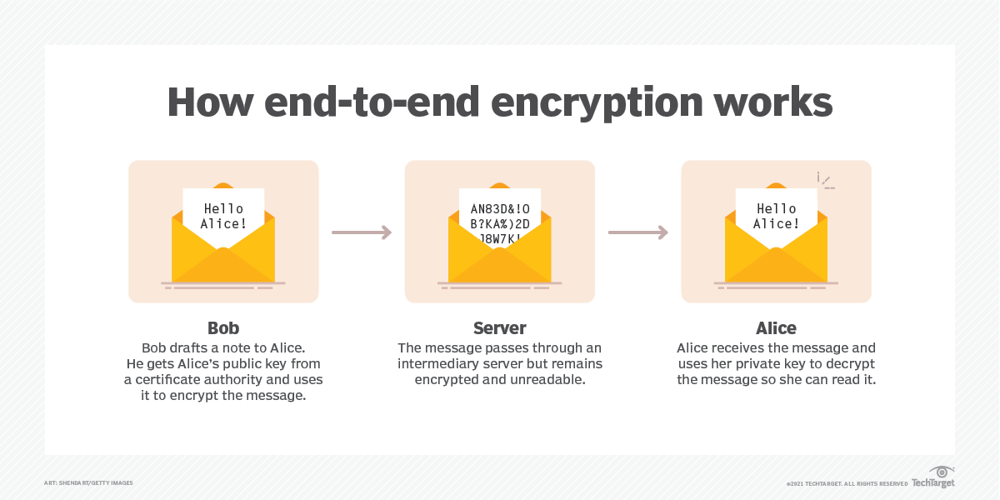

## Issue #1 Data Movement

The main issue with ChatGPT or any hosted system is that when you ask it a question you are actually **moving data from one place to another**.

Transferring data to ChatGPT can trigger various laws and regulations depending on the nature of the data, the industry, and the jurisdictions involved. Key areas of concern often include data protection, privacy, intellectual property, and corporate governance. Here are some of the main types of issues with data transfer.

1. **Data Protection and Privacy Laws:**
   - **General Data Protection Regulation (GDPR):** Applies to companies handling personal data of individuals in the European Union. It mandates strict data handling, transfer, and storage practices, and requires explicit consent for data transfers outside the EU.
   - **California Consumer Privacy Act (CCPA):** Similar to GDPR, it applies to businesses that collect personal data of California residents, providing them rights over their data and imposing restrictions on data transfers.
   - **Health Insurance Portability and Accountability Act (HIPAA):** In the U.S., HIPAA governs the handling of personal health information and is critical for companies in the healthcare sector.

2. **Intellectual Property (IP) Laws:**
   - **Trade Secret Laws:** Protects confidential business information that gives a company a competitive edge. Unauthorized disclosure can lead to significant legal repercussions.
   - **Copyright and Patent Laws:** Ensure that proprietary information, software, inventions, and creative works are not unlawfully distributed or used.

3. **Industry-Specific Regulations:**
   - **Financial Services Regulations:** Laws like the Gramm-Leach-Bliley Act (GLBA) and various SEC regulations in the U.S. govern the handling of financial data.
   - **Defence and Export Control Laws:** Such as the International Traffic in Arms Regulations (ITAR) and Export Administration Regulations (EAR) in the U.S., which control the export of defence related technology and information.

4. **Corporate Governance and Compliance:**
   - **Sarbanes-Oxley Act (SOX):** In the U.S., SOX imposes rigorous record-keeping and reporting requirements on public companies, including the safeguarding of financial information.
   - **The Dodd-Frank Act:** Also in the U.S., it includes provisions related to data security and whistleblower protection.

5. **Contractual Obligations:**
   - **Non-Disclosure Agreements (NDAs):** These agreements between parties can impose additional restrictions on sharing company data.
   - **Employment Contracts:** Often include clauses that restrict the sharing of company information.

6. **Cross-Border Data Transfers:**
   - **Privacy Shield Framework (now defunct):** Was a mechanism for complying with data protection requirements when transferring personal data from the EU to the U.S.
   - **Standard Contractual Clauses (SCCs):** Currently used for data transfers out of the EU in the absence of an adequacy decision.

#### Consequences of Non-Compliance

Failure to comply with these laws can result in severe penalties, including:
   - **Fines and Penalties:** GDPR can impose fines up to 4% of global annual revenue or €20 million, whichever is higher. HIPAA and CCPA also have substantial penalties.
   - **Lawsuits:** Non-compliance can lead to litigation from affected parties, including class-action lawsuits.
   - **Reputational Damage:** Breaches and non-compliance can damage a company's reputation and customer trust.

## Issue #2 Responses

The reply you get back from ChatGPT can also raise legal concerns..

1. **Misinformation**: Responses that contain inaccurate or misleading information, leading to potential legal liabilities if acted upon.

2. **Privacy Violations**: Responses containing confidential or personally identifiable information without proper consent or authorization, it could violate privacy laws.

3. **Defamation**: Responses that contain defamatory statements about individuals or organizations could result in legal action for libel or slander.

4. **Copyright Infringement**: Responses that reproduce copyrighted material without permission, potentially leading to claims of copyright infringement.

5. **Regulatory Compliance**: Responses may need to comply with industry-specific regulations, such as those governing financial advice or healthcare information, to avoid legal repercussions.

6. **Harmful Content**: Generating responses that promote hate speech, violence, or illegal activities could result in legal consequences for facilitating such content.

So even if we address the data leakage issue before we ask the questions, we still have the problem of what the model can say back to us.

## Approaches to Solving the Issue

### Deploying Solutions on Premise

By installing a ChatGPT replacement that runs on premise in the companies private network a lot of the issues with data movement go away.

### Using models trained on Open Source Data

The "[pile](https://pile.eleuther.ai/)" is a vast and diverse dataset used to train open-source large language models (LLMs) like Llama 7B. It contains text from various sources, aiding LLMs in learning language patterns and context.

Due to its open source nature it easy to verify that it doesn't contain copyright information.

### Data Loss Prevention Solutions

Data loss prevention (DLP) solutions are deployed in many organisations and any internal ChatGPT replacements should be integrated with those systems.

- **Protecting Data**: DLP solutions prevent unauthorized access, use, or transmission of sensitive information, such as personal or proprietary data.
- **Monitoring and Detection**: They monitor data in motion, at rest, and in use, identifying and flagging potential security risks or policy violations.
- **Policy Enforcement**: DLP solutions enforce organizational policies and regulatory requirements regarding data protection and privacy.
- **Encryption and Masking**: They encrypt or mask sensitive data to ensure confidentiality and integrity, even if it's compromised.
- **Incident Response**: DLP solutions facilitate timely incident response by alerting administrators to security breaches or policy violations, allowing them to take corrective action.
- **Compliance Management**: They assist organizations in meeting compliance standards and regulations by ensuring the secure handling of sensitive data.

There are many existing solutions on the market.

### Guardrails

In the context of general artificial intelligence (GenAI), "guardrails" are essential mechanisms and guidelines to ensure AI systems operate safely, ethically, and reliably. Key aspects include:

1. **Ethical Guidelines**: Ensuring transparency, fairness, accountability, and privacy in AI operations to align with human values.

2. **Regulatory Frameworks**: Adhering to laws, standards, and best practices, such as those from ISO or IEEE, to ensure compliance and ethical deployment.

3. **Technical Safeguards**: Building robust, secure, and explainable AI systems that include human-in-the-loop mechanisms to allow human intervention when necessary.

4. **Societal Considerations**: Promoting inclusivity and public engagement to ensure AI serves diverse demographic needs and fosters trust.

These guardrails manage the balance between technological advancements and societal impact, aiming to harness GenAI's benefits while minimizing potential harms.

### End to End Encryption

End-to-end encryption (E2EE) could significantly enhance ChatGPT's handling of data privacy and security issues. By encrypting data at the source and ensuring it remains encrypted until it reaches the intended recipient, E2EE protects user interactions from unauthorized access, interception, and tampering. 

This is still in the very early stages but some promising research is available.

- [Securing ChatGPT & LLMs with End-to-end Encryption](https://www.fhenix.io/securing-chatgpt-llms-with-end-to-end-encryption/)
- [Making ChatGPT Encrypted End-to-end](https://www.zama.ai/post/chatgpt-privacy-with-homomorphic-encryption)

## Conclusion

To bring Generative AI back to the enterprise we need solutions that address all the concerns raised above and implement **Defence in Depth**.