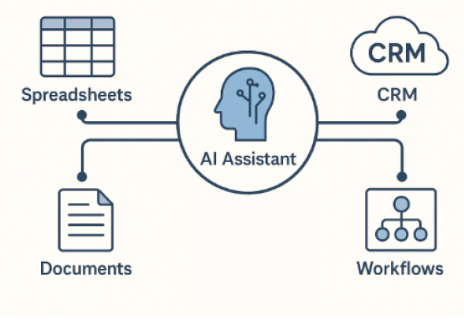
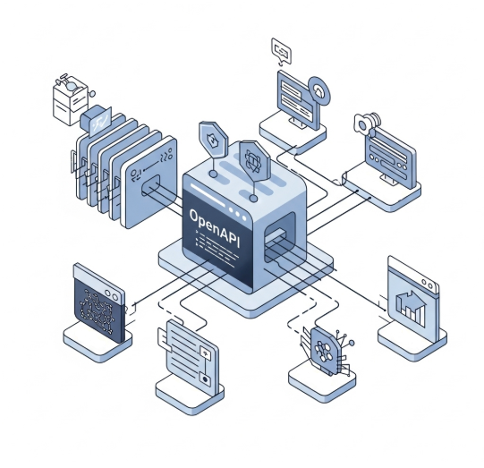

## Why AI Integrations Matter More Than Ever ##

AI assistants are no longer just chatbots—they’re becoming powerful digital workers that automate tasks, pull live data, and interact with the full ecosystem of business tools. From querying spreadsheets to pulling customer info from CRMs and orchestrating workflows across apps, AI integrations unlock the true value of intelligent automation.
But scaling these AI integrations across an enterprise brings big challenges: security risks, complex maintenance, and difficulty monitoring AI behaviour. Without a solid integration foundation, AI remains a siloed experiment rather than a business multiplier.

## What Is Model Context Protocol (MCP)? ##
Model Context Protocol (MCP) is a relatively new open standard designed to help AI assistants connect to the tools and data sources they need—whether documents, applications, or systems enterprises already rely on. The goal is to avoid building one-off connections for every new data source by creating a common way for AI to access context.

In principle, MCP aims to make AI assistants smarter and more useful out of the box by plugging into real-world information flows seamlessly.

## Why MCP Falls Short for Enterprise Needs ##
While promising, the current MCP implementations present several significant drawbacks when applied at scale in enterprises:

**Security Risks**: Most MCP implementations rely on insecure API keys or shared secrets instead of modern, robust authentication like OAuth2 with scoped permissions. This leaves sensitive data exposed.

**Operational Sprawl**: Each integration often requires a separate MCP service or function to be deployed, monitored, and maintained. Imagine managing dozens or even hundreds of these—each with its own secrets, logs, and failure points.

**Limited Observability**: It’s hard to trace exactly what your AI assistants are doing, which APIs they’re calling, or if any misuse occurs. This makes compliance with enterprise policies or regulations difficult.

**Single User**: Currently, the majority of MCP servers have been desktop-bound and thus designed for a single user. This means there's no built-in concept of user roles, team-based access controls, or multi-tenant isolation—features that are essential in an enterprise environment. This complicates auditing and usage tracking, since everything runs under a single user context, making it impossible to distinguish who triggered what or to enforce different permissions based on organizational roles.

The result? MCP, as it stands today, doesn’t meet the enterprise bar for security, scale, and governance.

## OpenAPI: The Proven Standard for Scalable AI Integrations ##
Instead of building new protocols, Bionic takes a different, pragmatic approach: leveraging the OpenAPI standard, a well-established specification for describing RESTful APIs in a machine-readable way.
OpenAPI has been the backbone of API integrations across industries since 2010, allowing tools to understand APIs consistently and dynamically—no custom connectors required.
With OpenAPI, AI assistants can:
**Understand your APIs automatically** by reading the API specification.

**Authenticate securely** with enterprise-grade protocols like OAuth2 and scoped permissions—no secrets floating around.

**Scale effortlessly** without deploying hundreds of microservices.

**Stay fully observable** —every API call your assistant makes is logged, traceable, and auditable.

## How Bionic Leverages OpenAPI for Next-Gen AI Integrations ##
At Bionic, we architect our platform around OpenAPI for AI integrations, providing several key enterprise advantages:
Security-first architecture: We never share secrets with third-party platforms, safeguarding your data.

**Scalable deployment**: No need to spin up and monitor hundreds of integration microservices—one OpenAPI spec does it all.

**Designed for AI agents**: Our system is context-aware, composable, and built with AI in mind.

**Full observability**: Every API call made by your AI assistant is tracked with detailed logs for compliance and auditing.

This approach transforms AI assistants from isolated chatbots to powerful, trusted collaborators that interact securely and efficiently with your existing enterprise ecosystem.

To understand how Bionic can be used to make the most of your enterprise data book a call to discuss your use cases
