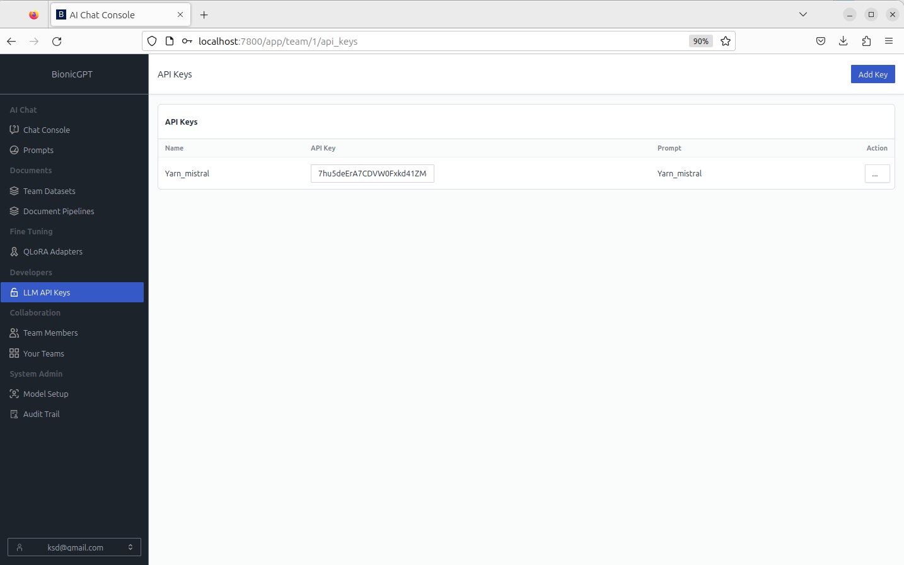
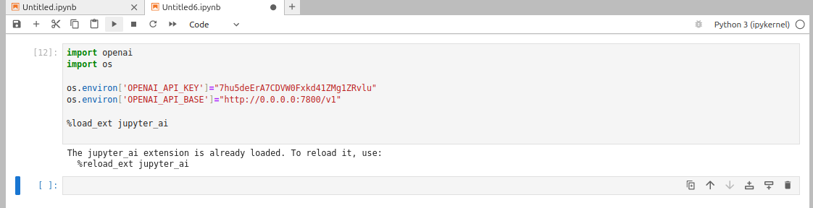
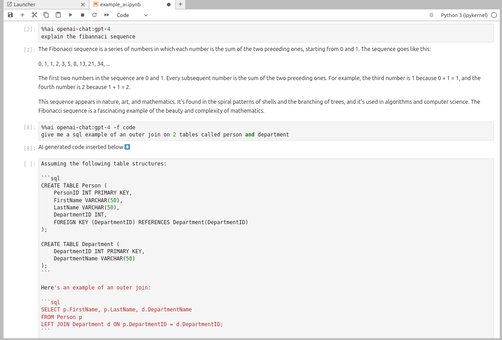
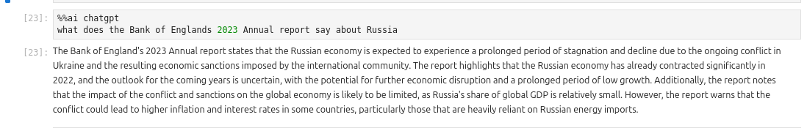

#### Calling Local LLMs for Data Scientists. Access any LLM without writing a provider

While it couldn’t be said all, it can be said with a fair degree of certainty that a large
percentage of data scientists the world over use and maybe even love Jupyter Notebook,
running either locally or remotely. It’s an environment they feel comfortable in. You can even
call LLMs directly from within your Jupyter notebook via the use of an extension called
jupyter_ai. But what about all the data scientists working at any of those companies that
have banned the use of publicly hosted LLMs such as ChatGPT? Mainly for security and
cost reasons.

Step forward bionicGPT. bionicGPT provides a way to run generative AI on premise without
the security and cost concerns of using publicly hosted LLMs. Now why shouldn’t those
same data scientists have access to these same locally deployed LLMs for use from within
Jupyter.

JupyterAI is built upon langchain and comes with a number of provider classes allowing
access to several different remote LLMs. You can even extend JupyterAI and write your own
provider. That all sounds like a little bit too much when there is a much simpler answer.

bionicGPT provides an API that is an OpenAI compatible interface allowing a standard
interface to any model registered within bionicGPT, be it local or remote.

bionicGPT allows you to create an API key that is directly associated with an LLM.
The first step thus is to create your own bionicGPT API key

Since bionicGPT’s API is OpenAI compatible we can cheat and use an existing provider
from within Jupyter AI, in fact we can use any that are OpenAI compatible.

First we need to set a couple of environment parameters.  
**OPENAI_API_KEY** to the key generated in bionicGPT, and  
**OPENAI_API_BASE** to the address of our locally running version of bionicGPT

And that is all. We can now start to call our LLM using the %%ai magic

Since bionicGPT allows you to register multiple LLMs we can use multiple different LLMs
within the notebook merely by updating the OPENAI_API_KEY value.

One of the other advantages of using bionicGPT is that the API key relates to a prompt that
relates to a dataset, meaning you can use RAG directly from within your notebook.
Here is an example of RAG after I had uploaded The Bank of England’s Annual Report and
Accounts published earlier in 2023.

#### bionicGPT
bionicGPT provides a way to run generative AI on premise for the 1000's of companies that
have banned ChatGPT due to security and cost concerns.

We do this in 4 ways:
* A user interface to run code and text generation via open source large language models
* An API to give data scientists and engineers the ability to innovate new solutions on
premise
* No code RAG pipelines so teams can quickly test new RAG use cases without the need for
skilled AI engineers
* An audit trail to ensure LLM resources are securely shared between teams and see who is
using what and where
