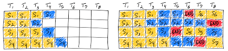
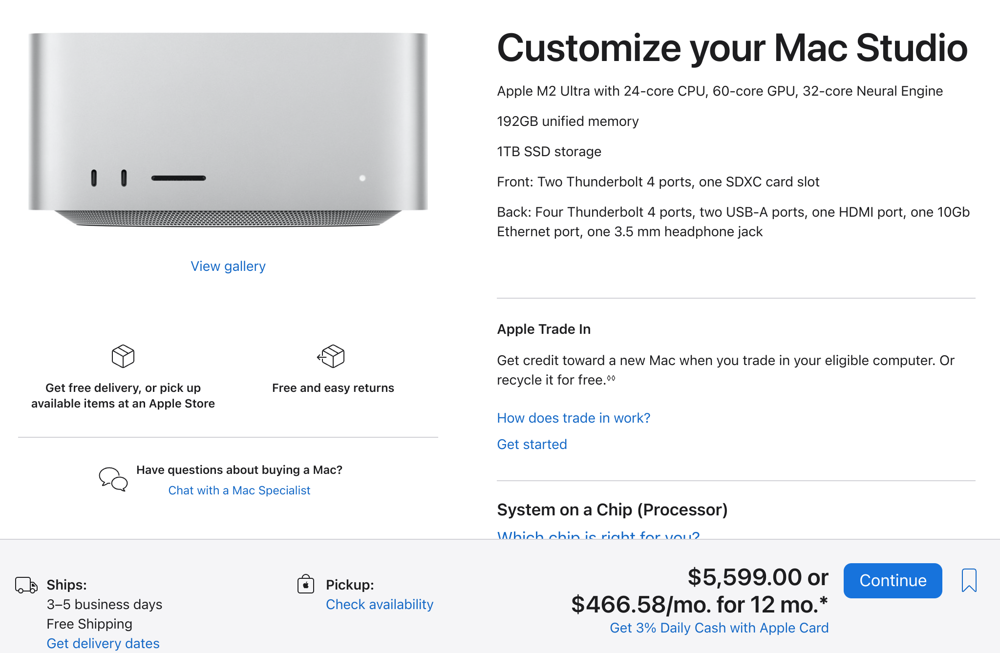

Here we try our best to breakdown the possible hardware options and requirements for running *LLM's in a production scenario*.

We do this by estimating the **tokens per second** the LLM will need to produce to work for 1000 registered users. Then we try to match that with hardware.

## Tokens Per Second (t/s)

The number of tokens (which roughly corresponds to words) an LLM can generate a second gives us a rough idea how our LLM is performing.

Most LLM solutions stream tokens back to the user so they see the answer to their query build up in real time.

Even if the total time of generation is 20 seconds, the user can start reading straight away which gives the feeling the system is more responsive.

* A speed of **5 t/s per user** in our experience would generate text or code as fast as someone can read.
* The LLM will need to be able to support more than one user at a time.
* So we have to bear in mind we want tokens per second to be really high to give a good experience under heavy load for every user.

## Tokens Per Second Per Dollar

A second metric to look at is how much are we paying for our tokens per second.

The idea here is to see how much vendors are marking up graphics cards that they market towards businesses compared to their gaming GPU offerings.

## Tokens per second to support 1000 users

There was a thought exercise with websites that said something like

> The 1% rule. 1% of your user base will be logged in and 1% of those users will be active simultaneously

I'm not sure how that applies to applications running on top of LLM's.

Especially as websites generally react much faster.

So let's take a more pessimistic rule.

> The 10% rule of LLM's. 10% of your user base will be logged in and 10% of those users will be active simultaneously

That means for every 1000 users you can expect 10 users in the queue waiting for their requests to stream.

There will be considerable bias based on time of day, day of the week, season, closing date, etc.

## Continuous Batch Inference Saves the Day

LLM inference is Memory bound not Compute bound. That means by using a technique called [Continuous Batch Inference](https://www.anyscale.com/blog/continuous-batching-llm-inference) we are able to serve multiple users at the same time with very little dip in tokens per second performance.

Basically we can send multiple prompts at the same time to the inference engine and it processes them simultaneously.

## Hardware Requirements by Parameters

We've collated results from various sources on the tokens per second performance achieved on CPU, Gaming GPU and a data center GPU i.e. A100.

All the models are quantized to use less RAM/VRAM and quantized models give better tokens per second performance with only a small amount of fall off in terms of text generation.

### 7 Billion Parameters

If you can get away with 7 Billion parameters for your use case you'll get great performance.

{{ metrics(
    title1="AMD 2700X",
    data1="1.2 t/s",
    description1="$1500",
    title2="RTX 4090",
    data2="138 t/s",
    description2="$5000 Complete System",
    title3="Nvidia A100",
    data3="714.33 t/s",
    description3="$10,000 1U System (Estimated)"
) }}

#### Sources

* [LLama 7B Nvidia 4090](https://www.hardware-corner.net/guides/computer-to-run-llama-ai-model/)
* [LLama 7B on an A100](https://github.com/vllm-project/vllm/discussions/275)

### 70 Billion Parameters

70 Billion parameters gets you close to the performance of GPT3.5. As the open source LLM's mature we'll probably see models getting closer to GPT4.

{{ metrics(
    title1="AMD Epyc (CPU)",
    data1="3.7 t/s",
    description1="Hello",
    title2="2 x Nvidia 4090",
    data2="38 t/s",
    description2="$7500 Complete System",
    title3="2 x A10G",
    data3="41.2 t/s",
    description3="$15,000 1U System (Estimated)"
) }}

In this case we can see the performance of the 2 x A10G isn't much better than what you get from the Nvidia 4090's despite the higher cost.

#### Sources

* [Machine Learning Compiler](https://github.com/mlc-ai/mlc-llm) (MLC) 38 TPS running on 2 Nvidia 4090's
* [AMD Epyc](https://www.amd.com/en/products/cpu/amd-epyc-9654)
* [OctoML 2xA100](https://octoml.ai/blog/making-the-llama-2-herd-work-for-you-on-octoai/) 

## Return of the Mac

Apple silicon with it's unified memory turns out to be a great way of running local LLM's.

Here's an [example of some running Llama 70b](https://blog.gopenai.com/how-to-deploy-llama-2-as-api-on-mac-studio-m2-ultra-and-enable-remote-api-access-7c4e6423b2dd) on a mac studio and getting **13.77 tokens per second**.

That's with 192GB of memory so you're looking at a system cost of $5,599.

## API Requirements

Most application that use LLM's rely on an API and the standard API at the moment is the Open AI `chat/completions` [API](https://platform.openai.com/docs/api-reference/chat).

Any API will need to ideally follow that standard and support the following

* **Streaming results**. We want users to see replies to their queries feeding back in real time. This is going to give the best user experience.
* **Batching**. If there are 5 users in the queue, we want each user to get feedback straight away. Not wait for each user to complete their query in turn.

The following inference engines support continuous batching as well as an Open AI compatible API. [Text Generation Inference](https://github.com/huggingface/text-generation-inference), [vLLM](https://github.com/vllm-project/vllm) and there are more.

## Conclusion

Assuming our assumptions are in the correct ball park then you're looking at hardware costs of approximately **$5000 to support 1000 users**.

If you disagree with our conclusion or have some feedback, you can raise an issue on [our github](https://github.com/bionic-gpt/bionic-gpt) or [contact us](https://bionic-gpt.com/contact/).