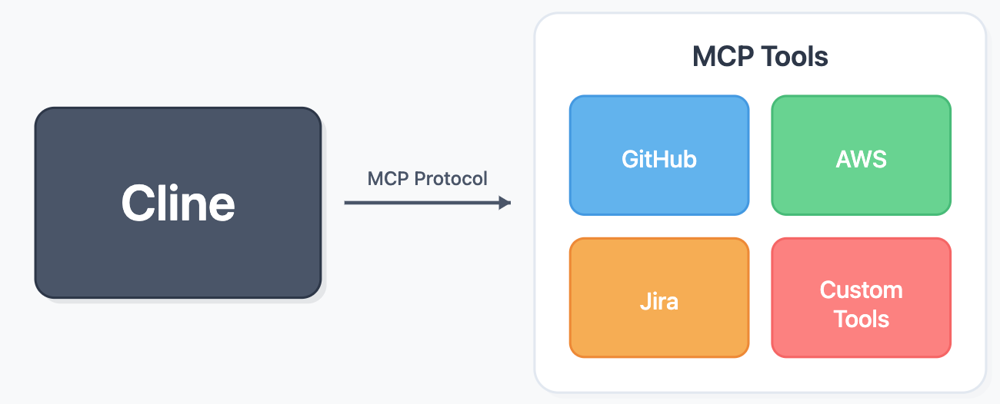

## Overview

1. Using Helicone to capture requests and responses.
1. Simple Test
1. Cline response and request
1. Aider response and request

## Intercepting requests with Helicone


## A very simple test

```sh
Create an index.html "Hello World"
```

```sh
Make it say "Hello Universe" instead.
```

## Cline


### The full request/response

[Cline System Prompt](https://gist.github.com/242816/4edc9fdbb052c9d9bef3d27e71620809)


### The main prompt
### MCP



### The dynamic parts
### Results

```xml
<write_to_file>
<path>index.html</path>
<content>
<!DOCTYPE html>
<html lang="en">
<head>
    <meta charset="UTF-8">
    <meta name="viewport" content="width=device-width, initial-scale=1.0">
    <title>Hello World</title>
</head>
<body>
    <h1>Hello World</h1>
</body>
</html>
</content>
</write_to_file>
```

```xml
<replace_in_file>
<path>index.html</path>
<diff>
<<<<<<< SEARCH
    <h1>Hello World</h1>
=======
    <h1>Hello Universe</h1>
>>>>>>> REPLACE
</diff>
</replace_in_file>
```

## Aider


### The full request/response

[Aider System Prompt](https://gist.github.com/242816/1d84df20b036abb008dd5d0e92664579)

### The main prompt
### The dynamic parts
### The Results

```
To create an `index.html` file with "Hello World", I will create a new file. No existing files need to be edited for this task. Here is the new file:

index.html
``html
<<<<<<< SEARCH
=======
<!DOCTYPE html>
<html lang="en">
<head>
    <meta charset="UTF-8">
    <meta name="viewport" content="width=device-width, initial-scale=1.0">
    <title>Hello World</title>
</head>
<body>
    <h1>Hello World</h1>
</body>
</html>
>>>>>>> REPLACE
``

You can open this file in a web browser to view the "Hello World" message.
```

```
To change the text from "Hello World" to "Hello Universe" in the `index.html` file, we need to update the content inside the `<h1>` tag. Here is the *SEARCH/REPLACE* block:

index.html
```html
<<<<<<< SEARCH
    <h1>Hello World</h1>
=======
    <h1>Hello Universe</h1>
>>>>>>> REPLACE

You can open the `index.html` file in a web browser to see the updated "Hello Universe" message.
```

## Observations