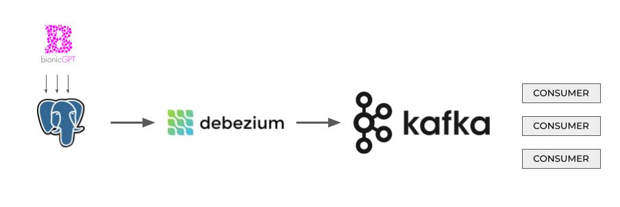

As large language models (LLMs) like GPT become integral to business operations, the need for real-time content alerting grows. Organisations must ensure that their AI systems remain compliant, ethical, and safe, especially when deployed at scale. In this blog post, we introduce a solution that provides real-time monitoring of LLM inputs and outputs to flag harmful content, ensuring smooth and responsible use. While large organisations already employ sophisticated monitoring systems, such as banks overseeing traders, this solution extends the same safeguards to AI-driven interactions—without crossing into “Big Brother” territory.

### Leveraging bionicGPT for Seamless Monitoring
One of the key advantages of bionicGPT is its built-in capability to log all inputs and outputs to the LLMs it manages. By automatically capturing this data, bionicGPT simplifies the task of real-time alerting. Because the data flow is already logged and accessible, configuring a system to monitor and analyse these interactions in real time becomes a relatively straightforward task. This seamless logging infrastructure allows organisations to easily implement content alerting with minimal additional effort.

### What is Real-Time Content Alerting?
Real-Time Content Alerting refers to the continuous monitoring and analysis of all interactions handled by large language models to identify harmful, inappropriate, or non-compliant content. It provides a robust mechanism for flagging content in real time, ensuring that both inputs (prompts) and outputs (responses) align with corporate policies and legal standards.

With bionicGPT’s automatic logging system already in place, this real-time alerting can be efficiently implemented using an architecture that includes Debezium for change data capture, Kafka for message brokering, and IBM Granite HAP for content analysis.

### Existing Monitoring in Large Organisations
Large organisations, especially those in highly regulated sectors like finance, are no strangers to monitoring. For example, banks routinely monitor traders’ communications, emails, and activities to ensure compliance with financial regulations and to prevent fraud or unethical practices. Many industries already have sophisticated systems in place to ensure employees and operations follow guidelines without compromising privacy.

Real-Time Content Alerting follows a similar philosophy: it’s about safeguarding the organization and its customers, not about intrusive surveillance. By focusing on the outputs and inputs of AI systems, it ensures that the technology adheres to established ethical and legal standards while preserving operational efficiency.

### Why Real-Time Content Alerting is Essential for Large Organisations
1. **Ensures Compliance and Regulatory Adherence** In sectors like banking, healthcare, and law, ensuring that AI-generated content complies with industry regulations is crucial. Whether it’s avoiding the spread of misinformation, preventing the unauthorized release of sensitive data, or adhering to industry-specific standards (like HIPAA in healthcare), real-time content alerting provides a protective layer for large organisations.

2. **Mitigates Risk in Real Time** With thousands of interactions happening every minute, particularly in large organisations, the ability to monitor LLM outputs for harmful or non-compliant content is invaluable. By detecting issues in real time, companies can intervene before any significant damage occurs, reducing reputational and financial risks.

3. **Supports Fairness and Bias Detection** AI systems can sometimes generate biased or unfair content, potentially harming certain groups or individuals. With real-time alerting, organisations can actively detect and address bias issues as they arise, ensuring their AI models deliver equitable and fair interactions.

4. **Scalable and Efficient** Real-Time Content Alerting scales with the needs of the organization. Whether dealing with thousands or millions of interactions per day, this system can efficiently monitor, flag, and address potential issues without creating bottlenecks or requiring excessive manual oversight.

5. **Maintains Ethical Standards without Over Surveillance** Organisations can reassure their employees and customers that this monitoring is not invasive or oppressive. Much like how banks protect themselves and their clients by monitoring traders, Real-Time Content Alerting protects the integrity of interactions, ensuring the AI systems operate within ethical bounds without feeling like an overreach.

### Architecture Behind Real-Time Content Alerting

Our solution for Real-Time Content Alerting uses the following key components:

**bionicGPT’s Logging System** All inputs and outputs are logged automatically, ensuring that no interaction is missed.

**Debezium** Captures real-time changes from the database, tracking every input and output generated by the LLM.

**Kafka** Acts as a message broker, handling the high-volume flow of data and ensuring smooth communication between the systems.

**IBM Granite HAP** A robust model designed to analyse text for harmful content, including bias, hate speech, and misinformation. This model serves as the final layer of analysis, ensuring flagged content is detected before it can cause issues.

By utilizing this architecture, large organisations can manage real-time alerting without overwhelming existing systems or compromising performance.

### Beyond Compliance: Additional Benefits of Real-Time Content Alerting
While compliance is a major benefit of real-time content alerting, it’s far from the only advantage. This system also contributes to:

**Quality Assurance** Ensuring that LLM outputs meet organizational quality standards, maintaining the professionalism and accuracy of customer-facing interactions.

**Customer Trust and Safety** Organisations can build trust by ensuring that their AI systems never generate harmful or inappropriate content.

**Operational Transparency** By keeping a close eye on AI outputs, companies can provide greater transparency to auditors, regulators, and customers.

### Conclusion
Real-Time Content Alerting offers a sophisticated yet non-intrusive solution for large organisations looking to safeguard their AI-driven interactions. With bionicGPT’s logging of all inputs and outputs, implementing a real-time alerting system is both straightforward and efficient. Much like the monitoring that already exists in sensitive sectors like banking, this system provides essential oversight without compromising privacy or ethical standards. Whether for compliance, bias detection, or simply ensuring safe and trustworthy outputs, real-time alerting is a necessary layer of defence in today’s AI landscape.